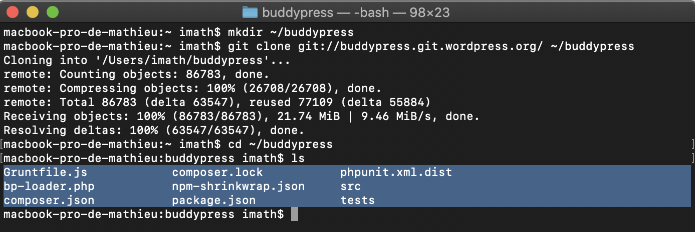

# Contribute with Code

Thank you for your interest in contributing to BuddyPress! BuddyPress is an **open-source project** and, as such, is **maintained by volunteers** just like you. It is *vital* for the current, and future success of BuddyPress needs to have a healthy group of contributors. You are very welcome to join us to work on making the plugin as great as possible: **every enhancement and each improvement depends on the community**. This Quick Start Guide to contributing code to BuddyPress Core is where you can find the resources needed to take you through the process of submitting your first patch.

## Choose the code editor you feel most comfortable with!

BuddyPress mainly uses four coding languages: PHP, JavaScript, CSS, and HTML. To write into these languages, you need a code/text editor. Here are below some suggestions for nice ones:

- [Visual Studio Code](https://code.visualstudio.com/) ([download links](https://code.visualstudio.com/#alt-downloads)),
- [Sublime Text](https://www.sublimetext.com/) ([download links](https://www.sublimetext.com/3)),
- [Atom](https://atom.io/) ([download links](https://github.com/atom/atom/releases)),
- [Notepad++](https://notepad-plus-plus.org/downloads/) (MS Windows only).
- If your a ninja, you can try [Vim](https://www.vim.org/) 😉

## Choose the version control system of your preference

BuddyPress uses a **Subversion** repository to manage the plugin’s code source. This repository is also mirrored on a Git repository. So the version control system you will use is up to you!
If you want to install Subversion, the WordPress “[Core Contributor Handbook](https://make.wordpress.org/core/handbook/)” has a [great tutorial](https://make.wordpress.org/core/handbook/tutorials/installing-a-vcs/) about it.

If you prefer Git and you’ve chosen a different text editor than Visual Studio Code (it is included into it), here are some ways to get it:

- [Git](https://git-scm.com/) ([download links](https://git-scm.com/downloads)),
- [Git for Windows](https://gitforwindows.org/) ([download link](https://github.com/git-for-windows/git/releases/latest))
- [Command Line Tools for your Mac](https://developer.apple.com/downloads/) (They should be automatically downloaded if you type `git` or `svn` into a Terminal window).
- If you chose the Atom editor, you could install the [Git/GitHub package](https://github.atom.io/),
- If you feel more comfortable with GUI software, you can use [GitKraken](https://www.gitkraken.com/git-client) or [Sourcetree](https://www.sourcetreeapp.com/).

## Install some additional tools to fully enjoy BuddyPress contribution

You probably won’t need all the tools listed below when you start contributing to BuddyPress. You can choose only to install NodeJS and install the other tools once you need them.

- [NodeJS latest LTS version](https://nodejs.org/en/) ([download links](https://nodejs.org/en/download/)). **Required**.
- [GruntJS](https://gruntjs.com/) ([Installation procedure for the CLI](https://gruntjs.com/getting-started#installing-the-cli)) *[1]*.
- [Composer](https://getcomposer.org/) ([Installation procedure](https://getcomposer.org/download/)) *[2]*. Once installed we advise you to make it globally available under the command name `composer`.
- [WP CLI](https://wp-cli.org/) ([Installation procedure](https://wp-cli.org/#installing)) *[3]*. Once installed we advise you to make it globally available under the command name `wp`.
- [PHPunit](https://phpunit.de/) ([WordPress installation tutorial](https://make.wordpress.org/core/handbook/testing/automated-testing/phpunit/), [Alternative installation tutorial](https://phpunit.de/getting-started/phpunit-7.html)) [4] Once installed we advise you to make it globally available under the command name `phpunit`.

*[1] GruntJS is used by BuddyPress to run some building tasks like preparing files to be committed, generating RTL versions of CSS stylesheets or minimizing JavaScript files.*
*[2] Composer is used to install some packages in order to be able to check PHP Code Compatibility and to run PHPUnit tests in* ***our default*** *local development environment.*
*[3] WP CLI is used to generate a POT file out of the plugin’s PHP and JavaScript files. This POT file is used by translators to translate BuddyPress into various languages (French, German, Spanish, etc..). For your information, WP CLI is a very powerful tool to run WordPress scripts from command lines*.
*[4] PHPUnit is used to run PHPUnit tests in* ***any*** *local development environment.*

## Get the BuddyPress development version

First you’ll need a Terminal software, macOs and Linux have been including such a software natively for years. If you’re using Microsoft Windows and chose to work with Git for Windows it includes a BASH emulation to run the same commands we’ll use into this tutorial, otherwise the latest [Microsoft Terminal](https://aka.ms/terminal) is looking great.

Once you opened a new Terminal window, create a new directory named “buddypress” into the local path of your choice.

```bash
mkdir ~/Plugins/buddypress
```

if you are using **Subversion**, run this command:

```bash
# SVN
svn co https://buddypress.svn.wordpress.org/trunk/ ~/Plugins/buddypress
```

If you are using **Git**, you can share your suggestions in 2 different ways. Just like it’s the case with Subversion: you can use a specific file containing the changes you want to introduce (a patch). In this case, you’ll get the development version using the following command.

```bash
# Git using patches
git clone git://buddypress.git.wordpress.org/ ~/Plugins/buddypress
```

**Or** you can choose to use the [Pull Request](https://docs.github.com/en/pull-requests) feature provided by [GitHub.com](https://github.com/buddypress). In this case, if you haven’t created your BuddyPress fork on GitHub, log in to your [GitHub account](https://github.com/), head over to the [https://github.com/buddypress/buddypress.git](https://github.com/buddypress/buddypress) repository and click on the “Fork” button !


You’ll get a new repository on your GitHub account to work from to contribute to BuddyPress, here’s mine for instance: [https://github.com/imath/buddypress.git](https://github.com/imath/buddypress). Now to get you local clone of this repository on your computer, you’ll need to run a command looking like this:

```bash
# Git using Pull Requests
git clone https://github.com/imath/buddypress.git ~/Plugins/buddypress
```

You will use your fork to create a specific branch each time you’ll want to contribute to BuddyPress code and you will use a “Pull Request” to suggest the changes you added to your local branch.

If you move to the `~/Plugins/buddypress` directory once the download has finished, you should find the highlighted folders and files of the following screen capture.



## Install our default local development environment

The BuddyPress development version you just downloaded contains the [@wordpress/env](https://developer.wordpress.org/block-editor/packages/packages-env/) package to generate a local environment using [NodeJS (latest LTS version)](https://nodejs.org/en/) and [Docker](https://www.docker.com/). To install Docker, please follow the instructions listed below according to your operating system:

- [Windows 10 Pro](https://docs.docker.com/docker-for-windows/install/),
- [all other versions of Windows](https://docs.docker.com/toolbox/toolbox_install_windows/),
- [macOS](https://docs.docker.com/docker-for-mac/install/),
- [Linux](https://docs.docker.com/v17.12/install/linux/docker-ce/ubuntu/#install-using-the-convenience-script).

Once Docker is installed and is running in the background, open a Terminal window to setup your local development environment.

```bash
cd ~/Plugins/buddypress
```

From the `~/Plugins/buddypress` the folder where you downloaded the code, you’ll first need to install the node modules we are using in BuddyPress. To do so simply run the following command and take a well-deserved break to let NodeJS download the modules we use as development dependencies (it might take some time!) :

```bash
npm install
```

For starters, if you face any error during npm install at the Microsoft windows env, you will also have to install [windows-build-tools](https://www.npmjs.com/package/windows-build-tools).

Once node modules are installed, if you plan to run/write PHP unit tests, you’ll also need to install some `composer` packages:

```bash
composer install
```

You should see that your `~/Plugins/buddypress` directory now contains 1 or 2 more sub directories: `/node_modules` and `/vendor` if you installed the composer packages.


Now we can setup the local development environment using this command:

```bash
npm run wp-env start
```

The first time you’ll execute this command it will take some time to run and you’ll see that 2 downloads will start:

- [BP REST](https://github.com/buddypress/BP-REST): it’s the plugin we use to develop the BP REST API.
- [WordPress](https://core.trac.wordpress.org/browser/trunk): it’s the WordPress development version.

Wait until the Terminal displays the following message:

```bash
WordPress development site started at http://localhost:8888
WordPress test site started at http://localhost:8889
MySQL is listening on port 49856
MySQL for automated testing is listening on port 49857

 ✔ Done! (in 0s 00ms)
 ```

Then, you can open your Internet Browser and go to this URL: [http://localhost:8888/wp-admin/](http://localhost:8888/wp-admin/).

Here are the default credentials for the Administrator account:

- Username: `admin`
- Password: `password`

### Useful commands

#### Stopping the development environment

```bash
npm run wp-env stop
```

Once you run this command, you will quickly get the following confirmation message.

```bash
 ✔︎ Stopped WordPress. (in 00s 00ms)
```

#### Running PHP unit tests

If you chose to install Composer and the packages we use as development dependencies, you will be able to run our PHP unit tests suite *(and of course contribute to it adding new tests)*.

On a regular WordPress configuration

```bash
npm run test-php
```

On a Multisite WordPress configuration

```bash
npm run test-php-multisite
```

### Customizing your BuddyPress local development environment

To develop BuddyPress we use the development version of [WordPress](https://core.trac.wordpress.org/browser/trunk), the development version of the [BP REST API](https://github.com/buddypress/BP-REST) and we set two debugging constants:

```php
define( 'WP_DEBUG', true );
define( 'SCRIPT_DEBUG', true );
```

These options are defined into the `.wp-env.json` file of the BuddyPress repository. You can override these options using a file named `.wp-env.override.json` into your `~/Plugins/buddypress` local directory.

For instance, you could choose to include another plugin like the one we use to develop the [BP Classic](https://github.com/buddypress/bp-classic) backwards compatibility add-on using this content for the overriding file:

```json
{
	"core": "WordPress/WordPress#master",
	"plugins": [ ".", "buddypress/BP-REST#master", "buddypress/bp-classic#trunk" ],
	"config": {
		"WP_DEBUG": true,
		"SCRIPT_DEBUG": true
	}
}
```

## Setting up a different development environment

Our goal with our [local development environment](https://codex.buddypress.org/participate-and-contribute/contribute-with-code/#install-our-default-local-development-environment) is to try to make it easier & faster for new contributors to be ready to help the BuddyPress project. If you prefer to build your very own local environment: it’s totally fine! In this case, to contribute to BuddyPress, you’ll simply need to checkout our SVN repository or clone our Git mirror into the `/wp-content/plugins` directory of the WordPress you use into your local environment.

For your information, the WordPress core contributor handbook includes [great tutorials](https://make.wordpress.org/core/handbook/tutorials/installing-a-local-server/) to build such an environment.

## Patching BuddyPress

Let’s work with a real bug example (It might has been fixed when you’ll read this page!) to understand how to suggest a fix to the BuddyPress development team. First, open the `~/Plugins/buddypress` directory into your favorite code editor.


As you can see, I’m using the Visual Studio Code editor 🙂 I like to have a tree of all directories and files on the left and a Terminal window under the opened file’s content.

The first big differences you will find with the way the BuddyPress plugin is organized into the [WordPress Plugins directory](https://wordpress.org/plugins/buddypress/) are:

- The plugin’s code is inside a `src` directory: **that’s your main target as a new BuddyPress contributor**.
- There’s a `js` directory at the same level than the plugin’s component directories
- The plugin’s PHP unit tests suite is inside the `tests` directory
- There’s a bunch of configuration files like `package.json` or `composer.json`

Before doing any changes, I advise you to always synchronize your local copy of the BuddyPress development version with our central repository. Using your Terminal, simply run the command corresponding to the [version control system](https://codex.buddypress.org/participate-and-contribute/contribute-with-code/#choose-the-version-control-system-of-your-preference) you chose.

```bash
# SVN
svn up
     
# Git using patches
git pull origin master
```

If you chose to contribute using GitHub “Pull Requests”, the git commands will be slightly different:

```bash
# Git using Pull Requests

# First make sure your origin master branch is up to date with BuddyPress remote one.
git fetch usptream/master

# If you need to include some changes which happened upstream, merge them!
git merge origin/master

# Then update your fork.
git push origin master

# Finally, create a new branch you will use to include the changes you want to suggest.
git checkout -b nameofyourbranch
```

Ready? Ok, let’s launch the BuddyPress local development environment.

```bash
npm run wp-env start
```

Once you get the confirmation it’s up and running, you can go to [http://localhost:8888](http://localhost:8888/) to play with the WordPress site.


### Finding an issue

If you log in and go to the Dashboard then open the BuddyPress’ tools submenu, here’s what you get.


Nothing special so far, but let’s activate one of the checkboxes, hit the “Repair items” button and have eyes on the notice that will then be displayed.


Then, you should see some lack of consistency with the WordPress administration general appearance:

- The notice message does not used the width you could find in other administration screens.
- This notice message also has a bigger height, giving the impression the dismissible button (x) is not vertically aligned.

Moreover, it’s minor but, the color of the information above the “Repair tools” form (which seems to be an important advice) is lighter than the rest of the text.


If you look deeper using your Web browser software’s inspector and comparing the BuddyPress tools administration screen (image on the right) with another WordPress tools administration screen (image on the left), you’ll see HTML output *[1]* needs to be edited as well as the `src/bp-core/admin/css/common.css` file *[2]*.

*[1] You can see that compared to other administration screens, an* `hr` *tag is missing under the main title located into the* `h1` *tag. Now if you compare the form structure with the one available into the* [*WordPress Export tool*](https://core.trac.wordpress.org/browser/trunk/src/wp-admin/export.php#L176)*, you can see it’s improvable. Let’s add an* `h2` *tag to visually inform the users about what they need to do to select one or more tools and use the* `legend` *tag to inform screen readers about what to expect from the checkboxes. You can also wrap the checkboxes into a paragraph tag.*
*[2] If the notice message has a bigger height and a smaller width, it’s due to the BuddyPress Admin CSS file that is restricting the content’s width of the wrapper to 950 pixels max and is using a bigger* `line-height` *for paragraphs.*

**Editing the code to fix the issue into your BuddyPress local repository**
The content of the BuddyPress tools administration screen is generated by the `bp_core_admin_tools()` function from the `src/bp-core/admin/bp-core-admin-tools.php` file.


To successfully warn the administrator about the potential database overhead that may happen if you run more than one tool at a time, you could use the `attention` CSS class instead of the `description` one that is used. You should also add the `hr` tag to delimit the end of the page’s header and use a form structure more inline with the [WordPress Export tool](https://core.trac.wordpress.org/browser/trunk/src/wp-admin/export.php#L176) ‘s screen.


Once edits are saved, let’s check the results into the web browser. You need to reproduce the steps that made you discover the issue.


You still need to deal with the notice presentation: let’s edit the BuddyPress Admin CSS file!


As you’ve edited the HTML output, some CSS rules are not needed anymore and as you’ve seen earlier, you don’t need to restrict the width of the screen’s content wrapper. I believe you don’t need any of the CSS rules of the `5.0 Tools - BuddyPress` section actually. So let’s remove it and update the sections numbering.


### Suggesting a fix

To share your suggestion to fix an issue with the BuddyPress development team, you’ll **always** (yes even if you chose to use GitHub pull requests) need to use our [Trac](https://buddypress.trac.wordpress.org/) (our tool to manage the BuddyPress code source and track BuddyPress bugs).

If you don’t have a **WordPress.org account yet**, [create one](https://login.wordpress.org/register) as you’ll need to log in the BP Trac to be able to submit tickets.


#### Including your fix into a patch.

> [!NOTE]
> If you are using GitHub Pull Requests, you can ignore this part.

The patch is a file containing the code you changed compared with the existing code and you’ll use this file as an attachment to the Trac ticket explaining the issue.
Here’s the command to run to create this file:

```bash
# SVN
svn diff > ~/Desktop/replaceWithTicketNumber.diff
    
# Git using patches
git diff --no-prefix > ~/Desktop/replaceWithTicketNumber.patch
```    

**NB:** the `--no-prefix` option of the Git command is important so that people using SVN can apply your patch. If you want to avoid adding this option each time you create a patch, you can customize your Git configuration this way:

`git config --global --bool diff.noprefix true`

Here’s how the *diff* file should look like if you open it into your code editor:


Now you’ve created the patch, you need to clean things up so that next time you synchronize your local copy of the BuddyPress repository you don’t get errors. To do so, run the following command:

```bash
# SVN
svn revert -R *
	
# Git using patches
git checkout .
```

#### Sharing your ticket on BuddyPress Trac

Now you have your patch ready and you cleaned your local copy of the BuddyPress repository, you can write a ticket about it to inform the BuddyPress development team about your great contribution. Head over to the [BP Trac’s page to submit your ticket](https://buddypress.trac.wordpress.org/newticket) to do so.


Into the summary field, insert a short description of your issue. Use the Description multiline text field to detail your issue making sure to inform about the **steps to reproduce** it and eventually the **specific configuration** to use to reproduce it (*eg: Multisite with BuddyPress active on a sub site*).

**If you are using a patch:**

> [!NOTE]
> If you are using GitHub Pull Requests, you can ignore this part.

Don’t forget to add the `has-patch` keyword to your ticket and to activate the checkbox to attach a file once your ticket will be posted.

You can include **screenshots** or any complementary information that can help understanding what your patch will fix once applied.

**If you are using a patch:**

> [!NOTE]
> If you are using GitHub Pull Requests, you can ignore this part.

Submit your ticket and don’t forget to edit the name of your file to match the ticket number you’ll find once the next screen will load.


For this patch, the `replaceWithTicketNumber.patch` file should be renamed to `8357.patch`.

Good job so far! You can have a look at the submitted ticket: [#8357](https://buddypress.trac.wordpress.org/ticket/8357).

Every time your ticket will be updated (comments, commits, …), you’ll receive an email notification. Discussions about your ticket are likely to happen: eg. BuddyPress developers may ask you to update/edit your patch. You’ll see these discussions can be really interesting and can greatly help you improve your skills.

#### Including your fix into a Pull Request

You’ll first need to commit your changes and push them to your fork.

```bash
# Git using Pull Requests
git add .
git commit -m 'Make the BP Tools Admin screen more consistent with WP Admin ones'
git push origin nameofyourbranch
```

Once done, go to your fork’s page on GitHub and click on the link to create a Pull Request. You’ll be directed to the page where you’ll be able to link your Pull Request to an existing BuddyPress Trac ticket.


Find the `<!-- insert a link to the BuddyPress Trac ticket here -->` text and replace it with the Trac Ticket link, for example https://buddypress.trac.wordpress.org/ticket/8357.

## Applying a patch to your local copy of the BuddyPress repository

There are 2 situations when you’ll need to apply a patch to your local copy of the BuddyPress repository:

1. You need to update a patch you previously shared on BP Trac.
2. You want to contribute to a patch shared by another contributor and provide him with your feedbacks about it.

In both cases, the commands to run are the same. First from your Terminal software move to your BuddyPress repository’s local copy.

```bash
cd ~/Plugins/buddypress
```

Once there, don’t forget to synchronize your local copy with the central BuddyPress repository.

```bash
# SVN
svn up
	
# Git using patches
git pull origin master

# Git using Pull Requests
git fetch usptream/master
git merge origin/master
git push origin master

# Create a new branch to test the patch.
git checkout -b nameofyourbranchtotestthepatch
```

Otherwise, you’ll need to download the patch from the ticket’s page before applying it.


Alternatively, if the patch was shared using a GitHub Pull Request, use the view patch link to get it (make sure to replace all occurrences of  `a/` and `b/` with an empty string to ease your like, otherwise you will be prompt to type the file(s) you want to patch.


Once downloaded, whether you use SVN or Git the command to apply the patch is the same.

```bash
patch -p0 < /path-to-the-downloaded-patch/8357.patch
```

Once you finished updating your patch (& possibly generating a new version of it) or testing another contributor’s patch, don’t forget to clean your BuddyPress repository’s local copy.

```bash
# SVN
svn revert -R *

# Git using patches
git checkout .

# Git using pull request
git checkout master
```

## Follow WordPress Coding & Documentation standards

When editing the BuddyPress code source, it’s important your code follows the WordPress Coding Standards. I advise you to check them often as they can be updated. Here are the coding standard links:

- [Accessibility](https://developer.wordpress.org/coding-standards/wordpress-coding-standards/accessibility/)
- [CSS](https://developer.wordpress.org/coding-standards/wordpress-coding-standards/css/)
- [HTML](https://developer.wordpress.org/coding-standards/wordpress-coding-standards/html/)
- [JavaScript](https://developer.wordpress.org/coding-standards/wordpress-coding-standards/javascript/)
- [PHP](https://developer.wordpress.org/coding-standards/wordpress-coding-standards/php/)

For the inline documentation (for Classes, hooks and functions DocBlocks) you might use into your code, it’s also important to use these WordPress standards:

- [JavaScript](https://developer.wordpress.org/coding-standards/inline-documentation-standards/javascript/)
- [PHP](https://developer.wordpress.org/coding-standards/inline-documentation-standards/php/)

Congratulations! You are now ready to **contribute to the BuddyPress code source**. If you’re looking for issues to fix, check our [roadmap](https://buddypress.trac.wordpress.org/roadmap) and click on the “active” link of the latest milestone to discover what we need to do 😉

