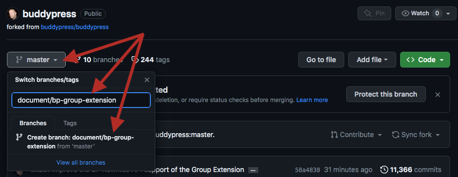

# Contribute to documentation

BuddyPress now uses a new place to create and keep up to date documentation resources for users, developers & contributors: right inside the `/docs` directory of our [main repository](https://buddypress.trac.wordpress.org/browser/trunk#docs).

We've decided to use this new location because it has some very interesting benefits:

- We don’t need to wait to put up documentation sites to share documentation resources with users, they can always read it from the [GitHub repository](https://github.com/imath/buddypress/tree/master/docs) that is synchronized with our main repository.
- As explained into our last [feedback post](https://buddypress.org/2023/06/buddypress-community-contribution/): having docs directly inside our repository shows **we acknowledge Documentation is as important as code**.
- Using GitHub to review documentation contributions is very convenient as the [BP Documentation team members](https://github.com/orgs/buddypress/teams/documentation-team) can ask contributors to improve their work using the GitHub features.
- & **most importantly**: when committing a new Documentation contribution from our main repository (SVN), we can credit authors so that they are rewarded with a lovely BuddyPress contributor badge on their WordPress profile, just like a code contributor would be.

## How to contribute to BuddyPress Docs?

**NB**: everything remains totally free!

### Steps you need to accomplish once

1. If you're not registered on WordPress.org yet, create a [WordPress.org account](https://login.wordpress.org/register?locale=en_US) & eventually link it to the [WordPress.org’s slack](https://make.wordpress.org/chat/) to attend Docs Chat.
2. If you don't have a GitHub account yet, [sign up for one here](https://github.com/signup?source=header-repo&source_repo=buddypress%2Fbuddypress).
3. If you haven't added BuddyPress to your GitHub forks, [fork the BuddyPress GitHub repository](https://docs.github.com/en/get-started/quickstart/fork-a-repo).

### Steps you need to accomplish for each of your contributions

Each contribution needs to be organized as a Pull Request (PR) to the BuddyPress GitHub main branch (master). If you're familiar with GitHub and use it locally along with your Favorite editor, it's the exact same process than pulling a request for a code contribution.

> [!IMPORTANT]
> To write documentation resources, you need to use the [GitHub Markdown](https://docs.github.com/en/get-started/writing-on-github/getting-started-with-writing-and-formatting-on-github/basic-writing-and-formatting-syntax) language.

The steps we're detailling below are explaining how you can still contribute to docs if you have no clue about GitHub thanks to their website features.

**NB**: below steps need to be accomplished from your BuddyPress GitHub fork.

#### Create a new branch

 
