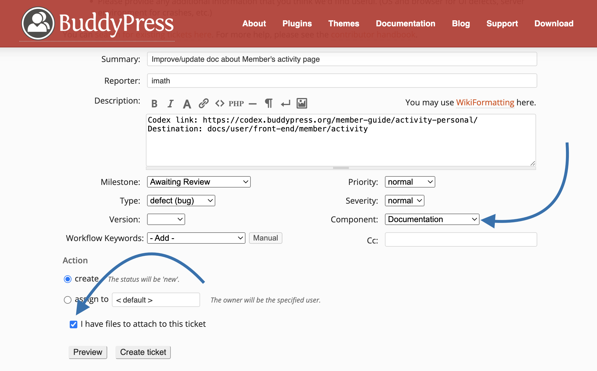

# Contribute to documentation

BuddyPress now uses a new place to create and keep up to date documentation resources for users, developers & contributors: right inside the `/docs` directory of our [main repository](https://buddypress.trac.wordpress.org/browser/trunk#docs).

We've decided to use this new location because it has some very interesting benefits:

- We don’t need to wait to put up documentation sites to share documentation resources with users, they can always read it from the [GitHub repository](https://github.com/buddypress/buddypress/tree/master/docs) that is synchronized with our main repository.
- As explained into our last [feedback post](https://buddypress.org/2023/06/buddypress-community-contribution/): having docs directly inside our repository shows **we acknowledge Documentation is as important as code**.
- Using GitHub to review documentation contributions is very convenient as the BP Documentation team members can ask contributors to improve their work using the GitHub features.
- & **most importantly**: when committing a new Documentation contribution from our main repository (SVN), we can credit authors so that they are rewarded with a lovely BuddyPress contributor badge on their WordPress profile, just like a code contributor would be.

## How to contribute to BuddyPress Docs?

**NB**: everything remains totally free and opens to everyone!

The most important requirement is to have a [WordPress.org](https://wordpress.org) account. If you're not registered on WordPress.org yet, create a [WordPress.org account](https://login.wordpress.org/register?locale=en_US) & eventually link it to the [WordPress.org’s slack](https://make.wordpress.org/chat/) to chat with the BuddyPress team in the [#buddypress](https://wordpress.slack.com/messages/buddypress) channel.

> [!NOTE]
> To write documentation resources so that they can be displayed immediately into the BuddyPress GitHub repository and synchronized with a documentation website of the [BuddyPress.org network](https://buddypress.org) (in a near future, once we have a v1 ready), you need to use the [GitHub Markdown](https://docs.github.com/en/get-started/writing-on-github/getting-started-with-writing-and-formatting-on-github/basic-writing-and-formatting-syntax) language.

That being said, if code writers are very comfortable with Markdown, GitHub and collobarating using Pull Requests, some of you might find it too complex. If so, no worries: our main challenge is to have an up to date **content** for our documentation resources.

### Contributing without GitHub

You can use the writing tool of your choice as long as in the end the content you wrote can be exported into a Markdown file (having the `.md` file extension).

> [!TIP]
> An interesting free & WYSIWYG tool is [Dropbox Paper](https://paper.dropbox.com/) as it's possible to share a link to your content and/or export your content as a Markdown file.

Once your content is ready, share it with us submitting a [new ticket](https://buddypress.trac.wordpress.org/newticket) on our Trac environment making sure:

- your ticket description informs about:
  - The link of the outdated page of the [BuddyPress Codex](https://codex.buddypress.org) if it exists.
  - Where it should be inserted in your opinion.
  - The link to the content you're suggesting (if it's hosted online).
  - Where to insert attached screenshots into your content (if you attached images to the ticket).
  - Other information you think are important.
- to choose the `Documentation` component in the corresponding selectbox
- to click on the `I have files to attach to this ticket` if you need to attach your `.md` file and/or screenshots.

Once submitted, your ticket will be reviewed by a member of the BuddyPress team. If everything is fine, this member will eventually craft a GitHub Pull Requests out of your content (which will be referenced inside your ticket) or directly add your documentation resource into the right `/docs` folder of the BuddyPress main repository.

### Contributing with GitHub

1. If you don't have a GitHub account yet, [sign up for one here](https://github.com/signup?source=header-repo&source_repo=buddypress%2Fbuddypress).
2. If you haven't added BuddyPress to your GitHub forks, [fork the BuddyPress GitHub repository](https://docs.github.com/en/get-started/quickstart/fork-a-repo).

Each contribution needs to be organized as a Pull Request (PR) to the BuddyPress GitHub main branch (master). If you're familiar with GitHub and use it locally along with your Favorite editor, it's the exact same process than pulling a request for a code contribution.

The steps we're detailling below are explaining how you can still contribute to docs if you have no clue about GitHub thanks to their website features.

> [!IMPORTANT]
> Below steps need to be accomplished from your BuddyPress GitHub fork.

#### Create a new branch

Head over to your GitHub fork of BuddyPress. Once there, you'll see a dropdown control to navigate into your branches (first red arrow in the above screenshot) where the current selected one defaults to the `master` branch. Open this dropdown control and start writing the name of the branch you will use to create your Pull Request into the text input (second red arrow in the above screenshot). You'll notice as you type a button to create the branch will appear (third red arrow in the above screenshot). Once you're happy with the name of your branch, click on this button.

You should be redirected to the branch you just created in your GitHub fork and a message should confirm you just did it!

#### Adding a Markdown file

Now from the folder navigation tree on the left of the screen, navigate to the folder you want to add a new file to. Then use the "Add file" dropdown control on the right of the screen and select the "Create a new file" option.

If you need to put your new file inside a new folder under the current active one, you just need to use the `/` (slash) character as a separator between the folder path to create and the name of your Markdown file.

> [!NOTE]
> If you need the file to be automatically displayed when browsing into the folder, you can use the `README.md` name. 

You now have to write your documentation resource inside the main area (the one having the "Enter file contents here" placeholder). Once you're done, click on the "Commit changes" green button (on the top right of the screen) to display the dialog box to enter your commit message as shown below.

Confirm by clicking on the "Commit changes" green button of this dialog box.

#### Uploading images to the assets directory of the handbook.

If you need to include one or more images inside your documentation resource, please use the `assets` directory of the handbook you're contributing to. Once you clicked on the "Upload files" option of the "Add file" dropdown control on the right of the screen, you'll reach the following uploader form.

Use the drag and drop control or the "choose your files" link to select the images you want to include into your documentation resource. Shortly after you've achieved this step, GitHub will list your uploaded files and you'll just need commit these using the green button.

#### Edit an existing Markdown file

Open the file you want to edit using the navigation tree on the left of the screen, then using the Edit dropdown control on the right of the screen (see the two red arrows in the screenshot below), select the "Edit in place" option.

You'll then be able to edit your file from the editor we've described when explaining how to create a new Markdown file. To confirm your edits, you'll need to use the "Commit changes" green button.

#### Submitting your Pull Request on the BuddyPress master branch

Once you believe your contribution is ready, use the "Contribute" dropdown control to open your pull request as shown below.

You'll reach the form to describe and confirm your Pull Request. Please, make sure to allow edits by maintainers before clicking on the "Create pull request" green button.

> [!IMPORTANT]
> Once a Pull Request is validated by a member of the BuddyPress team, a BP Core Committer will include the changes to the BuddyPress **SVN** repository so that they will be synchronized with the BuddyPress GitHub repository (It’s very important PR are not merged from the BuddyPress GitHub repository).

### Keeping the master branch of your BuddyPress fork up to date.

Before you start building a Pull Request, please make sure the master branch of your BuddyPress fork is up to date with the BuddyPress master branch.

You can easily do so using the "Sync fork" dropdown control and clicking on the "Update branch" green button.
