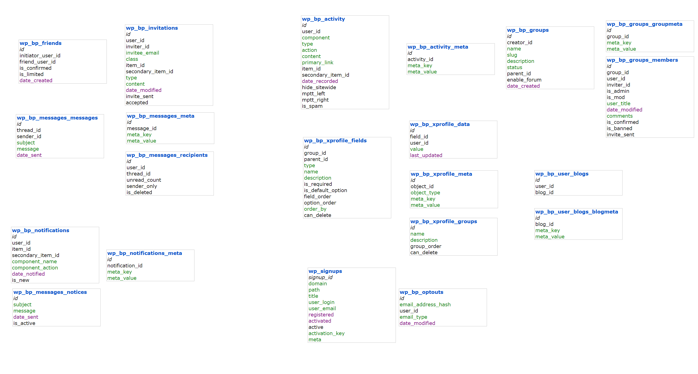

# BuddyPress Database Schema Overview

## Introduction

BuddyPress is a powerful plugin that extends WordPress by adding community features, including activity streams, user profiles, groups, private messaging, and more. BuddyPress creates additional database tables to manage these community-centric features. This document provides an overview of the BuddyPress database schema to help developers understand and extend the data structure.

---

## Database Diagram

Below is a visual representation of the BuddyPress database schema:



# BuddyPress Database Schema - Detailed Text-based Design

```
       +-----------------+    +-------------------+
       |  wp_bp_activity  |    | wp_bp_friends     |
       +-----------------+    +-------------------+
       | id              |    | id                |
       | user_id         |    | initiator_user_id |
       | component       |    | friend_user_id    |
       | type            |    | is_confirmed      |
       | action          |    | is_limited        |
       | content         |    | date_created      |
       | primary_link    |    +-------------------+
       | item_id         |              |
       | secondary_item_id|              v
       | date_recorded   |    +-------------------+
       | hide_sitewide   |    | wp_bp_groups       |
       | mptt_left       |    +-------------------+
       | mptt_right      |    | id                |
       | is_spam         |    | creator_id        |
       +-----------------+    | name              |
                               | slug              |
       +-------------------+   | description       |
       | wp_bp_activity_meta |  | status           |
       +-------------------+   | parent_id         |
       | id                |   | enable_forum      |
       | activity_id       |   | date_created      |
       | meta_key          |   +-------------------+
       | meta_value        |
       +-------------------+
```

```
       +---------------------+    +---------------------+
       | wp_bp_messages       |    | wp_bp_notifications |
       +---------------------+    +---------------------+
       | id                  |    | id                  |
       | thread_id           |    | user_id             |
       | sender_id           |    | item_id             |
       | subject             |    | secondary_item_id   |
       | message             |    | component_name      |
       | date_sent           |    | component_action    |
       +---------------------+    | date_notified       |
                                   | is_new              |
                                   +---------------------+
```

```
       +---------------------+    +---------------------+
       | wp_bp_messages_meta  |    | wp_bp_notifications_meta |
       +---------------------+    +--------------------------+
       | id                  |    | id                       |
       | message_id          |    | notification_id          |
       | meta_key            |    | meta_key                 |
       | meta_value          |    | meta_value               |
       +---------------------+    +--------------------------+
```

```
       +--------------------+     +-------------------+
       | wp_bp_groups        |     | wp_bp_groups_meta |
       +--------------------+     +-------------------+
       | id                 |     | id                |
       | creator_id         |     | group_id          |
       | name               |     | meta_key          |
       | slug               |     | meta_value        |
       | description        |     +-------------------+
       | status             |
       | parent_id          |
       | enable_forum       |
       | date_created       |
       +--------------------+
```

```
       +---------------------+    +------------------+
       | wp_bp_groups_members |    | wp_bp_invitations|
       +---------------------+    +------------------+
       | id                  |    | id               |
       | group_id            |    | user_id          |
       | user_id             |    | inviter_id       |
       | inviter_id          |    | invitee_email    |
       | is_admin            |    | class            |
       | is_mod              |    | item_id          |
       | user_title          |    | secondary_item_id|
       | date_modified       |    | type             |
       | comments            |    | content          |
       | is_confirmed        |    | date_modified    |
       | is_banned           |    | invite_sent      |
       | invite_sent         |    | accepted         |
       +---------------------+    +------------------+
```

```
       +------------------------+    +---------------------+
       | wp_bp_xprofile_data     |    | wp_bp_xprofile_fields |
       +------------------------+    +---------------------+
       | id                     |    | id                  |
       | field_id               |    | group_id            |
       | user_id                |    | parent_id           |
       | value                  |    | type                |
       | last_updated           |    | name                |
       +------------------------+    | description         |
                                     | is_required         |
                                     | is_default_option   |
                                     | field_order         |
                                     | option_order        |
                                     | order_by            |
                                     | can_delete          |
                                     +---------------------+
```

```
       +------------------------+    +------------------------+
       | wp_bp_xprofile_groups   |    | wp_bp_xprofile_meta     |
       +------------------------+    +------------------------+
       | id                     |    | id                     |
       | name                   |    | object_id              |
       | description            |    | object_type            |
       | group_order            |    | meta_key               |
       | can_delete             |    | meta_value             |
       +------------------------+    +------------------------+
```

```
       +-------------------+    +----------------------+
       | wp_bp_user_blogs   |    | wp_bp_user_blogs_meta|
       +-------------------+    +----------------------+
       | id                |    | id                   |
       | user_id           |    | blog_id              |
       | blog_id           |    | meta_key             |
       +-------------------+    | meta_value           |
                                 +----------------------+
```

```
       +---------------------+    +--------------------+
       | wp_bp_optouts        |    | wp_bp_signups      |
       +---------------------+    +--------------------+
       | id                  |    | signup_id          |
       | email_address_hash   |    | domain             |
       | user_id             |    | path               |
       | email_type          |    | title              |
       | date_modified       |    | user_login         |
       +---------------------+    | user_email         |
                                  | registered         |
                                  | activated          |
                                  | active             |
                                  | activation_key     |
                                  | meta               |
                                  +--------------------+
```

## Activity Tables

### wp_bp_activity

This table stores all activities (such as posts, comments, updates) made by users in BuddyPress.

- **Columns:**
  - `id`: The unique ID for each activity entry.
  - `user_id`: The ID of the user who performed the activity.
  - `component`: Specifies which BuddyPress component (e.g., groups, members) the activity is associated with.
  - `type`: Type of activity (e.g., new post, comment, group creation).
  - `action`: Human-readable description of the action performed.
  - `content`: Additional content (text) related to the activity.
  - `primary_link`: A link to the activity item or content.
  - `item_id`: ID associated with the primary item (group or other).
  - `secondary_item_id`: Additional context ID, if applicable.
  - `date_recorded`: When the activity was recorded.
  - `hide_sitewide`: Whether the activity is hidden from the sitewide activity stream.
  - `mptt_left` & `mptt_right`: Used for threaded comments/activities.
  - `is_spam`: Marks the activity as spam.

#### Example Query:

```sql
SELECT * FROM wp_bp_activity WHERE user_id = 1;
```

### wp_bp_activity_meta

Stores metadata associated with activity entries.

- **Columns:**
  - `id`: Meta ID.
  - `activity_id`: The ID of the associated activity.
  - `meta_key`: Metadata key.
  - `meta_value`: Metadata value (usually stored as serialized data).

---

## Friends Tables

### wp_bp_friends

This table manages the friendship connections between users.

- **Columns:**
  - `id`: Unique ID for each friendship connection.
  - `initiator_user_id`: The user who sent the friend request.
  - `friend_user_id`: The user who received the friend request.
  - `is_confirmed`: Whether the friendship has been confirmed (1) or is pending (0).
  - `is_limited`: Whether the friendship has any limitations.
  - `date_created`: Timestamp of when the friendship was initiated.

#### Example Query:

```sql
SELECT * FROM wp_bp_friends WHERE initiator_user_id = 1;
```

---

## Groups Tables

### wp_bp_groups

This table stores the details of groups created in BuddyPress.

- **Columns:**
  - `id`: Unique ID for the group.
  - `creator_id`: User ID of the group creator.
  - `name`: Name of the group.
  - `slug`: Unique slug for the group.
  - `description`: Group description.
  - `status`: Group visibility status (public, private, hidden).
  - `parent_id`: Parent group ID (if applicable).
  - `enable_forum`: Whether the group has forums enabled.
  - `date_created`: When the group was created.

### wp_bp_groups_groupmeta

Stores metadata associated with groups.

- **Columns:**
  - `id`: Unique ID for group metadata.
  - `group_id`: The ID of the associated group.
  - `meta_key`: Metadata key.
  - `meta_value`: Metadata value (usually stored as serialized data).

### wp_bp_groups_members

Manages membership of users in groups.

- **Columns:**
  - `id`: Unique membership ID.
  - `group_id`: The ID of the group.
  - `user_id`: The ID of the user.
  - `inviter_id`: The ID of the user who invited the member (if applicable).
  - `is_admin`: Whether the user is an admin of the group.
  - `is_mod`: Whether the user is a moderator of the group.
  - `user_title`: The role or title of the user within the group.
  - `date_modified`: When the membership was last modified.
  - `is_confirmed`: Whether the membership is confirmed.
  - `is_banned`: Whether the user is banned from the group.
  - `invite_sent`: Whether an invitation has been sent.

#### Example Query:

```sql
SELECT * FROM wp_bp_groups_members WHERE group_id = 2;
```

---

## Messaging Tables

### wp_bp_messages_messages

Stores private messages sent between users.

- **Columns:**
  - `id`: Unique message ID.
  - `thread_id`: ID of the conversation thread.
  - `sender_id`: User ID of the message sender.
  - `subject`: Subject of the message.
  - `message`: The actual message content.
  - `date_sent`: When the message was sent.

### wp_bp_messages_meta

Stores metadata associated with messages.

- **Columns:**
  - `id`: Unique meta ID.
  - `message_id`: The ID of the associated message.
  - `meta_key`: Metadata key.
  - `meta_value`: Metadata value.

---

## Notifications Tables

### wp_bp_notifications

Stores notifications for user actions.

- **Columns:**
  - `id`: Unique notification ID.
  - `user_id`: The ID of the user receiving the notification.
  - `item_id`: Primary item related to the notification.
  - `secondary_item_id`: Secondary item, if applicable.
  - `component_name`: Name of the BuddyPress component (e.g., groups, messages).
  - `component_action`: Action triggering the notification (e.g., group invite, message received).
  - `date_notified`: When the notification was created.
  - `is_new`: Whether the notification is new.

### wp_bp_notifications_meta

Stores metadata for notifications.

- **Columns:**
  - `id`: Unique meta ID.
  - `notification_id`: The ID of the associated notification.
  - `meta_key`: Metadata key.
  - `meta_value`: Metadata value.

---

## XProfile (Extended Profiles) Tables

### wp_bp_xprofile_data

Stores custom profile data for users.

- **Columns:**
  - `id`: Unique profile data ID.
  - `field_id`: ID of the profile field.
  - `user_id`: ID of the user.
  - `value`: Value of the profile field for the user.
  - `last_updated`: Timestamp of the last update.

### wp_bp_xprofile_fields

Stores the fields available in extended profiles.

- **Columns:**
  - `id`: Unique field ID.
  - `group_id`: ID of the group the field belongs to.
  - `parent_id`: Parent field ID (for hierarchical fields).
  - `type`: The type of field (e.g., text, checkbox, select).
  - `name`: The name of the field.
  - `description`: Description of the field.
  - `is_required`: Whether the field is required.
  - `is_default_option`: Whether this is the default option.
  - `field_order`: The order of the field.
  - `option_order`: The order of field options.
  - `order_by`: The sorting method for the field.
  - `can_delete`: Whether the field can be deleted.

### wp_bp_xprofile_groups

Stores groups of profile fields.

- **Columns:**
  - `id`: Unique group ID.
  - `name`: Name of the group.
  - `description`: Description of the group.
  - `group_order`: The order of the group.
  - `can_delete`: Whether the group can be deleted.

---

## Other BuddyPress Tables

- **wp_bp_user_blogs**: Stores user blog associations in multisite.
- **wp_bp_user_blogs_blogmeta**: Metadata for user blogs.
- **wp_bp_invitations**: Stores invitations sent by users.
- **wp_bp_optouts**: Stores opt-out preferences for users who do not want to receive emails.

---

This document outlines the structure of BuddyPress database tables, providing developers with the information needed to understand, query, and extend the BuddyPress data model. The schema offers flexibility for extending community features, creating custom plugins, and building complex integrations.
