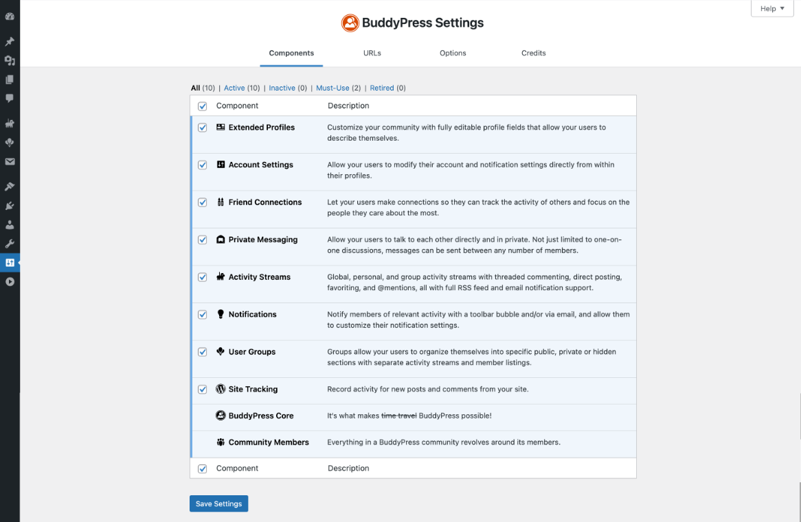

# BuddyPress Components

BuddyPress comes with several components that integrate directly with your site, with each other, and even with other plugins (check out [bbPress](https://bbpress.org) for support forums). Site administrators can select the optional components they wish to activate for their community. Only 2 components are required and are always loaded into BuddyPress:

- the Core component
- the Members component

## Extending existing components

TBD.

## Building a custom component

The more convenient way to build a custom component is to extend the `BP_Component` class from your plugin. This class contains methods you can override to set your component's globals such as the `has_directory` one which informs about whether your component is using a directory page or not, include the files your component needs, register and set up your component's displayed user navigation, customize your component's routes, init your component's REST API Endpoints or Blocks, etc.

Read about the [BP Component details](./build-component.md) to learn more about it.
