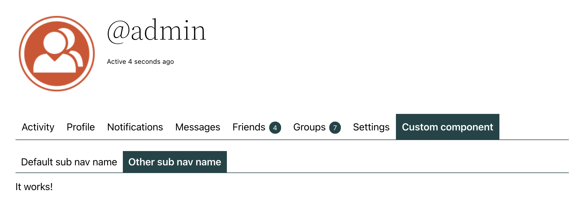
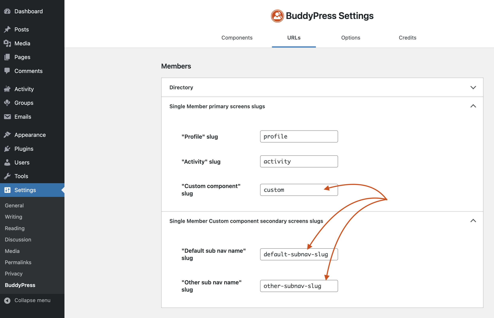
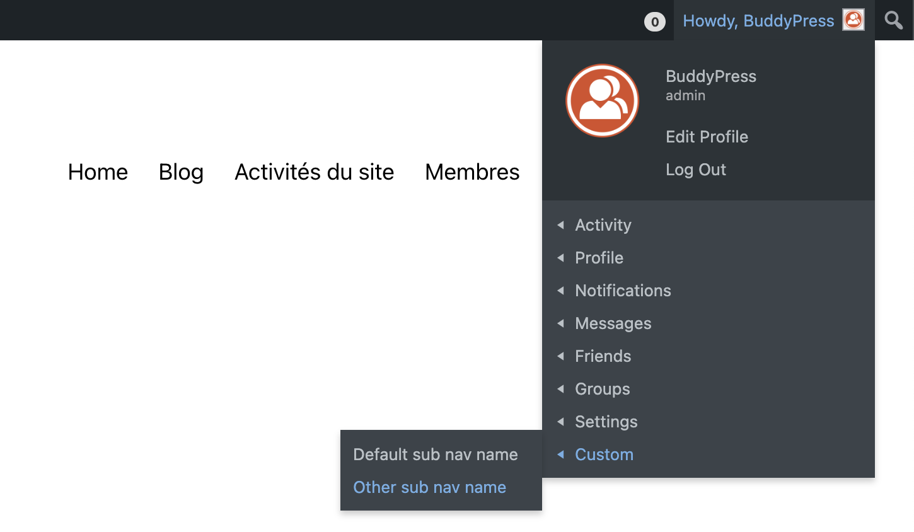
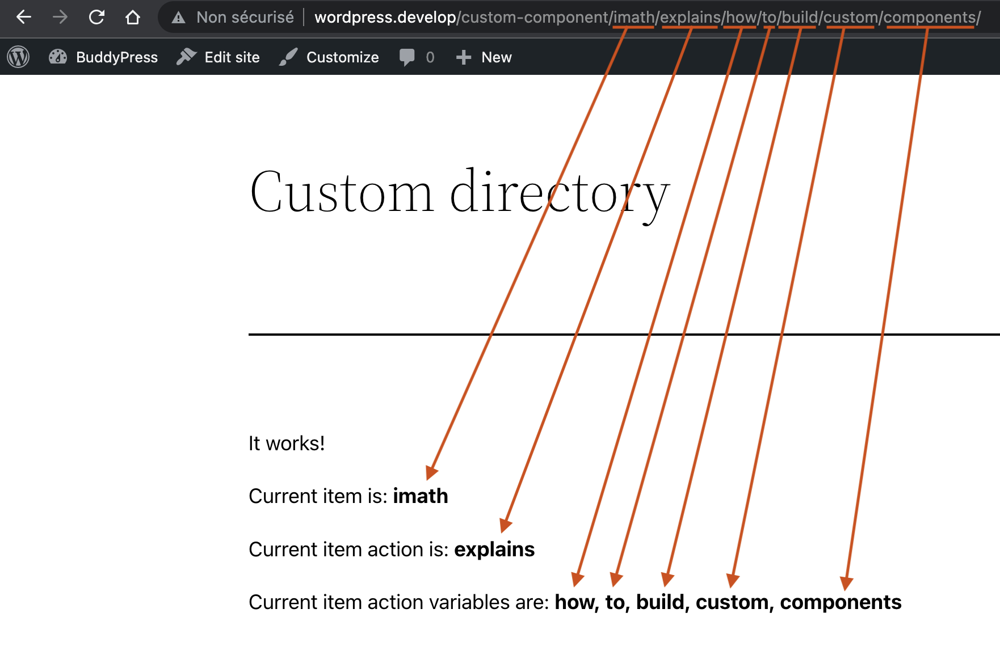

# Building a custom BuddyPress component

Located inside the `/bp-core/classes` directory, the `BP_Component` class can be used as the parent of your custom component's class to organize it. BuddyPress components are registered into the main `buddypress()` instance using their ID: a unique string which is generally the same as your component default slug. This registration step is hooked to the `bp_setup_components` action. Below is an example of how you can register your component in BuddyPress.

```php
function register_custom_component() {
	/*
	 * BP_Custom_Component is the class of your component.
	 * You'll discover in the rest of this documentation resource how you
	 * can build this class.
	 */ 
	buddypress()->custom = new BP_Custom_Component();
}
add_action( 'bp_setup_components', 'register_custom_component' );
```

You can use the third argument (`$priority` the priority argument) of the `add_action()` function to choose when your component will be inited as long as it is after **1** to be sure required components have been inited, in the above example `custom` is hooked at default priority ie: **10**. Here's the initiation order of built-in BuddyPress components:

- Core (required) is hooked to `bp_setup_components` at priority **0**.
- Members (required) is hooked to `bp_setup_components` at priority **1**.
- Extended Profiles (optional) are hooked to `bp_setup_components` at priority **2**.
- Activity, Blogs, Friends, Groups, Messages, Notifications, Settings (optionals) are hooked to `bp_setup_components` at priority **6**.

## Building your component’s class

It’s a [WordPress good practice](https://developer.wordpress.org/coding-standards/wordpress-coding-standards/php/#naming-conventions) to put the code of your class into a file having a `class-` prefix followed by your class name where caps are replaced by their corresponding lower case value and underscores by dashes. As our custom component's class is named `BP_Custom_Component`, we are putting its code inside a `class-bp-custom-component.php` file. Let's built it making sure you will inherit from the `BP_Component` parent class using the `extends` keyword.

```php
class BP_Custom_Component extends BP_Component {
	/*
	 * The properties and methods of for your component's class.
	 */ 
}
```

### Adding the constructor of your class

This is where you are using the `BP_Component::start()` method to inform about some of your component's globals such as your component ID, your component name, the path from where additional files should be included and additional parameters such as the position for your menu under the WP Toolbar's "My Account menu", your component optional features and the string to be used as the query argument in component search URLs.

```php
class BP_Custom_Component extends BP_Component {
	/**
	 * Your component's constructor.
	 */
	public function __construct() {
		parent::start(
			// Your component ID.
			'custom',

			// Your component Name.
			__( 'Custom component', 'custom-text-domain' ),

			/*
			 * The path from where additional files should be included.
			 * 
			 * FYI: this class is inside an `/inc` subdirectory of your add-on directory.
			 * 
			 * Below is a typical relative path for it:
			 * `/wp-content/plugins/bp-custom/inc/classes/class-bp-custom-component.php
			 */ 
			plugin_dir_path( dirname( __FILE__ ) ),

			// Additional parameters.
			array(
				'adminbar_myaccount_order' => 100,
				'features'                 => array( 'feature-one', 'feature-two' ),
				'search_query_arg'         => 'custom-component-search',
			)
		);
	}
}
```

### Setting up your component global variables

Your component's class can include a `setup_globals()` method to define BP specific globals or custom ones. If you do add this method to your class, it will override the `BP_Component::setup_globals()`. In this case, to be sure to reference your component inside the BuddyPress `loaded_components` queue and your component's BP specific globals, don't forget to call `parent::setup_globals( $bp_globals );` inside your method.

```php
class BP_Custom_Component extends BP_Component {
	/**
	 * A custom global for your component only.
	 * 
	 * @var boolean
	 */
	public $custom_global = false;

	public function __construct() { /** Your component's constructor code. */ }

	/**
	 * Setup BP Specific globals and custom ones.
	 * 
	 * @since BuddyPress 1.5.0
	 * 
	 * @param array $bp_globals {
	 *     All values are optional.
	 *     @type string   $slug                  The portion of URL to use for a member's page about your component.
	 *                                           Default: the component's ID.
	 *     @type string   $root_slug             The portion of URL to use for your component's directory page.
	 *     @type boolean  $has_directory         Whether your component is using a directory page or not.
	 *     @type array    $rewrite_ids           Your components rewrite IDs.
	 *     @type string   $directory_title       The title of your component's directory page.
	 *     @type string   $search_string         The placeholder text in the component directory search box.
	 *                                           Eg: 'Search Custom objects...'.
	 *     @type callable $notification_callback The callable function that formats the component's notifications.
	 *     @type array    $global_tables         An array of database table names.
	 *     @type array    $meta_tables           An array of metadata table names.
	 *     @type array    $block_globals         An array of globalized data for your component's Blocks.
	 * }
	 */
	public function setup_globals( $bp_globals = array() ) {
		$bp_globals = array(
			'slug'          => 'custom-slug',
			'has_directory' => false,
		);

		// BP Specific globals.
		parent::setup_globals( $bp_globals );

		// Your component's globals (if needed).
		$this->custom_global = true;
	}
}
```

### Including files

Depending on how you will organize your add-on, you may need to include some other PHP files. The `includes()` method of your component can be used to do so. You'll simply need to call `parent::includes( $files )` where `$files` is the list of the filenames you need to load.

```php
class BP_Custom_AddOn_Component extends BP_Component {
	public function __construct() { /** Your component's constructor code. */ }
	public function setup_globals( $bp_globals = array() ) { /** Your component's code to set custom/BP globals. */ }

	/**
	 * Include your component's required files.
	 * 
	 * @since BuddyPress 1.5.0
	 *
	 * @param array $files An array of file names located into `$this->path`.
	 *                     NB: `$this->path` in this example is `/wp-content/plugins/bp-custom/inc`
	 */
	public function includes( $files = array() ) {
		parent::includes(
			array(
				'functions.php',
			)
		);
	}
}
```

Even if you can directly include your files without overriding/calling from your component's method `BP_Component::includes( $files )`, as BuddyPress triggers a dynamic hook at the end of this method, it's a good practice to use it!

### Adding your custom menu items to the single Member's navigation

Here's a method with a more concrete result! Thanks to it, you will be able to create specific pages for your component inside the single Member’s area. 



To get this result, you need to override the `BP_Component::setup_nav()` method from your component’s to define 2 arrays before sending them to `parent::setup_nav( $main_nav, $sub_nav )` as shown below.

```php
class BP_Custom_AddOn_Component extends BP_Component {
	public function __construct() { /** Your component’s constructor code. */ }
	public function setup_globals( $bp_globals = array() ) { /** Your component’s code to set custom/BP globals. */ }
	public function includes( $files = array() ) { /** Your component’s code to include required files. */ }

	/**
	 * Add your custom menu items to the single Member's navigation.
	 *
	 * @since BuddyPress 1.5.0
	 *
	 * @param array $main_nav Associative array
	 * @param array $sub_nav  Optional. Multidimensional Associative array.
	 */
	public function setup_nav( $main_nav = array(), $sub_nav = array() ) {
		$parent_url = bp_get_members_component_link( $this->id );

		if ( $parent_url ) {
			// Member main navigation.
			$main_nav = array(
				'name'                => $this->name,
				'slug'                => $this->slug,
				'position'            => 100,
				'screen_function'     => 'bp_custom_add_on_screen_callback',
				'default_subnav_slug' => 'default-subnav-slug',
				'item_css_id'         => $this->id,
			);

			// Member sub navigation.
			$sub_nav = array(
				array(
					'name'            => __( 'Default sub nav name', 'custom-text-domain' ),
					'slug'            => 'default-subnav-slug',
					'parent_slug'     => $this->slug,
					'parent_url'      => $parent_url,
					'position'        => 10,
					'screen_function' => 'bp_custom_add_on_screen_callback',
					'item_css_id'     => 'default-subnav-' . $this->id,
				),
				array(
					'name'            => __( 'Other sub nav name', 'custom-text-domain' ),
					'slug'            => 'other-subnav-slug',
					'parent_slug'     => $this->slug,
					'parent_url'      => $parent_url,
					'position'        => 20,
					'screen_function' => 'bp_custom_add_on_screen_callback',
					'item_css_id'     => 'other-subnav-' . $this->id,
				),
			);
		}

		parent::setup_nav( $main_nav, $sub_nav );
	}
}
```

`BP_Component::setup_nav()` will use these two arrays to generate the single Member’s navigation items for your components using `bp_core_new_nav_item()` for your main navigation item and `bp_core_new_subnav_item()` for your sub navigation items. The `$parent_url` attribute of your sub navigation multidimensional array is only needed for BuddyPress versions that are lower than 12.0.0. The `$screen_function` attribute is required for both arrays as the callback function you choose will be triggered to load the BuddyPress single member’s template needed by your Add-on. Most of the time, this callback function should include `bp_core_load_template( 'members/single/home' );` to do so.

To have the "It works!" content on the component’s single member displayed page, here's the code that was used inside the `functions.php` page that was included previously:

```php
function bp_custom_add_on_screen_displayed() {
	echo 'It works!';
}

/**
 * The screen function referenced as the `$screen_function` of your
 * navigation arrays. Of course you can use different screen functions
 * for each of your sub navigation items.
 */ 
function bp_custom_add_on_screen_callback() {
	bp_core_load_template( 'members/single/home' );

	add_action( 'bp_template_content', 'bp_custom_add_on_screen_displayed' );
}
```

By default, unless you filtered how BuddyPress is loading templates, the `buddypress/members/single/plugins.php` of the active BP Template Pack or of your active standalone BuddyPress theme will be loaded to display your Add-on’s content.

### Making sure the URL of your component’s single member pages can be customized.

Using `BP_Component::setup_nav()` to generate your component’s single member navigation **will work for any BuddyPress versions** (well actually those which are >= 1.5.0).

BuddyPress 12.0.0 introduced a major change about how URL requests are parsed and analyzed to serve BuddyPress content. One of the benefits of this change is the ability for the Site Owner to customize every BuddyPress URLs from the `URLs` tab of the BuddyPress settings you can reach from your WordPress Dashboard.

Although BuddyPress built-in components automatically enjoy URL slugs customization, your custom component won't unless you override a specific method which is only available since **BuddyPress 12.0.0**: `BP_Component::register_nav()`. When you override this method you don't need to override `BP_Component::setup_nav()` anymore. Although `BP_Component::register_nav()` accepts the same arguments than `BP_Component::setup_nav()`, it's slightly different as it's fired very early into the BuddyPress loading process. For this reason, if you were familiar with restricting access to some navigation items using functions like `bp_core_can_edit_settings()` or `bp_is_my_profile()` into the `$show_for_displayed_user` argument of your main navigation array or into the `$user_has_access` argument of your sub navigation multidimensional array, you will now need to reference them as callbacks into the `$user_has_access_callback` argument of your main navigation array or your sub navigation multidimensional array. Once BuddyPress URL globals will be set the `BP_Component::setup_nav()` will call these callbacks to eventually restrict access to your component’s single member pages.

```php
class BP_Custom_AddOn_Component extends BP_Component {
	public function __construct() { /** Your component’s constructor code. */ }
	public function setup_globals( $bp_globals = array() ) { /** Your component’s code to set custom/BP globals. */ }
	public function includes( $files = array() ) { /** Your component’s code to include required files. */ }

	/**
	 * Register your custom menu items into the single Member's navigation.
	 *
	 * @since 12.0.0
	 *
	 * @param array $main_nav Associative array
	 * @param array $sub_nav  Optional. Multidimensional Associative array.
	 */
	public function register_nav( $main_nav = array(), $sub_nav = array() ) {
		parent::register_nav(
			array(
				'name'                => $this->name,
				'slug'                => $this->slug,
				'position'            => 100,
				'screen_function'     => 'bp_custom_add_on_screen_callback',
				'default_subnav_slug' => 'default-subnav-slug',
				'item_css_id'         => $this->id,
			),
			array(
				array(
					'name'            => __( 'Default sub nav name', 'custom-text-domain' ),
					'slug'            => 'default-subnav-slug',
					'parent_slug'     => $this->slug,
					'position'        => 10,
					'screen_function' => 'bp_custom_add_on_screen_callback',
					'item_css_id'     => 'default-subnav-' . $this->id,
				),
				array(
					'name'                     => __( 'Other sub nav name', 'custom-text-domain' ),
					'slug'                     => 'other-subnav-slug',
					'parent_slug'              => $this->slug,
					'position'                 => 20,
					'screen_function'          => 'bp_custom_add_on_screen_callback',
					'item_css_id'              => 'other-subnav-' . $this->id,

					// Let's restrict this page to members viewing their own profile.
					'user_has_access_callback' => 'bp_is_my_profile',
				),
			)
		);
	}
}
```

In the above code, we are only overriding `BP_Component::register_nav()` to generate the custom component’s single member navigation items and to restrict the access of the "Other sub nav name" sub item we are using the `'bp_is_my_profile'` callback inside the `$user_has_access_callback` argument of the corresponding entry of the multidimensional array. If you go to the `URLs` tab of the BuddyPress settings of your WordPress Dashboard, you'll see you'll be able to customize these component slugs from the Members accordion panel.



**PS**: if you need your Add-on to be compatible with BuddyPress 12.0.0 as well as with previous versions of BuddyPress, you can have a look at how the [BP Attachments Add-on](https://github.com/buddypress/bp-attachments/blob/trunk/bp-attachments/classes/class-bp-attachments-component.php) deals with the `register_nav()` & `setup_nav()` methods.

### Adding your custom menu items to the Member's WP Admin Bar navigation

To let the logged in member easily reach their own pages, BuddyPress adds a specific menu to the WP Admin Bar. If your component needs to add its custom menu items to it, you need to override the `BP_Component::setup_admin_bar()` from your component’s class. Once you added your custom menu items arguments in a multidimensional array, as usual, you simply need to send them to `parent::setup_admin_bar()` so that BuddyPress insert them for you. 

**NB**: unlike the `bp_get_members_component_link()` function which help you build a displayed user link in all BuddyPress versions, there's no equivalent function to have the loggedin user URL. In this case you can add the following backward compatibility method to your component's class to build this URL for all BuddyPress versions.

```php
/**
 * Get the user logged in URL in BuddyPress >= 12.0.0 and older ones.
 *
 * @param array $path_chunks {
 *     An array of arguments. Optional.
 *
 *     @type string $single_item_component        The component slug the action is relative to.
 *     @type string $single_item_action           The slug of the action to perform.
 *     @type array  $single_item_action_variables An array of additional informations about the action to perform.
 * }
 * @return string The logged in user URL.
 */
public function get_loggedin_user_url( $path_chunks = array() ) {
	$user_url = '';

	// BuddyPress 12.0.0 is being used.
	if ( function_exists( 'bp_core_get_query_parser' ) ) {
		$user_url = bp_loggedin_user_url( bp_members_get_path_chunks( $path_chunks ) );

		// An older version of BuddyPress is being used
	} else {
		$user_url = bp_loggedin_user_domain();

		if ( $path_chunks ) {
			$action_variables = end( $path_chunks );
			if ( is_array( $action_variables ) ) {
				array_pop( $path_chunks );
				$path_chunks = array_merge( $path_chunks, $action_variables );
			}

			$user_url = trailingslashit( $user_url ) . trailingslashit( implode( '/', $path_chunks ) );
		}
	}

	return $user_url;
}
```

Once this method is in place, you'll just need to use it within your component’s `setup_admin_bar()` method. Another option is to use a specific function for this compatibility task as there’s a good chance you will need it in other parts of your code. You can have some examples of how to achieve this checking the way the [BP Attachments Add-on](https://github.com/buddypress/bp-attachments/blob/trunk/bp-attachments/bp-attachments-compat.php) is making sure to build user URLs for all BuddyPress versions.

```php
class BP_Custom_AddOn_Component extends BP_Component {
	public function __construct() { /** Your component’s constructor code. */ }
	public function setup_globals( $bp_globals = array() ) { /** Your component’s code to set custom/BP globals. */ }
	public function includes( $files = array() ) { /** Your component’s code to include required files. */ }
	public function register_nav( $main_nav = array(), $sub_nav = array() ) { /** Your component’s code to register the member’s nav. */ }
	public function get_loggedin_user_url( $path_chunks = array() ) { /** The backcompat method to get the logged in user URL for your component. */ }

	/**
	 * Set up the component entries in the WordPress Admin Bar.
	 *
	 * @since BuddyPress 1.5.0
	 *
	 * @param array $wp_admin_bar A multidimensional array of nav item arguments.
	 */
	public function setup_admin_bar( $wp_admin_bar = array() ) {
		if ( is_user_logged_in() ) {

			// Add the "Custom" sub menu.
			$wp_admin_bar[] = array(
				'parent' => buddypress()->my_account_menu_id,
				'id'     => 'my-account-' . $this->id,
				'title'  => _x( 'Custom', 'My Account Custom sub nav', 'custom-text-domain' ),
				'href'   => $this->get_loggedin_user_url( array( $this->slug ) ),
			);

			// Add the "Default sub nav" sub menu.
			$wp_admin_bar[] = array(
				'parent'   => 'my-account-' . $this->id,
				'id'       => 'my-account-' . $this->id . 'default-sub-nav',
				'title'    => _x( 'Default sub nav name', 'My Account Custom sub nav', 'custom-text-domain' ),
				'href'     => $this->get_loggedin_user_url( array( $this->slug, 'default-subnav-slug' ) ),
				'position' => 10,
			);

			// Add the "Other sub nav" sub menu.
			$wp_admin_bar[] = array(
				'parent'   => 'my-account-' . $this->id,
				'id'       => 'my-account-' . $this->id . 'other-sub-nav',
				'title'    => _x( 'Other sub nav name', 'My Account Custom sub nav', 'custom-text-domain' ),
				'href'     => $this->get_loggedin_user_url( array( $this->slug, 'other-subnav-slug' ) ),
				'position' => 20,
			);
		}

		parent::setup_admin_bar( $wp_admin_bar );
	}
}
```
Here's what you should get:



### Parsing requests about your custom Add-on directory

Before looking at the method you need to override to parse requests about your component’s directory, let’s first make sure the `setup_globals()` method of your component is using the right BuddyPress globals: the ones to let it know your component has a directory area.

5 BP Specific globals are about adding this directory area to your component: `$root_slug`, `$has_directory`, `$rewrite_ids`, `$directory_title`, & `$search_string`. To generate and be able to parse requests about your component's directory page, you need (at least) to set the directory attribute of your component Rewrite IDs and the `has_directory` global to `true`. For example:

```php
$bp_globals = array(
	// This what comes after your `site_url()`.
	'root_slug'       => 'custom-component',

	// I confirm my component has a directory area.
	'has_directory'   => true,

	/*
	 * This is new in BuddyPress 12.0.0: the BP Rewrites API globals.
	 * 
	 * If you specify the following 4 keys, BuddyPress will build the corresponding
	 * WordPress rewrite rules for you.
	 */ 
	'rewrite_ids'     => array(
		'directory'                    => 'custom_directory',
		'single_item'                  => 'custom_item',
		'single_item_action'           => 'custom_item_action',
		'single_item_action_variables' => 'custom_item_action_variables',
	),
	'directory_title' => __( 'Custom Directory', 'custom-text-domain' ),
	'search_string'   => __( 'Search custom items', 'custom-text-domain' ),
);
```

Rewrite rules about the `$directory`, `$single_item`, `$single_item_action` & `$single_item_action_variables` keys will automatically be generated by BuddyPress, if you use other/additional keys, you'll need to handle the corresponding rewrites rules from the `add_rewrite_tags()` & `add_rewrite_rules()` methods of your component.



To get the above results, you first need to override the `BP_Component::parse_query()` method from your component’s class. Thanks to its `$query` argument you'll be able to check if the `WP_Query` (WordPress query) is about your component's directory:
Using the `WP_Query::get()` method like this `$query->get( $this->rewrite_ids['directory'] )` from your method, you'll know your component directory area is requested if `1` equals `$query->get( $this->rewrite_ids['directory'] )`. `$this->rewrite_ids['directory']` value was set thanks to the `$bp_globals` you defined from the `setup_globals()` method of your components. The 3 others `rewrite_ids` can be accessed the same way:

- `$query->get( $this->rewrite_ids['single_item'] )` is a string ("imath" in the above screen capture)
- `$query->get( $this->rewrite_ids['single_item_action'] )` is also a string ("explains" in the above screen capture)
- `$query->get( $this->rewrite_ids['single_item_action_variables'] )` is a slash separated value list or an array if you are using WordPress plain links.

Your goal is to map this rewrite IDs with the BuddyPress URI globals the plugin uses to load its content:

- Set `custom` (your component ID) as the `buddypress()->current_component`,
- Set `$query->get( $this->rewrite_ids['single_item'] )` as the `buddypress()->current_item`,
- Set `$query->get( $this->rewrite_ids['single_item_action'] )` as the `buddypress()->current_action`,
- And finally set `$query->get( $this->rewrite_ids['single_item_action_variables'] )` as the `buddypress()->action_variables`.

Below is an example of how your component's `parse_query()` could look like to perform this mapping.

```php
class BP_Custom_AddOn_Component extends BP_Component {
	public function __construct() { /** Your component’s constructor code. */ }
	public function setup_globals( $bp_globals = array() ) { /** Your component’s code to set custom/BP globals. */ }
	public function includes( $files = array() ) { /** Your component’s code to include required files. */ }
	public function register_nav( $main_nav = array(), $sub_nav = array() ) { /** Your component’s code to register the member’s nav. */ }
	public function setup_admin_bar( $wp_admin_bar = array() ) { /** Your component’s code to generate the menu entries into the WordPress Admin Bar. */ }

	/**
	 * Parse the WP_Query and eventually display the component's directory or single item.
	 *
	 * @since 1.0.0
	 *
	 * @param WP_Query $query Required. See BP_Component::parse_query() for
	 *                        description.
	 */
	public function parse_query( $query ) {
		// This is a request about your component's directory area!
		if ( 1 === (int) $query->get( $this->rewrite_ids['directory'] ) ) {
			$bp = buddypress();

			// Set the Custom component as the BP Current component.
			$bp->current_component = 'custom';

			$custom_item_slug = $query->get( $this->rewrite_ids['single_item'] );

			// Set the BP current item, if provided.
			if ( $custom_item_slug ) {
				$bp->current_item = $custom_item_slug;

				$current_action = $query->get( $this->rewrite_ids['single_item_action'] );

				// Set the BP current action, if provided.
				if ( $current_action ) {
					$bp->current_action = $current_action;
				}

				$action_variables = $query->get( $this->rewrite_ids['single_item_action_variables'] );

				// Set BP action variables, if provided.
				if ( $action_variables ) {
					// Pretty links.
					if ( ! is_array( $action_variables ) ) {
						$bp->action_variables = explode( '/', ltrim( $action_variables, '/' ) );

						// Plain links.
					} else {
						$bp->action_variables = $action_variables;
					}
				}
			}

			// Set the BuddyPress queried object.
			if ( isset( $bp->pages->custom->id ) ) {
				$query->queried_object    = get_post( $bp->pages->custom->id );
				$query->queried_object_id = $query->queried_object->ID;
			}
		}

		// Do not forget to send back the query to the `BP_Component` parent method.
		parent::parse_query( $query );
	}
}
```

Once you analyzed and parsed the WordPress query to set the BuddyPress URI globals, it's a good practice to send back the `$query` to the parent class to keep BuddyPress predictable as it then fires a dynamic hook about your component.

Now you've set BuddyPress URI globals, you need to use the [BP Theme Compat API](./../theme-compat/README.md) so that BuddyPress themes or BuddyPress Template packs can override the way the content of your Add-on directory is displayed.

Below is a quick workaround you can use to finally get the result shown in the screen capture.

```php
/**
 * Sets the template to load for the Custom directory.
 */
function bp_custom_add_on_directory_screen() {
	if ( ! bp_is_current_component( 'custom' ) || bp_is_user() ) {
		return;
	}

	bp_update_is_directory( true, 'custom' );

	// This is where you should use a custom template extending BP Templates stacks.
	bp_core_load_template( 'custom/index' );
}
add_action( 'bp_screens', 'bp_custom_add_on_directory_screen' );

/**
 * Sets the Custom Add-on directory content dummy post.
 */
function bp_custom_add_on_set_dummy_post() {
	// Use the Custom Add-on directory title by default.
	$title = bp_get_directory_title( 'custom' );

	bp_theme_compat_reset_post(
		array(
			'ID'             => 0,
			'post_title'     => $title,
			'post_author'    => 0,
			'post_date'      => 0,
			'post_content'   => '',
			'post_type'      => 'page',
			'post_status'    => 'publish',
			'is_page'        => true,
			'comment_status' => 'closed',
		)
	);
}

/**
 * Outputs the Custom directory content.
 */
function bp_custom_add_on_set_content_template() {
	/*
	 * You should use a specific template extending the BP Templates stack.
	 * eg: /path-to-your-add-on-templates/custom/index.php`.
	 *
	 * Then you'd need to buffer the template content doing:
	 * $template = bp_buffer_template_part( 'custom/index', null, false );
	 *
	 * This would let themes/template packs override your template if they need more
	 * customization.
	 */

	$template = sprintf( '<p>%s</p>', esc_html__( 'It works!', 'custom-text-domain' ) );

	if ( bp_current_item() ) {
		$template .= sprintf(
			'<p>%1$s <strong>%2$s</strong></p>',
			esc_html__( 'Current item is:', 'custom-text-domain' ),
			esc_html( bp_current_item() )
		);
	}

	if ( bp_current_action() ) {
		$template .= sprintf(
			'<p>%1$s <strong>%2$s</strong></p>',
			esc_html__( 'Current item action is:', 'custom-text-domain' ),
			esc_html( bp_current_action() )
		);
	}

	if ( bp_action_variables() ) {
		$template .= sprintf(
			'<p>%1$s <strong>%2$s</strong></p>',
			esc_html__( 'Current item action variables are:', 'custom-text-domain' ),
			implode( ', ', array_map( 'esc_html', bp_action_variables() ) )
		);
	}

	return $template;
}

/**
 * Sets the Custom Add-on directory theme compat screens.
 */
function bp_custom_add_on_set_directory_theme_compat() {
	if ( bp_is_current_component( 'custom' ) && ! bp_is_user() ) {
		add_action( 'bp_template_include_reset_dummy_post_data', 'bp_custom_add_on_set_dummy_post' );
		add_filter( 'bp_replace_the_content', 'bp_custom_add_on_set_content_template' );
	}
}
add_action( 'bp_setup_theme_compat', 'bp_custom_add_on_set_directory_theme_compat' );
```
