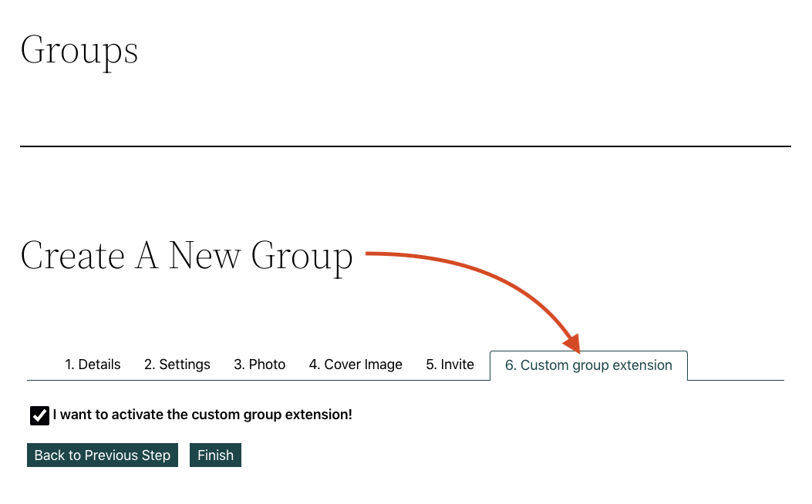
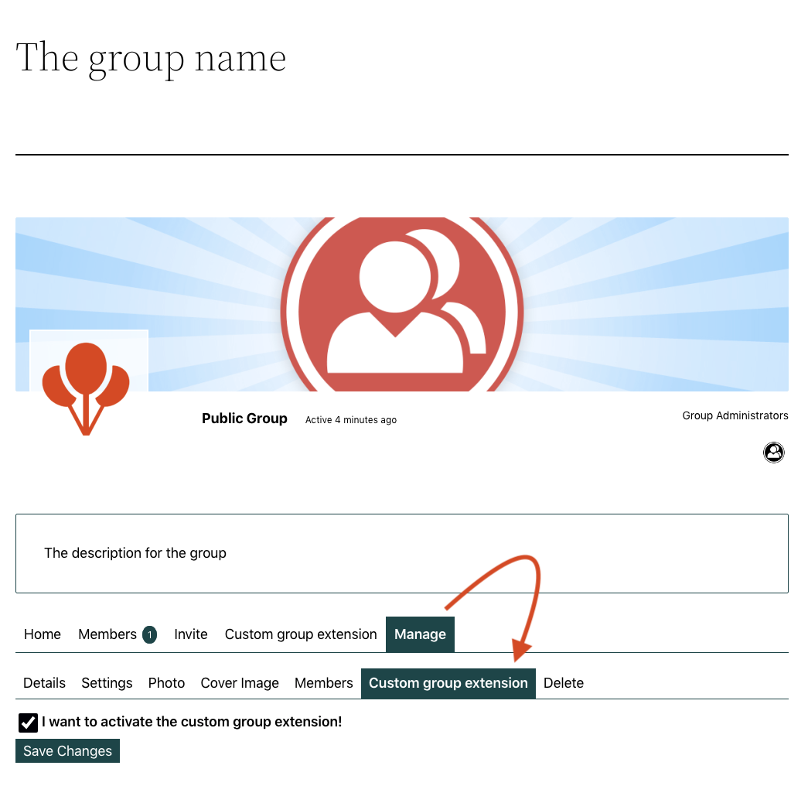
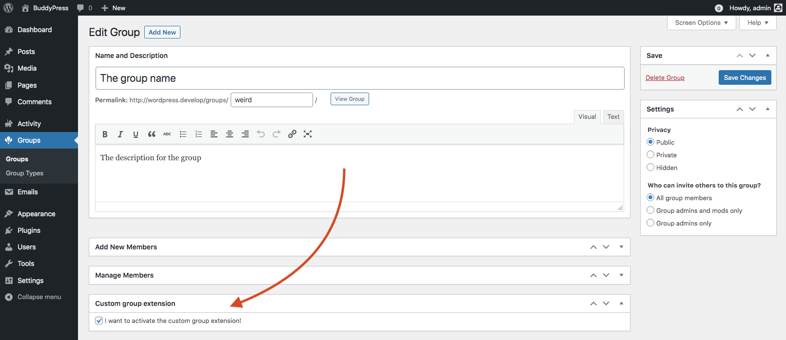

# Group Extension API

The group extension API makes it very easy to add custom creation steps, edit screens, navigation items and pages to a group. It essentially allows you to create fully functional extensions to BuddyPress created groups.

The Group Extension API consists of a base class called `BP_Group_Extension`, which you extend in your own add-on. `BP_Group_Extension` does most of the work necessary to integrate your content into BP group – creating new navigation tabs, registering a step during group creation, etc.

**NB**: the group extension requires the Groups component to be active. Please make sure to wrap your extended class in a `if ( bp_is_active( 'groups' ) ) :` check.

Located inside the `/bp-groups/classes` directory, the `BP_Group_Extension` class will help you to organize your custom group extension. BuddyPress group extensions are registered into the `$group_extensions` property of the `buddypress()->groups` global using the name of your custom class. This registration step needs to be hooked to the `bp_init` action at a priority lower than `11` (you can omit the hook `$priority` argument to use the default one - `10`) and is done passing the name of your class to the `bp_register_group_extension()` function. Below is an example of how you can register your group extension in BuddyPress.

```php
/**
 * Registers the custom group extension.
 */
function bp_custom_add_on_register_group_extension() {
	bp_register_group_extension( 'BP_Custom_AddOn_Group_Extension' );
}
add_action( 'bp_init', 'bp_custom_add_on_register_group_extension' );
```

## Building your group extension’s class

It’s a [WordPress good practice](https://developer.wordpress.org/coding-standards/wordpress-coding-standards/php/#naming-conventions) to put the code of your class into a file having a `class-` prefix followed by your class name where caps are replaced by their corresponding lower case value and underscores by dashes. As our custom group extension's class is named `BP_Custom_Group_Extension`, we are putting its code inside a `class-bp-custom-group-extension.php` file. Let's built it making sure you will inherit from the `BP_Component` parent class using the `extends` keyword.

```php
class BP_Custom_Group_Extension extends BP_Group_Extension {
	/*
	 * The properties and methods of for your group extension's class.
	 */ 
}
```

### Adding the constructor of your class

This is where you are using the `BP_Group_Extension::init()` method to configure your custom group extension. This method expects an associative array where specific keys will be used to define the name & URL slug for your group extension tab within groups, who can access to it, and init additional screens such as the one BuddyPress can load during the group's creation process, or the one to let group Administrators customize some settings about your group extension. Let's build a very basic tab that will be displayed on each single groups.


To get this result, here's how you need to define the arguments of the parameter you will send to the `parent::init()`  method at the end of your constructor.

```php
if ( bp_is_active( 'groups' ) ) {
	/**
	 * BP Custom group extension Class.
	 */
	class BP_Custom_AddOn_Group_Extension extends BP_Group_Extension {
		/**
		 * Your group extension's constructor.
		 */
		public function __construct() {
			$args = array(
				'slug'              => 'custom-group-extension',
				'name'              => __( 'Custom group extension', 'custom-text-domain' ),
				'nav_item_position' => 105,
				'access'            => 'anyone',
				'show_tab'          => 'anyone',
			);

			parent::init( $args );
		}

		/**
		 * Outputs the content of your group extension tab.
		 *
		 * @param int|null $group_id ID of the displayed group.
		 */
		public function display( $group_id = null ) {
			printf( '<p>%1$s %2$s</p>', esc_html__( 'It works! The displayed group ID is', 'custom-text-domain' ), $group_id );
		}
	}
}
```

The above code early introduced the `display()`  method of your group extension's class so that something is actually displayed into groups! Before looking to it more in details, let's first list all possible keys and values for the `$args` configuration array.

### Possible arguments for your configuration array

As we've just seen, the `__construct()` method of your group extension class should be used to pass a set of arguments to the `parent::init( $args )` method. Below are these `$args` possible keys and values:

#### `slug`

**(required)** A unique string identifier for your group extension. Used, among other places, in the construction of URLs.

#### `name`

**(required)** The translatable name of your extension. Used as the default value for navigation items and page titles.

#### `access`

_(optional)_ Which users can visit the group extension’s tab. Possible values: 'anyone', 'loggedin', 'member', 'mod', 'admin' or 'noone'. ('member', 'mod', 'admin' refer to user’s role in the current group.) Defaults to 'anyone' for public groups and 'member' for private groups. Note that the 'mod' level targets only moderators, so if you want to allow access for group moderators and administrators, specify `array( 'mod', 'admin' )`. **This argument was introduced in BuddyPress 2.1.0.**

#### `show_tab`

_(optional)_ Which users can see the group extension’s navigation tab. Possible values: 'anyone', 'loggedin', 'member', 'mod', 'admin' or 'noone'. ('member', 'mod', 'admin' refer to user’s role in the current group.) Defaults to 'anyone' for public groups and 'member' for private groups. Note that the 'mod' level targets only moderators, so if you want to show the tab to group moderators and administrators, specify `array( 'mod', 'admin' )`. **This argument was introduced in BuddyPress 2.1.0.**

#### `show_tab_callback`

_(optional)_ The name of the function to use to define the `show_tab` argument. If you need to check for a specific setting to define whether or not your group extension tab should be shown to members, the static `show_tab` argument won't reply to your need. Use the `show_tab_callback` argument so that your callback function will be called once BuddyPress has set everything about the displayed group. Your callback function needs to return one of the possible values of the `show_tab` one. **This argument was introduced in BuddyPress 12.0.0.**

#### `nav_item_position`

_(optional)_ An integer describing where your extension’s tab should appear. A number between `1` and `100` is recommended. Defaults to `81`.

#### `nav_item_name`

_(optional)_ The string you want to appear in the navigation tab for your group extension. Defaults to the value of the `name` argument, described above.

#### `template_file`

_(optional)_ The template file that BuddyPress will use as a wrapper to display the content of your group extension. Defaults to  `groups/single/plugins.php`. This template is provided by built-in BP Template Packs (nouveau & legacy). If you are building a BuddyPress standalone theme, please make sure to provide this template.

#### `screens`

_(optional)_ A multi-dimensional array of options related to the three secondary “screens” available to group extensions: `create` (the step dedicated to the extension during the group creation process), `edit` (the subtab dedicated to the extension under the Admin tab of the group), and `admin` (the extension’s metabox that appears on the group page when editing via the Groups Administration Dashboard panels). Each of these screens has a set of configuration options, to be described below. Note that all config values are optional, and you only need to override those values where you want to change the default – BuddyPress will parse your `screens` array, using your provided values when available, otherwise falling back on the defaults.

- `create` – Config options for the `create` screen
  - `position` – The position of the group extension’s step in the Create a Group process. An integer between `1` and `100` is recommended. Defaults to `81`.
  - `enabled` – `true` if you want your group extension to have a Create step, otherwise `false`. Defaults to `true`.
  - `name` – The name of the creation step, as it appears in the step’s navigation tab. Defaults to the general `name` value described above.
  - `slug` – The string used to create the URL of the creation step. Defaults to the general `slug` value described above.
  - `screen_callback` – The function BuddyPress will call to display the content of your create screen. BuddyPress attempts to determine this function 
  automatically; see Methods below. Do not change this value unless you know what you’re doing.
  - `screen_save_callback` – The function BuddyPress will call after the group extension’s create step has been saved. BuddyPress attempts to determine this 
  function automatically; see Methods below. Do not change this value unless you know what you’re doing.

- `edit` – Config options for the ‘edit’ screen, a sub item of the Group's Manage item on the front-end.
  - `submit_text` – The text of the submit button on the edit screen. Defaults to 'Edit'.
  - `enabled` – `true` if you want your group extension to have a subtab in the Group Admin area, otherwise `false`. Defaults to `true`.
  - `name` – The text that appears in the navigation tab for the group extension’s Edit screen. Defaults to the general `name` value described above.
  - `slug` – The string used to create the URL of the admin tab. Defaults to the general `slug` value described above.
  - `screen_callback` – The function BuddyPress will call to display the content of your admin tab. BuddyPress attempts to determine this function automatically; 
  see Methods below. Do not change this value unless you know what you’re doing.
  - `screen_save_callback` – The function BuddyPress will call after the group extension’s admin tab has been saved. BuddyPress attempts to determine this 
  function automatically; see Methods below. Do not change this value unless you know what you’re doing.

- `admin` – Config options for the `admin` screen, available from the "Groups" administration menu of your WordPress Dashboard (_Group Admin area_).  
  - `metabox_context` – The context for your group extension’s metabox. Defaults to `'normal'`. (See [add_meta_box()](https://developer.wordpress.org/reference/functions/add_meta_box/) for more details.)
  - `metabox_priority` – The priority for your group extension’s metabox. Defaults to `''`. (See [add_meta_box()](https://developer.wordpress.org/reference/functions/add_meta_box/) for more details.)
  - `enabled` – `true` if you want your group extension to have a subtab in the _Group Admin area_, otherwise `false`. Defaults to `true`.
  - `name` – The text used as the title for the meta box of your group extension’s Admin screen. Defaults to the general `name` value described above.
  - `slug` – The string used as the meta box ID (used in the `id` attribute for the meta box). Defaults to the general `slug` value described above.
  - `screen_callback` – The function BuddyPress will call to display the content for the meta box of your group extension’s Admin screen. BuddyPress attempts to 
  determine this function automatically; see Methods below. Do not change this value unless you know what you’re doing.
  - `screen_save_callback` – The function BuddyPress will call to save your group extension’s admin settings during the Group admin settings update. BuddyPress 
  attempts to determine this function automatically; see Methods below. Do not change this value unless you know what you’re doing.

### Available Methods for your group extension’s class

`BP_Group_Extension` has built-in support for a number of different customization methods, which you can override in your group extension’s class as needed.

#### `display()`
The most prominent of these methods is `display()`, which BuddyPress uses to generate the output of the add-on’s main tab. It includes the `$group_id` argument so that you can customize your output according to the current displayed group. Your `display()` method should echo markup, which BuddyPress will automatically place into the proper template. As a reminder, below is the code we used in our very basic example of a group extension's class.

```php
if ( bp_is_active( 'groups' ) ) {
	class BP_Custom_AddOn_Group_Extension extends BP_Group_Extension {
		public function __construct() { /* Your group extension's constructor. */ }

		/**
		 * Outputs the content of your group extension tab.
		 *
		 * @param int|null $group_id ID of the displayed group.
		 */
		public function display( $group_id = null ) {
			// You need to echo the markup.
			printf( '<p>%1$s %2$s</p>', esc_html__( 'It works! The displayed group ID is', 'custom-text-domain' ), $group_id );
		}
	}
}
```

#### Other screen methods
For the three “screen” contexts – `create`, `edit`, and `admin` – a flexible system allows you to customize the way that your group extension’s screens work, without unnecessary reproduction of code. Your group extension should, **at minimum**, provide the following two methods if you defined one or more screen context into your configuration array:

- `settings_screen()`: outputs the fallback markup for your `create` / `edit` / `admin` screens.
- `settings_screen_save()`: called after changes are submitted from the `create` / `edit` / `admin` screens. This method should contain the logic necessary to catch settings form submits, validate submitted settings, and save them to the database.

**NB**: these 2 methods include the `$group_id` argument so that you can customize your output/handler according to the current group being created, edited or administrated.

Let's improve our example of basic group extension including a feature to let the creator/administrator of the group decide whether they want to "activate" the group extension main tab for their group.

||||
|:-:|:-:|:-:|
|Create screen|Edit screen|Admin screen|

As shown above, we need to output a form on the group’s `create`, `edit` & `admin` screens. The first step is to edit the configuration array (`$args`) the `__construct()` method is sending to `BP_Group_Extension::init()` so that it includes a `$screens` argument and a `$show_tab_callback` argument. The first will define the screens we need to add, and the second one will set the callback function to use to check whether to display the group’s extension main tab or not. Here's how the configuration array should look like:

```php
$args = array(
	'slug'              => 'custom-group-extension',
	'name'              => __( 'Custom group extension', 'custom-text-domain' ),
	'nav_item_position' => 105,
	'access'            => 'anyone',

	// Set the callback function defining the `$show_tab` argument dynamically.
	'show_tab_callback' => array( $this, 'show_tab' ),

	// Define the screens using default screen settings.
	'screens'           => array(
		'edit'   => array(),
		'create' => array(),
		'admin'  => array(),
	),
);
```

**NB**: if you need your group extension to be back compatible with version of BuddyPress < 12.0.0, you'll need to add a conditional statement to use the `$show_tab` argument instead of the `$show_tab_callback` one. Here’s an example of how to add it:

```php
// BuddyPress < 12.0.0 or BuddyPress >= 12.0.0 with the BP Classic backcompat plugin active.
if ( ! function_exists( 'bp_core_get_query_parser' ) || 'legacy' === bp_core_get_query_parser() ) {
	$args['show_tab'] = $this->show_tab();
	unset( $args['show_tab_callback'] );
}
```

**NB**: note that in the above code, we are not setting the callback function but running it. This means as it doesn’t include the `$group_id` in this case, you’ll need to use the `bp_get_current_group_id()` to set it within your `show_tab()` method. For example:

```php
/**
 * Checks whether the main group extension’s tab should be displayed.
 *
 * @param int|null $group_id ID of the displayed group.
 * @return string 'anyone' if the group extension’s tab should be displayed. 'noone' otherwise.
 */
public function show_tab( $group_id = null ) {
	if ( ! $group_id ) {
		$group_id = bp_get_current_group_id();
	}

	$show_tab = 'noone';
	if ( $group_id && groups_get_groupmeta( $group_id, 'bp_custom_group_extension_is_active' ) ) {
		$show_tab = 'anyone';
	}

	return $show_tab;
}
```

The second step is to code the `settings_screen()` & `settings_screen_save()` methods so that each screen will output a form and handle its submission. Here's how these should look like into your group extension’s class:

```php
if ( bp_is_active( 'groups' ) ) {
	class BP_Custom_AddOn_Group_Extension extends BP_Group_Extension {
		public function __construct() { /* Your group extension's constructor. */ }
		public function display( $group_id = null ) { /* Outputs the content of your group extension tab. */ }

		/**
		 * Outputs a form to activate the extension on 'edit', 'create' & 'admin' screens.
		 *
		 * @param int|null $group_id ID of the displayed group.
		 */
		public function settings_screen( $group_id = null ) {
			$active = (int) groups_get_groupmeta( $group_id, 'bp_custom_group_extension_is_active' );
			printf(
				'<label><input type="checkbox" name="bp_custom_group_extension_is_active" value="1" %1$s>%2$s</input></label>
				<input type="hidden" name="bp_custom_group_extension_was_active" value="%3$s">',
				checked( $active, true, false ),
				esc_html__( 'I want to activate the custom group extension!', 'custom-text-domain' ),
				$active
			);
		}

		/**
		 * Activate or Deactivate the group extension from 'edit', 'create' or 'admin' screens.
		 *
		 * @param int|null $group_id ID of the displayed group.
		 */
		public function settings_screen_save( $group_id = null ) {
			$was_active = 0;
			$is_active  = 0;

			if ( isset( $_REQUEST['bp_custom_group_extension_was_active'] ) ) {
				$was_active = intval( wp_unslash( $_REQUEST['bp_custom_group_extension_was_active'] ) );

				if ( isset( $_REQUEST['bp_custom_group_extension_is_active'] ) ) {
					$is_active = intval( wp_unslash( $_REQUEST['bp_custom_group_extension_is_active'] ) );
				}

				if ( $was_active && ! $is_active ) {
					groups_delete_groupmeta( $group_id, 'bp_custom_group_extension_is_active' );
				} elseif ( ! $was_active && $is_active ) {
					groups_update_groupmeta( $group_id, 'bp_custom_group_extension_is_active', $is_active );
				}
			}
		}
	}
}
```

Finally, If your extension requires further customization to one or more of the screens, BuddyPress provides the following methods, which are context-specific:

- `create_screen()`: outputs the fallback markup for your `create` screen.
- `create_screen_save()`: called after changes are submitted from the `create` screen. This method should contain the logic necessary to catch settings form submits, validate submitted settings, and save them to the database.
- `edit_screen()`: outputs the fallback markup for your `edit` screen.
- `edit_screen_save()`: called after changes are submitted from the `edit` screen. This method should contain the logic necessary to catch settings form submits, validate submitted settings, and save them to the database.
- `admin_screen()`: outputs the fallback markup for your `admin` screen.
- `admin_screen_save()`: called after changes are submitted from the `admin` screen. This method should contain the logic necessary to catch settings form submits, validate submitted settings, and save them to the database.

**NB**: these methods include the `$group_id` argument so that you can customize your output/handler according to the current group being updated.

If your extension contains any of these methods, BuddyPress will use them when appropriate. Otherwise, the generic `settings_screen()` or `settings_screen_save()` will be used.
