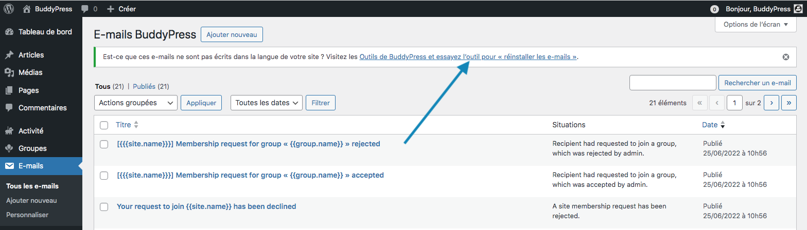
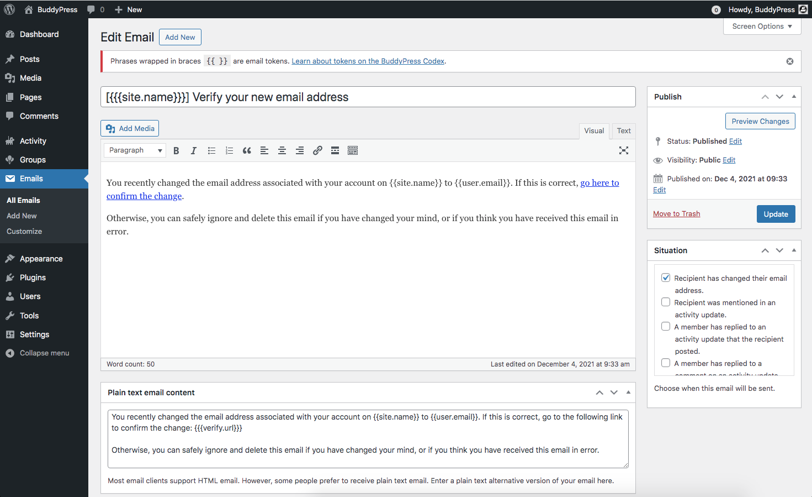
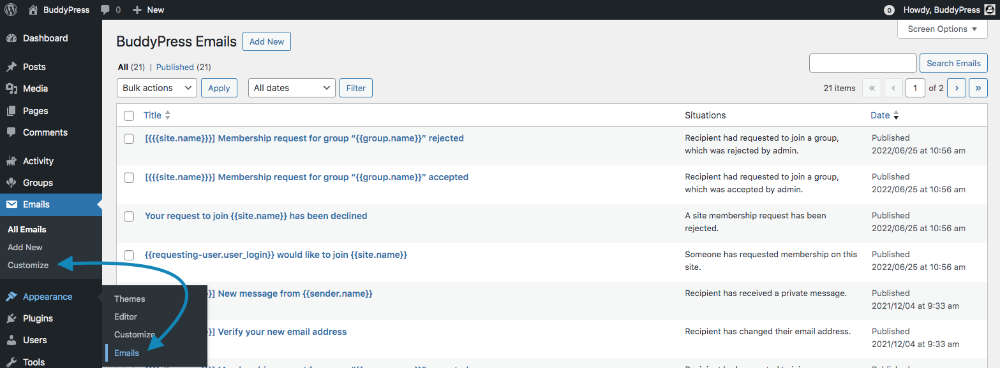
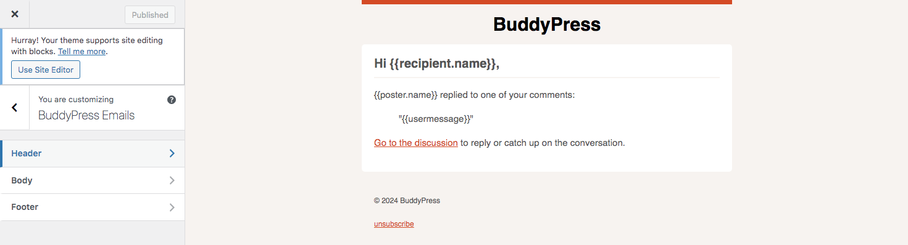
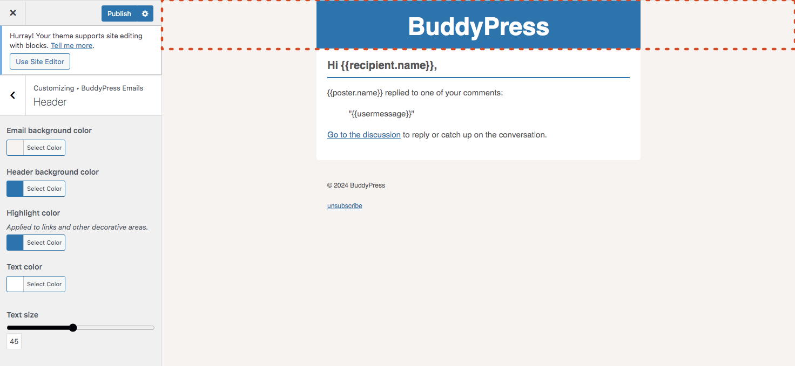
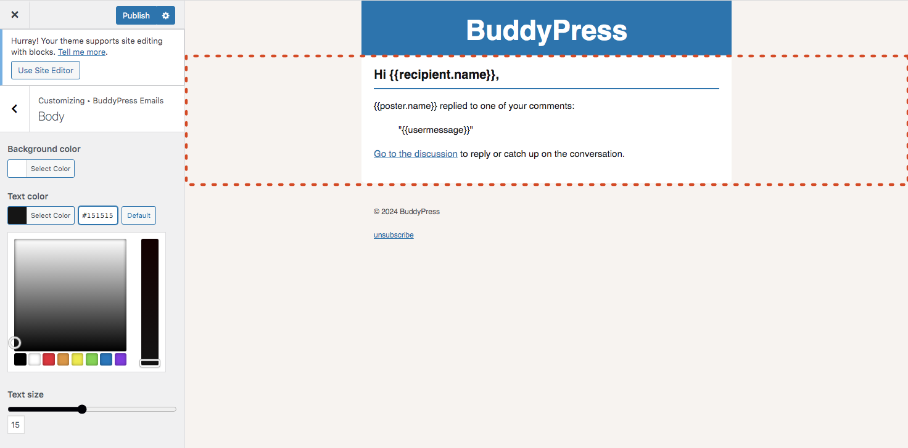
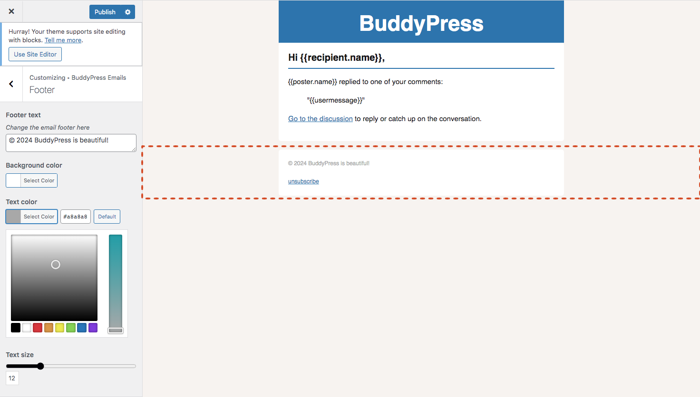

# BuddyPress Emails

BuddyPress comes with a customizable email API (introduced in version 2.5). This API is primarly used by the BuddyPress Core, Members and optional components to inform members of your community about specific events or interactions they are involved in. We call these events/interactions: "**situations**".

For instance, the very first email a member will receive is about the "_Recipient has registered for an account_" situation. Concretely, the BuddyPress Members component is using the email the new user filled into the community registration form to send a verification email to make sure there's a human behind this email address. The email's content is containing an activation link to let the new user confirms he's joining your great community site.

## Managing all situation emails

BuddyPress adds an "Emails" top level menu item to your main WordPress Dashboard navigation to let you customize the title and/or content of these emails to better suits your community vibes. The very first type of customization you may need is using emails into your site language.

If Emails are not into your site language, clicking on the link displayed into the administration notice will bring you to the [BuddyPress Repair Tools](.././tools/repair.md#reinstall-emails) so that you can use the one to completely reinstall all BuddyPress Emails.

### Editing a situation email

Editing an Email is very much like editing a post or page. The main difference here is the use of **tokens**. **Tokens** are variable strings surrounded with double or triple braces that will get replaced with dynamic content when the email gets sent.

> [!IMPORTANT]
> We advise you to leave them the way they are so that when a situation happens, BuddyPress can safely merge dynamic data with the email body or subject.

That being said, you can edit the rest of the text like you wish. From the BuddyPress Emails list, click on the title/subject of the Email you need to edit the content for to open the Classic Editor and start customizing it.

The "Situations" meta box is for selecting the action that triggers the sending of an email. Note that not all tokens are available for every situation trigger. Read the [tokens documentation page](../emails/tokens.md) to learn which tokens will work for your selected situation.

> [!IMPORTANT]
> We advise you to leave the selected situation the way it is so that the right BuddyPress Email is used when it happens.

BuddyPress Emails are multipart emails: they always include an HTML part and a Text part in case the receiver's Email client do not support HTML emails. If you edit the HTML part of your BuddyPress Email thanks to the Classic Editor, we advise you to also edit the Plain text part of it accordingly.

## Customizing the BuddyPress Emails design

BuddyPress uses the WordPress Customizer to let you customize the design of all BuddyPress Emails. You can access the BuddyPress Email Customizer using the "Customize" sub menu item of your WordPress Dashboard **Emails** top level menu or the "Emails" sub menu item of your WordPress Dashboard **Appearance** top level menu.

Once you clicked on one of these sub menu items, you're directed into the BuddyPress Emails Customizer. As all BuddyPress Emails share the same template, the BuddyPress Emails Customizer will randomly pick one of the Email Situations so that you can preview the design changes you're performing.

You can customize the 3 sections of the BuddyPress Email by clicking on the Customizer's corresponding panels.

### Header

Inside this Customizer panel, you can change the Email's global background color, the Email's header background and text color, the highlight color for links and other decorative elements of the entire Email and the hearder's text size.

### Body

Inside this Customizer panel, you can change the Email's body background color, the Email's body text color and the body's text size.

### Footer

Inside this Customizer panel, you can change the Email's footer text, its background & text color, as well as the footer's text size.
