# BuddyPress Group Types

The BuddyPress Group Types feature categorizes community groups into distinct categories, enhancing the management and personalization of group experiences within the community.

## Overview

BuddyPress Group Types allow for categorizing and managing groups in a community. This feature enables better organization and targeted interaction. It is useful in educational institutions for differentiating between classes, clubs, and project teams. It helps distinguish between departments, project teams, and interest-based groups in corporate environments, facilitating efficient communication and fostering a sense of community among employees.

## Managing Group Types

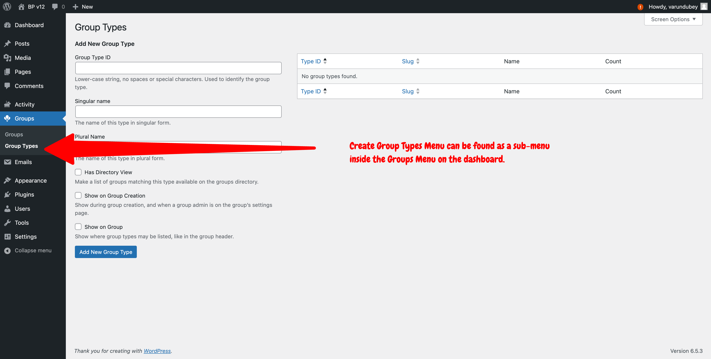

To manage group types, you simply need to open the corresponding Groups' submenu of your Dashboard left menu bar as shown in the above screenshot.

### Add Group Type:

Once you reach the Group Types administration screen, you can use the form on the left part of the screen to define the properties of your group type and click on the "Add new Group Type" blue button at the bottom of the form when you're happy with the properties you defined. Here are what inputs are used for within BuddyPress:

#### Group Type ID

It's your unique identifier for your group type. It's a required field and you need to use regular & lower-case characters to fill this input. As this value is used as a fallback to the URL portion of the Group type directory link, make sure to choose wisely this identifier.

#### Singular name

This name will be shown in various places such as the group's metabox to set their group type (which is available in the WP-Admin screen to edit a specific group) or the group's header of their front-end pages (if the Show on Group checkbox is activated).

#### Plural name

It's the plural form of the group type name.

#### Has Directory View

When this checkbox is active, you'll be able to filter the Groups directory according to a specific group type. FYI, a Group Type URL looks like this `https://site.url/groups/type/groupTypeSlug`. If you need to use a different URL portion to list groups having a specific Group Type inside the Groups directory, you can use the Custom type directory slug input that appears as soon as you activate the Has Directory View checkbox.

#### Show on Group Creation

Activate this checkbox if you want to show this group type during group creation and when a group admin is on the group’s settings front-end page.

#### Show on Group

Activate this checkbox if you want the Group's Group Type information to be displayed on their front-end pages header.

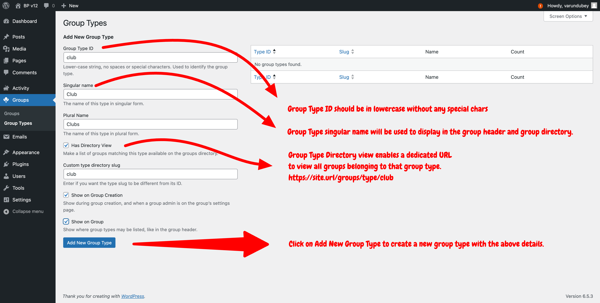

Once saved, an admin notice at the top of the screen will confirm you successfully added a new group type 👏. The table on the right part of the screen will contain a new specific row so that you can edit or remove this group type.

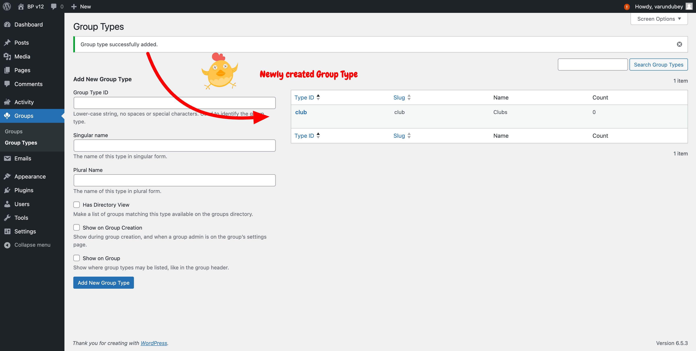

### Edit Group Type:

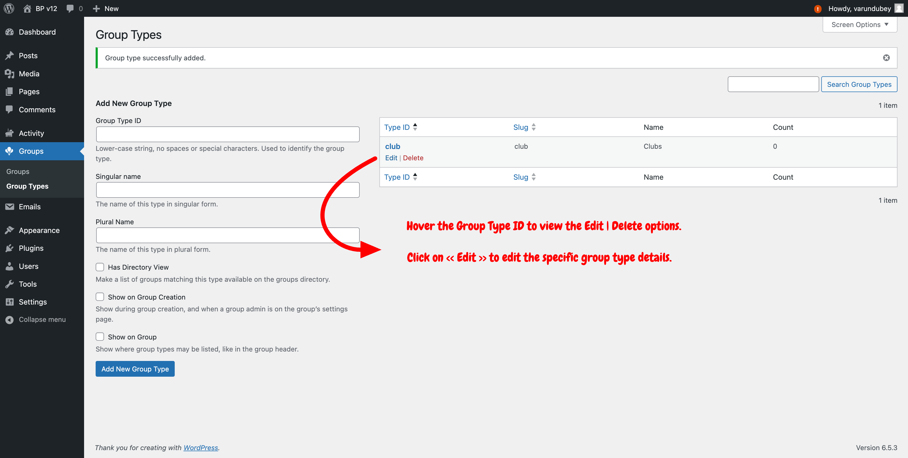

When you need to edit a group type, go back to the Group types administration of your dashboard to find the table listing all available group types. Hover the group type ID you need to edit so that action links will appear right under this ID. Click on the Edit link to reach the Edit form shown below.

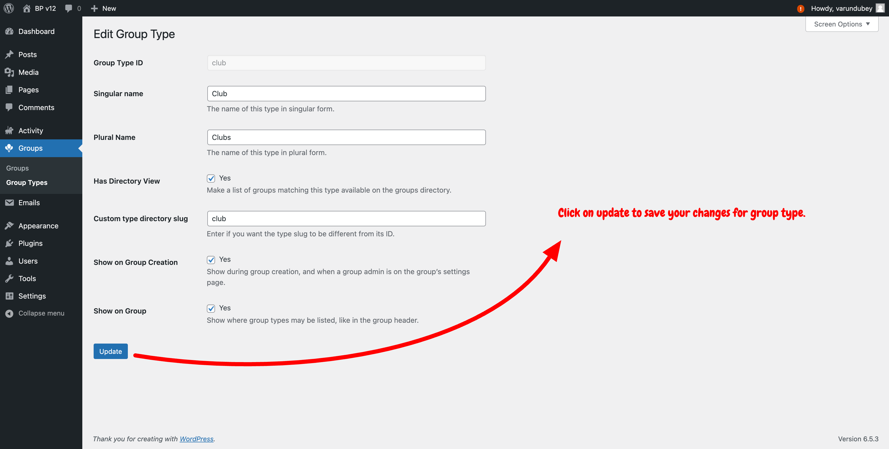

Once you're satisfied with your changes, click on the "Update" blue button to save them. The page will be reloaded to display the same form with applied changes and an Admin notice at the top of the screen will confirm you successfully updated your group type properties. The link inside this notice brings you back to the screen listing all available group types.

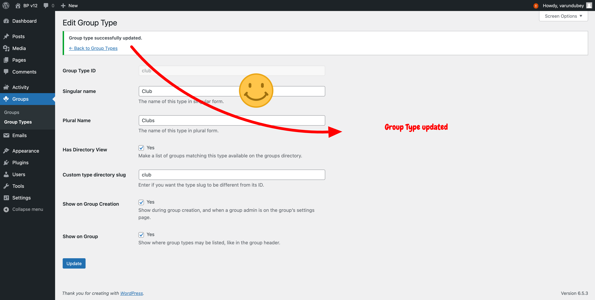

### Delete Group Type:

Deleting a group type is very similar to editing a group type. The only difference will be that instead of clicking on the "Edit" link, you'll click on the "Delete" one. 

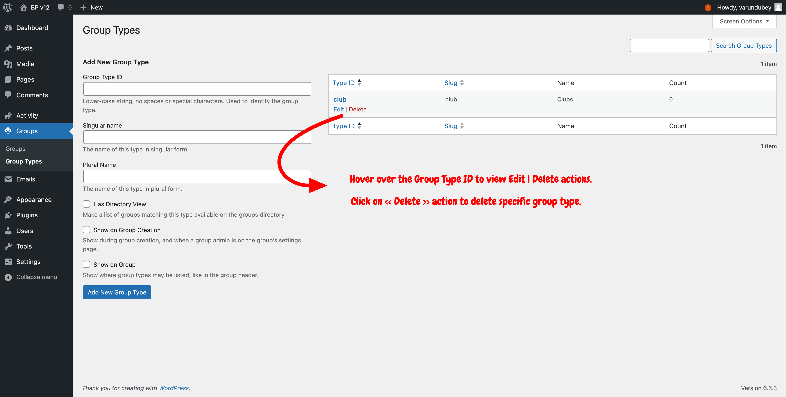

This time, the main Group types administration screen will be directly reloaded and a notice will confirm you successfully deleted the group type. The corresponding row won't be listed in the table on the right part of the screen anymore.

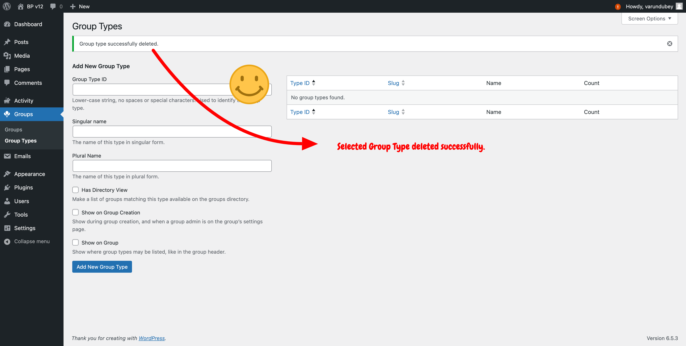

### Considerations for Creating Group Types:

- **Uniqueness**: Ensure each group type has a unique identifier to avoid conflicts.
- **Descriptiveness**: Choose clear and descriptive names and labels for group types to ensure they are easily understandable by administrators and community members.

## Assigning Group Types

Administrators can assign Group Types manually through the WordPress Dashboard or programmatically through custom code. Additionally, members can select available group types while creating groups if they are allowed to create groups. This flexibility allows for individual and bulk group-type assignments, catering to the needs of large and diverse communities.

### Methods of Assignment:

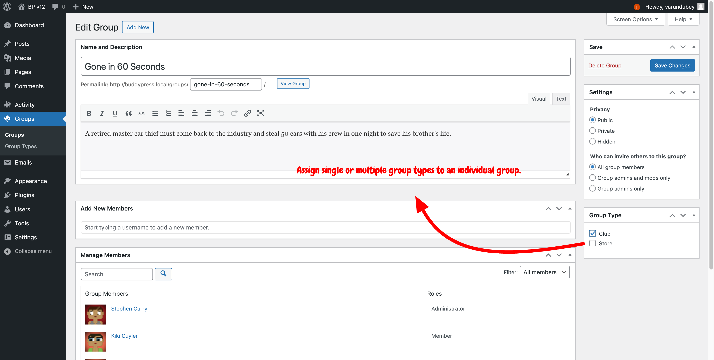

- **Manual Assignment:** as show above, a Group Type metabox is available for administrators to assign or change a group type through the WP-Admin screen to edit a specific group. It's also possible to assign or change a group type on the front-end from the Group's settings creation step/management page when you set the "Show on Group Creation" property to checked.
- **Bulk Assignment:** as show below, administrators can assign group types to multiple groups at once from the WP Admin screen listing all existing groups, streamlining the process for large group directories. To bulk assign a group type, activate the checkboxes next to the groups' avatars, select a Group Type from the dropdown list, and click the "change" button beside the dropdown.

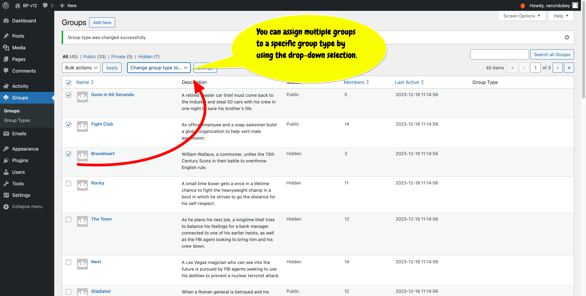

**Important:** when bulk assigning a group type to groups, groups already having one or more group types will be reassigned to the group type selected for the bulk action.

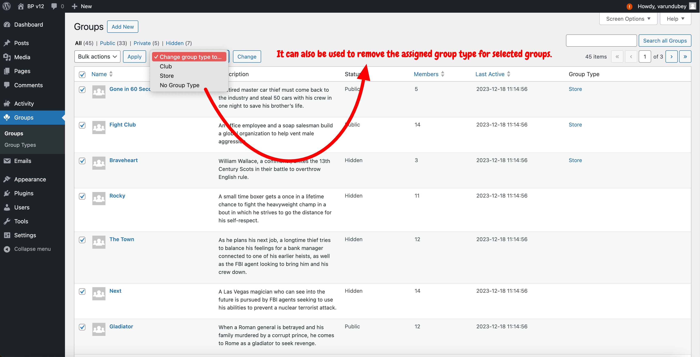

If you need to remove all group types of many groups, you can do so selecting the "No Group Type" choice of the Group Type's select box.
