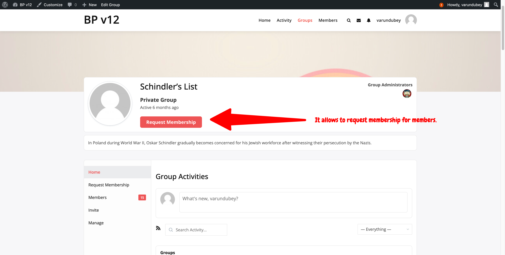
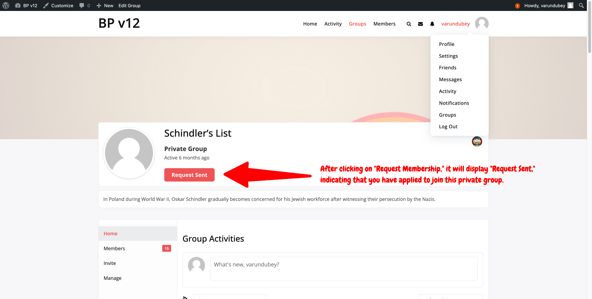
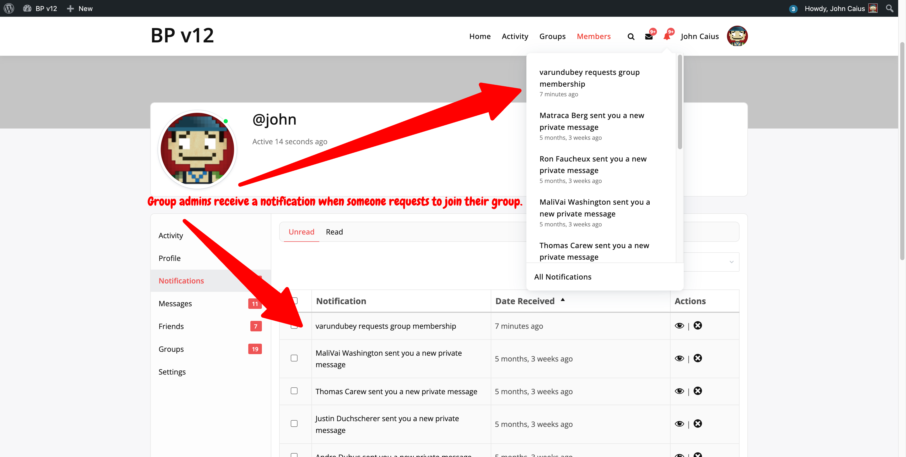
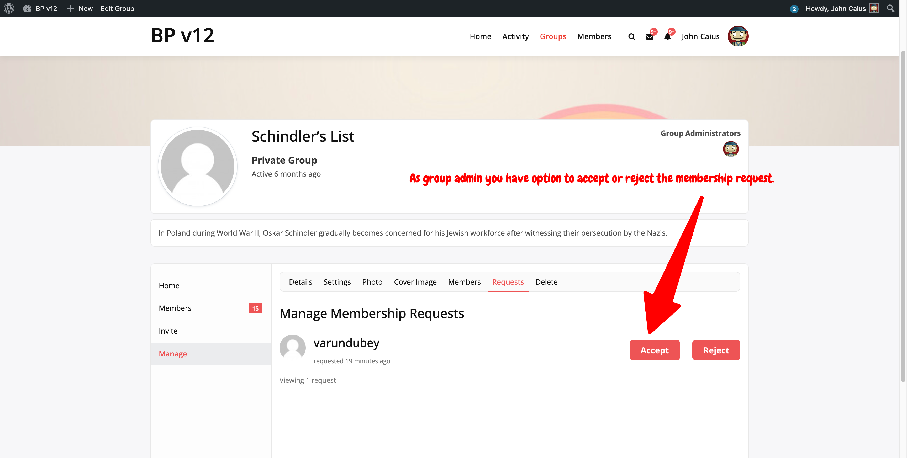
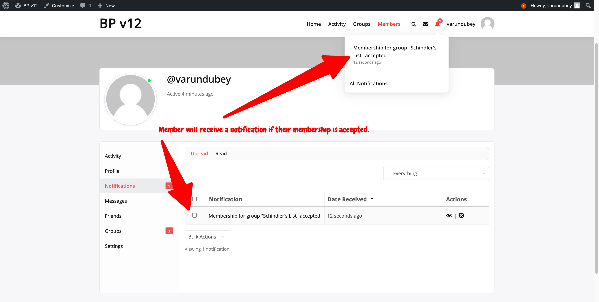
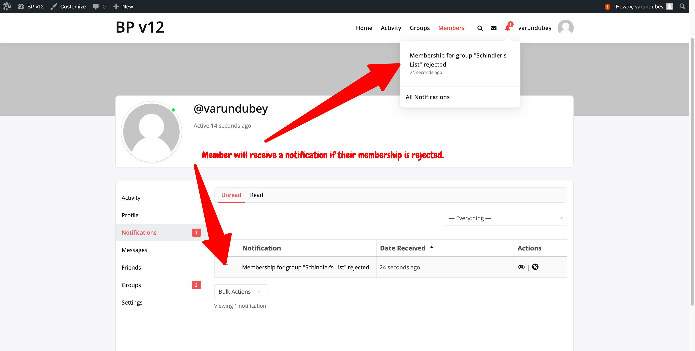

# How to Join a Private Group in BuddyPress

Joining a private group in BuddyPress involves a few steps. Below is a step-by-step guide to help you through the process.

## Step 1: Find the Group

1. **Navigate to the Groups Directory**:

   - Go to the main navigation menu on your BuddyPress site.
   - Click on "Groups" to access the Groups Directory.

2. **Search for the Group**:
   - Use the search bar to find the private group you want to join.
   - You can also browse through the listed groups to find the one you're interested in.

## Step 2: Request Membership

1. **Visit the Group's Page**:

   - Click on the name of the group you wish to join to visit its page.

2. **Request Membership**:

   - On the group’s page, you will see a button that says "Request Membership".
   - Click this button to send a membership request to the group admin.

   

## Step 3: Await Approval

1. **Wait for Approval**:

   - After requesting membership, you will need to wait for the group admin to approve your request.

   

   - The group admin will be notified of your request and will either approve or deny it.

2. **Group Admin Options**:

   - Group admin will receive a notification once your request has been reviewed.
     
   - If approved, you will become a member of the private group.
     

   - If denied, member can try contacting the group admin for more information.

3. **Member Notification**:

   - The member will be notified based on their request to either approve or deny it.

   

   

## Additional Information

- **Private Groups**: Private groups require approval from a group admin to join. Your request to join must be approved before you can participate in the group activities and view group content.
- **Group Admins**: Only group admins have the authority to approve or deny membership requests. If you have questions about your request, it is best to contact the admin directly.
