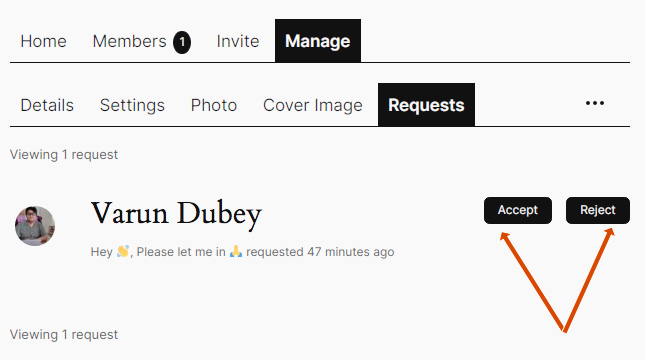

# Joining BuddyPress Groups

There are 4 ways to join a BuddyPress Group for a community member:
1. Directly opting-in from the Groups directory or the Group's single page: this way is only available to **public** groups.
2. Requesting to become a member of a **private** group from the Groups directory or the Group's single page.
3. Being invited by another community user who is already a member of the group: this way is available to all kind of groups (public, private or hidden).
4. Being added to any kind of group (public, private or hidden) by the community Administrator. This 4th way is documented into the Groups Administration chapters.

## 1. Group's direct membership

Logged in members can directly become members of any **public** group. The button to join a public group is available at two places:

- Inside each public Group's description of the Groups directory.
- Inside the displayed single Group's header.

|||
|:-:|:-:|
|From the Groups Directory|From the Group’s single pages|

## 2. Group's membership request

Logged in members can join **private** groups using this two-steps process:
- first, they request a membership to the private Group admin(s),
- then, they wait for one of the private Group admins to approve or deny their request.

The button to send this request can be found at three places:
- Inside each private Group's description of the Groups directory.
- Inside the displayed single Group's header.
- Using the single Group’s membership request form. The interest of this last place is that members can motivate their request using the optional multiline field.

||||
|:-:|:-:|:-:|
|From the Groups Directory|From the Group’s single pages|From the Group's membership request form|

As shown in the below screen capture, the private Group's admins will be notified a new membership request is awaiting their approval. They'll be able to manage this request from the Group’s management area.

As soon as this membership request is approved or denied, the corresponding member is notified of the Group's admins decision.

> [!NOTE]
> Private Groups require approval from one the Group's admins to join. The members request to join must be approved before they can participate in the group activities and view group content.
> Only Group Admins have the authority to approve or deny membership requests. If members have questions about their request, it is best to contact one the Group's admins directly.

## 3. Group's invitation

This is the only way for a logged in member to join an **Hidden Group**. All kind of groups (public, private or hidden) include a specific area to let other members of the group to invite their friends (or any member when using the BP Nouveau template pack).

Above is a screen capture the logged in members profile area where they can manage their group invitations.

> [!NOTE]
> Group creators and admins can restrict the power to invite others to join a group to Group's admins and/or mods.
