# Navigation menus

WordPress comes with various Administration interfaces to manage the navigation menus of your Website:

1. The [Appearance Menus Screen](https://wordpress.org/documentation/article/appearance-menus-screen/) (no more used by WordPress by default since version 6.0).
2. The [Customizer's Menus panel](https://wordpress.org/documentation/article/customizer/#menus). 
3. The [Site Editor Navigation](https://wordpress.org/documentation/article/site-editor-navigation/).

BuddyPress lets you include specific BP Menu items to your Website Navigation Menus using these Interfaces. There are two kinds of BP Menu items:

- **BP Directory** items: these items are linking to components’ directory pages such as the Members directory.
- **BP Member** items: these items are linking to the logged in member profile pages such as the member's personal activities.

Let's discover how you can use both item kinds within the 3 WordPress menu interfaces.

## Appearance Menus Screen

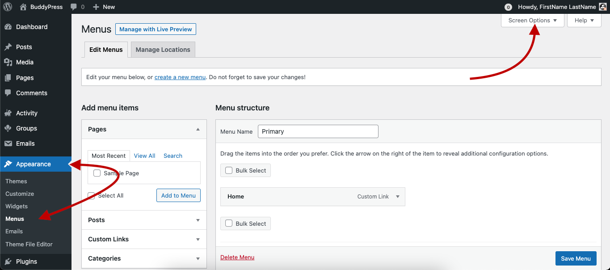

The very first thing you need to give a look at is whether the BP Menu items are available into the Menu Accordion UI. Click on the **Screen Options** tab at the top right of the screen to make them appear.

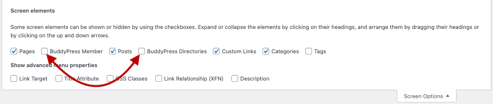

### BuddyPress Directories

Let's activate the corresponding checkbox into the **Screen Options** so that the BP Directories panel of the left part of the screen is shown.

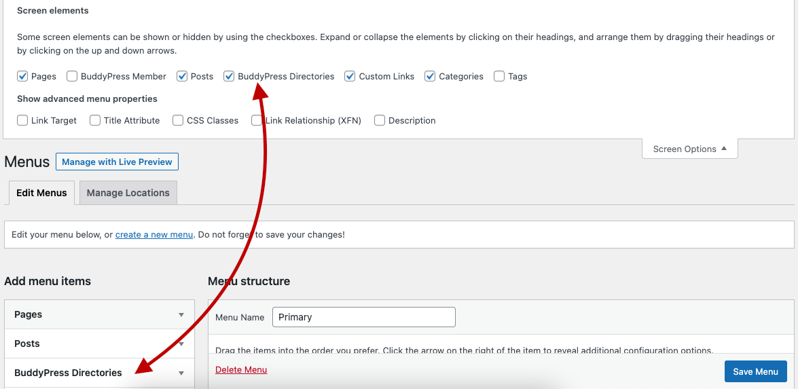

**NB**: Versions of BuddyPress lower than 12.0.0 used to create regular WordPress pages for the components’s directory pages. If you are still using one of these versions, you'll find the directory pages inside the **Pages** panel.

You can click on the BP Directories panel’s right arrow to list the available directory pages.

|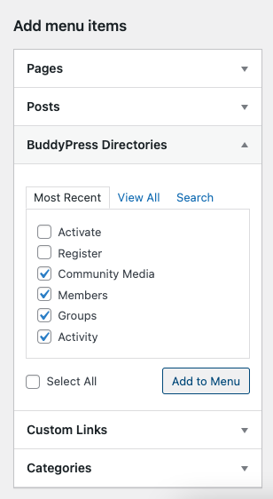|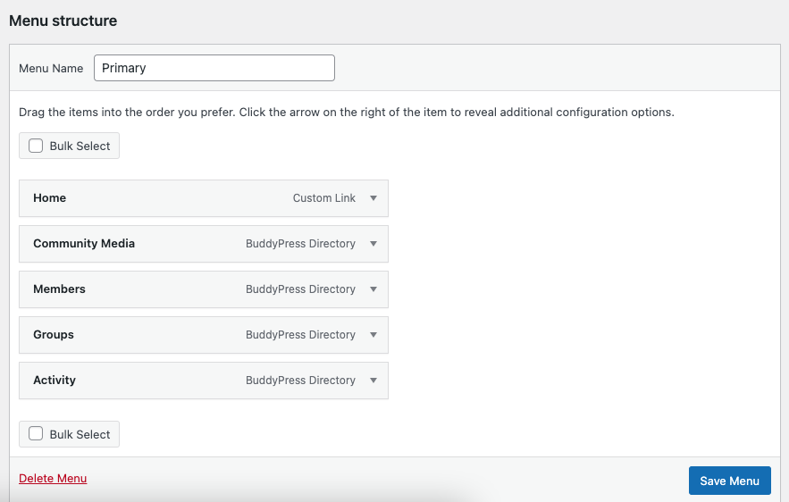|
|:-:|:-:|
|Left side of the Menus Accordion UI|Right side of the Menus Accordion UI|

Activate, on the left, all BP Directories checkboxes you need to add to your menu before clicking on the **Add to Menu** button. Once done, you'll see, on the right, added Menu items. Don’t forget to click on the Save Menu button! Below is a screenshot of the created menu having the Twenty Nineteen theme active.

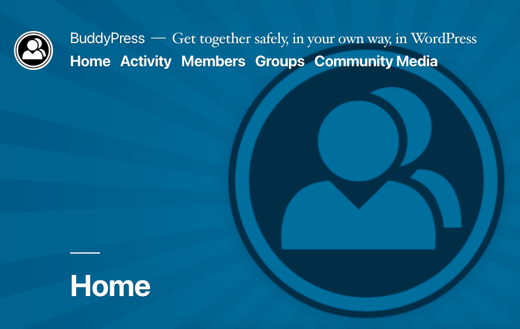

PS: the *Community Media* item is only available when the [BP Attachments Add-on](https://wordpress.org/plugins/bp-attachments/) is active.

### BuddyPress Member

Let's activate the corresponding checkbox into the **Screen Options** so that the BP Member panel of the left part of the screen is shown.

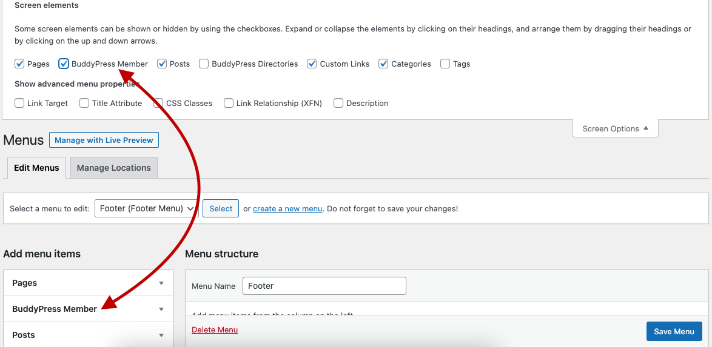

You can click on the BP Member panel’s right arrow to list the available member pages.

|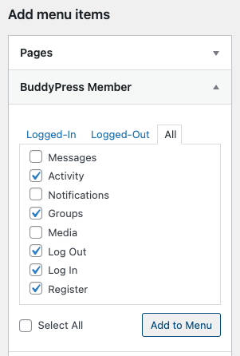|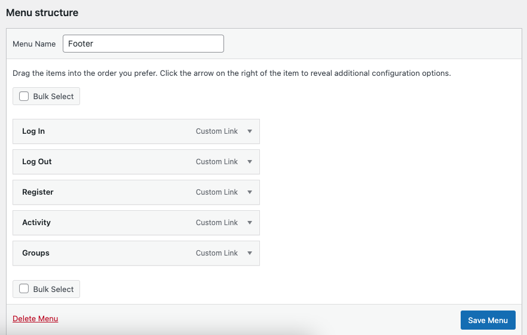|
|:-:|:-:|
|Left side of the Menus Accordion UI|Right side of the Menus Accordion UI|

Activate, on the left, all BP Member pages checkboxes you need to add to your menu before clicking on the **Add to Menu** button. Once done, you'll see, on the right, added Menu items. Don’t forget to click on the Save Menu button! Below is a screenshot of the created menu having the Twenty Nineteen theme active.

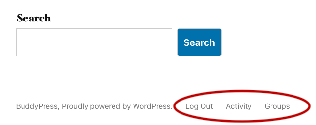

You may have noticed the **Log in** and **Log out** links were both added to the Menu. When the user is logged in, only the **Log out** link will be displayed as shown above. On the contrary, if the user is not logged in only the **Log in** and eventually the **Register** items will be displayed as shown below.

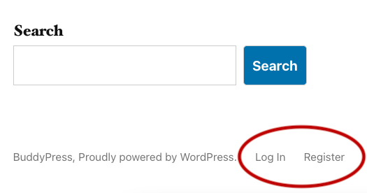

## Customizer's Menus panel

Once you've reached the Menu you need to edit from the Customizer, click on the **Add Items** button to display the type of available menu items. The BP Menu Items can be added from the BuddyPress Directories, the BuddyPress (logged-in) & the BuddyPress (logged-out) panels.

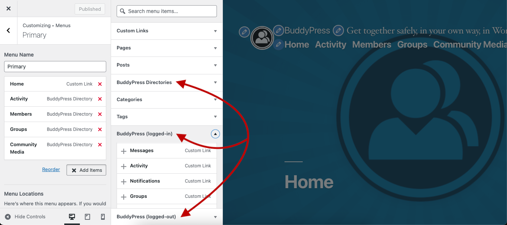

## Site Editor Navigation

Finally, for now, only the BP Directory pages are available from the WordPress navigation block of the site editor.

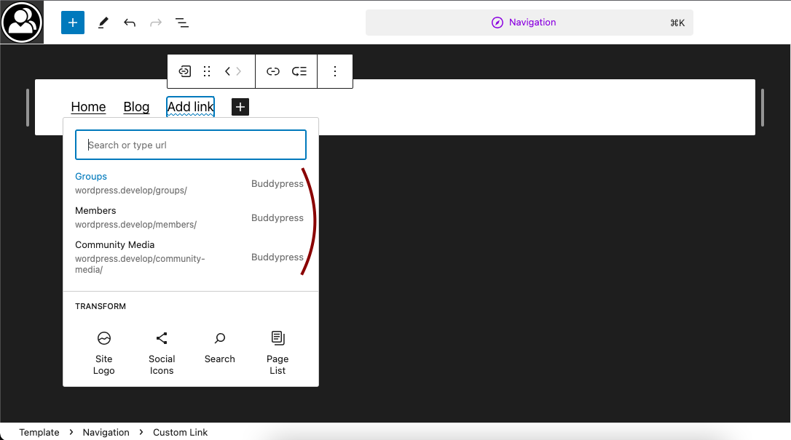
