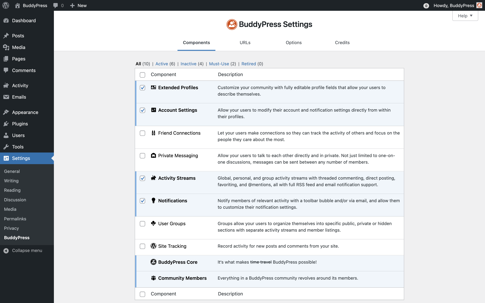

# BuddyPress Components settings

The BuddyPress Core & Members components are required ones and are always enabled. The first time you activate ByddyPress, 4 optional components are activated for you, by default: 

- Extended Profiles, 
- Account Settings,
- Activity Streams,
- & Notifications.

You can however, selectively disable/enable any of the components at anytime using the checkboxes at the beginning of each row, and saving your preferences clicking on the "Save Settings" blue button at the bottom of the settings page.

Just above the table, the view links can be used to filter the displayed components list according to their status and specificities. The landing view is set to "All(10)": accordingly, the list is populated with all available BuddyPress components. If you click on the "Active" view link, only active components will be listed. Clicking on the "Inactive" view link will let you only display the components that are not active. The Must-use view is only listing the required components (Core & Members). Finally, the "Retired" view is there to remember us, BuddyPress used to include a Forum component that was removed progressively: it was first listed into this view before being completely removed in favor of the [bbPress plugin](https://wordpress.org/plugins/bbpress/).
