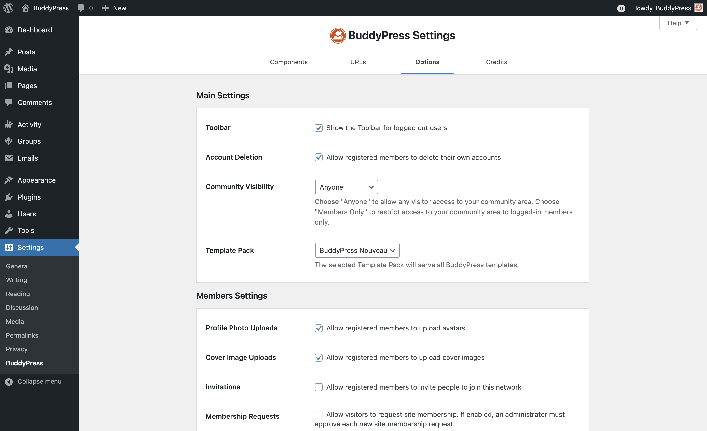

# BuddyPress options

The amount of available options is up to the BuddyPress Components you chose to activate. You'll always get the BuddyPress Core and Community Members sections as they refer to required components. 4 optional components are allowing some of their behaviors to be customized using specific options:

- Account Settings,
- Extended Profiles,
- User Groups,
- & Activity Streams.

## BuddyPress Core

### Toolbar

BuddyPress uses the WordPress Admin Bar to include shortcuts to the logged in user's profile pages and a Notifications "bubble". By default, it is enabled, but if you chose another way to display these informations, you can disable it.

### Community visibility

Version 12.0.0 of BuddyPress introduced the community visibility feature. Thanks to this option you can leave your community area completely public, allowing anyone to view BuddyPress generated content; or you can restrict this content to logged-in members only. In this second case, if an unauthenticated user tries to reach one of your community pages, a login form will be output instead of the community content.

### Template pack

BuddyPress Template packs are sets of community templates BuddyPress is using to organize the layout of the community pages. These templates are allowing BuddyPress to integrate - in an optimal way - into any WordPress theme. By default, the BP Nouveau template pack is active as it‘s the latest Template pack we've built. You can always chose to go back in time and use the BP Legacy one.

**NB**: when you chose to activate a BuddyPress standalone theme such as the BP Default theme that is available into the [BP Classic Add-on](https://wordpress.org/plugins/bp-classic/), this option won't be taken in account as this kind of themes is including a customized set of community templates. 

## Account Settings

### Account Deletion

Enabled by default, this option leaves the possibility to any member to delete their account from the corresponding sub-navigation of their personal settings area.

## Community Members

### Profile photo upload

Enabled by default, this option leaves the possibility to any member to upload an image and use it as their profile’s photo. This photo will be used at various places into the community area to better identify your members singularity.

### Cover image upload

Enabled by default, this option leaves the possibility to any member to upload an image and use it as their profile’s cover image. This image will only be used into the header part of your Members single pages.

### Invitations

To help your community growing, you can authorize your members to invite new users to be part of it. Administrators can follow and manage all sent invites and potential opt-outs from the BuddyPress tools page of your administration.

### Membership Requests

When site registrations are closed, you can activate this option to let users request a site membership. Administrators will then be able to accept or reject any site membership requests from the BuddyPress tools page of your administration.

## Extended Profiles

### Profile syncing

Enabled by default, this option (if active) will make sure the WordPress user display name is the same than the BuddyPress member's name.

## User Groups

### Group Creation

Enabled by default, this option leaves the possibility to any member of your community to create one or more groups. Administrators can always create groups even if this option is not active.

### Group photo upload

Enabled by default, this option leaves the possibility to any group administrator to upload an image and use it as the group's photo. This photo will be used at various places into the community area to better identify your groups singularity.

### Group cover image upload

Enabled by default, this option leaves the possibility to any group administrator to upload an image and use it as the group's cover image. This image will only be used into the header part of your Groups single pages.

## Activity Streams

### Post comments

**NB**: Activities about WordPress regular posts or comments are only generated when the Site Tracking component is active. As a result, this option has only an effect when Site Tracking is on.

By default this option is not active, meaning commenting WordPress posts or replying to a comment is only possible from the Posts's single view. When active, it allows your members to add comments to activities about WordPress posts or WordPress comments and these activity comments will be synchronized with regular post comments.

### Activity auto-refresh

Enabled by default, this option let Activity Streams pages to automatically checks for new activities according to a 15 seconds time interval.
