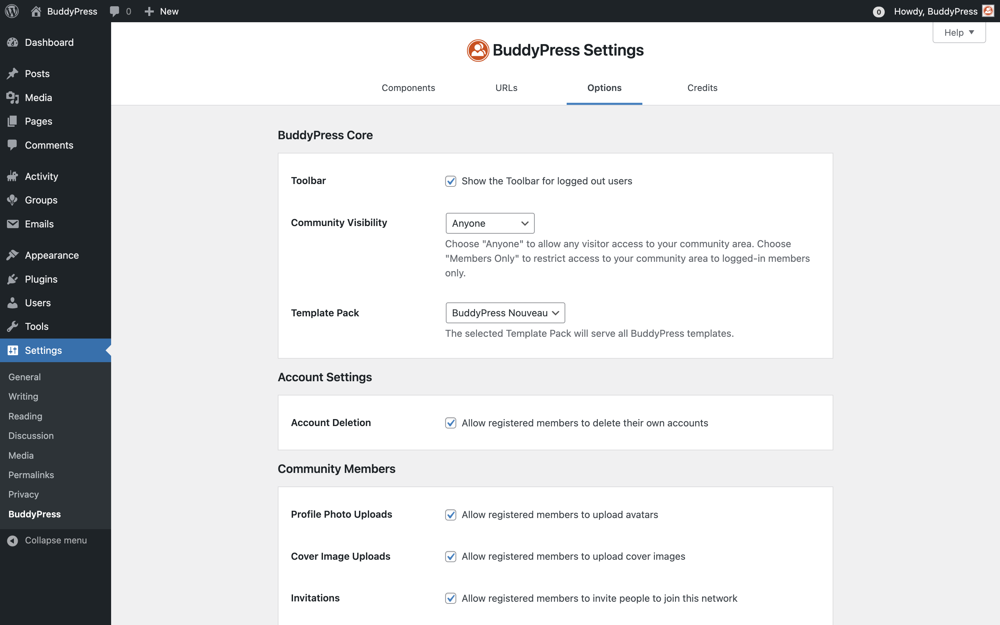

# BuddyPress options

The amount of available options is up to the BuddyPress Components you chose to activate. You'll always get the Main and Members sections as they refer to required components. 3 Optional components are allowing some of their behaviors to be customized using specific options:

- Extended profiles,
- Groups,
- & Activity.

## Main settings

### Toolbar

BuddyPress uses the WordPress Admin Bar to include shortcuts to the logged in user's profile pages and a Notifications "bubble". By default, it is enabled, but if you chose another way to display these informations, you can disable it.

### Account Deletion

Enabled by default, this option leaves the possibility to any member to delete their account from the corresponding sub-navigation of their personal settings area.
