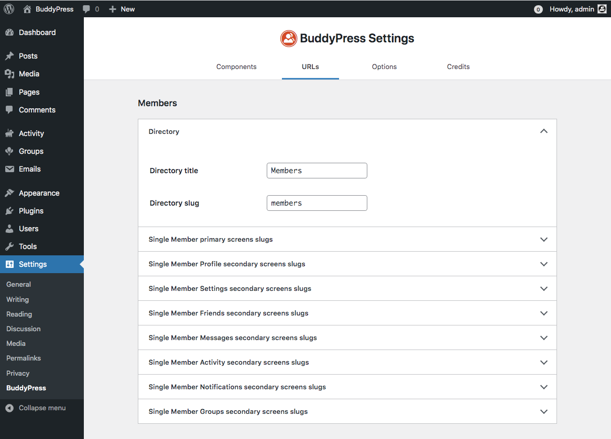

# BuddyPress URLs settings

Since version 12.0 of BuddyPress, you can now customize all URLs the plugin is generating to display your community content. An important change to note: BuddyPress directory pages are no longer regular WordPress pages and customizing these directory titles or URLs as well as any other BP URLs is only possible from the URLs tab of the BuddyPress settings Administration screen.

