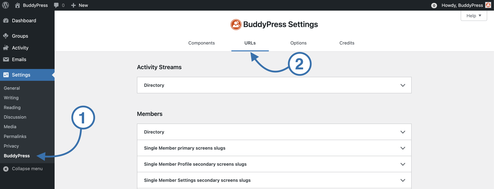
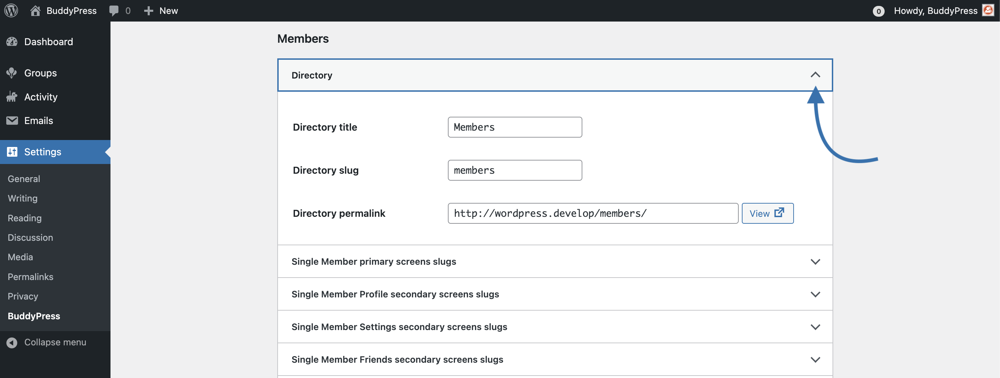
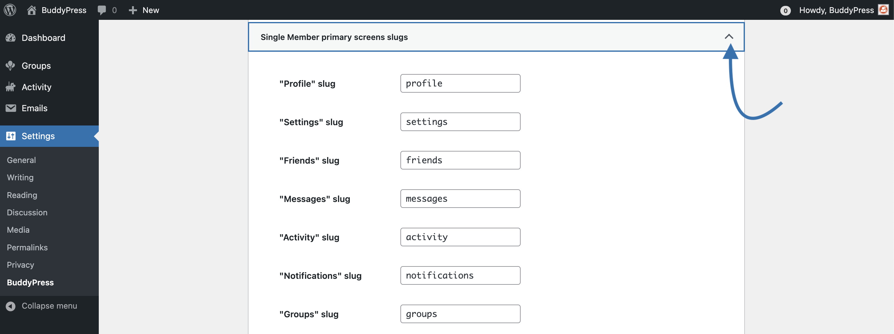
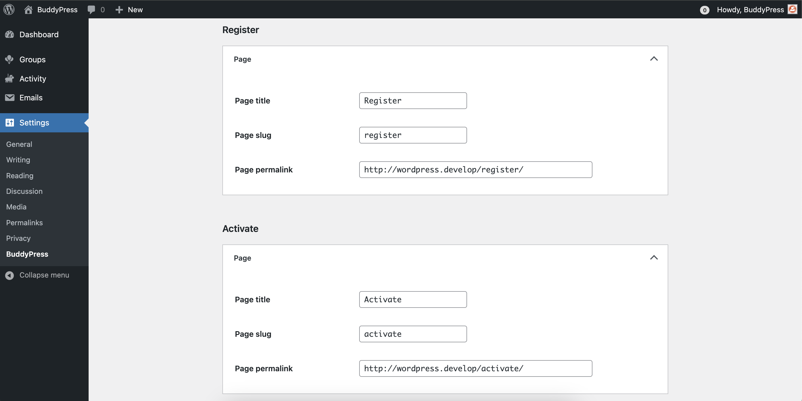

# BuddyPress URLs settings

Since version 12.0, BuddyPress no longer uses regular WordPress pages to let site administrators customize BP Directories titles and permalinks.

BuddyPress is now automatically generating specific entries into your WordPress site's database to store the information needed by BP Components requiring a directory to list their single items (eg: the Members directory is the community members).

Benefits are:

- It's no more needed to manually perform WordPress page association.
- Community content is not mixed with your regular WordPress content.
- BuddyPress URLs customization has been extended to **every chunks** of **any** URLs generated by the plugin to display your community content.
- BuddyPress supports any permalink structures, even the plain one!
- You can set all BP Components titles & URLs information from one screen: the URLs tab of the BuddyPress settings.

## The BP Component's directory panel

Every BP Component using a directory gets an accordion panel to let you customize its title and permalink as well as potential single item screen URLs when supported (eg: Members and Groups). Open the component's panel you need to edit the title or URL for and use the form fields to set your preferences.

You can use the "View" link to reach your directory page. Once you edited your directory slug, you'll need to save your changes from the "Save Settings" blue button at the bottom of the page to update your directory permalink.

> [!NOTE]
> If you need to add a link to your directory into your WordPress navigation, this [documentation page](./../navigations/README.md) is explaining how to achieve this in regular or Block Themes.

## The BP Component's single item primary & secondary screens panels

These panels are only available for the Groups and the Members components. To build a group or a member URL, BuddyPress simply adds the single item name (formatted to be used into an URL) at the end of the directory permalink. For single item primary screens, it adds the primary slug to the Group or Member URL and so on.

This panel is the place where you'll be able to edit every URL chunk (or slug) that will be added after the single item URL.

## Specific BP pages panels

If registrations to your community site are allowed, BuddyPress is overriding the WordPress registration process so that it can happen on the front-end of your site (instead of the WordPress login screen). The BP registration process has a 2 steps: the member submits a registration form from the corresponding page, then once they received the activation email, they use the activation link to reach the activation page.

> [!IMPORTANT]
> Unlike directory permalinks, there's no "View" link for these specific pages as you need to log out to reach these.

> [!NOTE]
> Once you're satisfied with URLs customization, don't forget to click on the "Save Settings" blue button at the bottom of the page to save your BuddyPress URLs settings.
