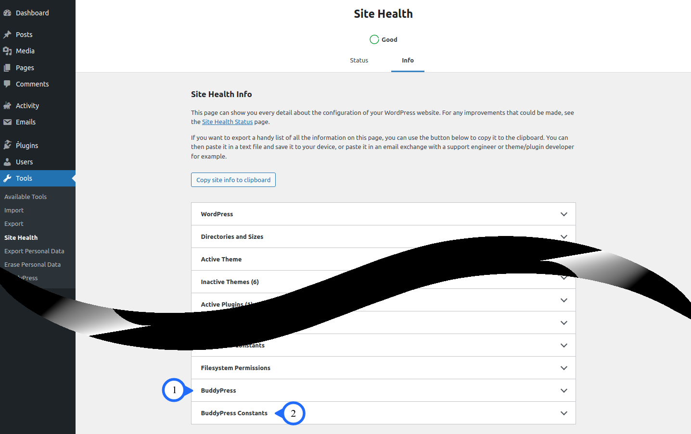
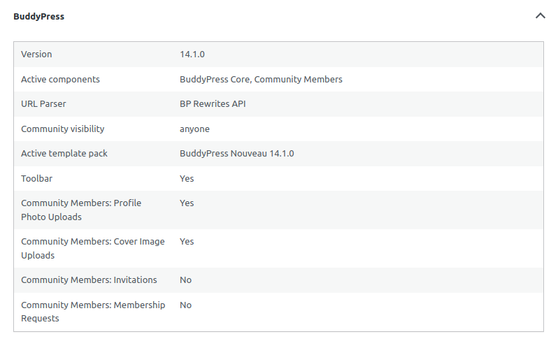
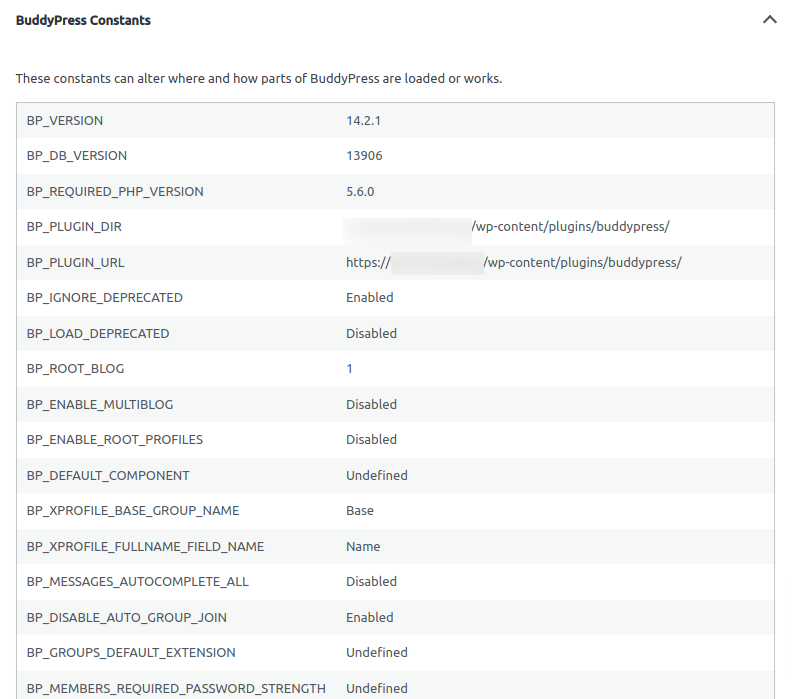

# Site Health Screen
> [!TIP]
> Detailed information regarding the **Site Health** screen can be found at [Support guides/Dashboard/Site Health screen](https://wordpress.org/documentation/article/site-health-screen/).

BuddyPress, currently, adds 2 (two) accordion panels to the **[Site Health Info](https://wordpress.org/documentation/article/site-health-screen/#info)** tab:

1. **[BuddyPress](#1-buddypress)**
2. **[BuddyPress Constants](#2-buddypress-constants)**
> [!NOTE]
> This information may prove instrumental in resolving site issues while communicating with support personnel, e.g., use the **Copy site info to clipboard** button and include any relevant information that will augment your support request.
***   

An example of the **Site Health** screen

### (1) BuddyPress
This panel contains details about your BuddyPress configuration depending upon which components are enabled.

The image above is an example of an expanded BuddyPress panel with minimum components enabled. Below is the full list of attributes and the component associated with each configurable attribute.

> [!NOTE]
> The **\*** (asterisk) indicates whether the **BuddyPress standalone theme** or the **Active template pack** attribute will be shown (not both). If no **BuddyPress standalone theme** is detected, then the fallback is to show the **Active template pack** attribute.
>
> Additionally, plugins may add **optional components** to the list of **Active components** attribute and/or add additional attributes.

| Attribute | Description | Component |
|:-------|:--------|:-------|
| Version | The installed version of BuddyPress. | BuddyPress Core |
| Active components | A list of active components. The defaults are **BuddyPress Core**, **Community Members**, **Extended Profiles**, **Account Settings**, **Activity Streams** & **Notifications**. Configurable from [BuddyPress Components](settings/components.md) screen, with the exceptions of **BuddyPress Core** & **Community Members** which are **Must-Use** components. | BuddyPress Core |
| URL Parser | Indicates which URL Parser is in use. The default is **BP Rewrites API**. Can be changed to the **Legacy Parser** by installing the [BP Classic](https://wordpress.org/plugins/bp-classic/) add-on. | BuddyPress Core |
| Community visibility | Indicates whether the BuddyPress community is public (**Anyone**) or private (**Members Only**). The Default is public (**Anyone**). Configurable from the [BuddyPress Options](settings/options.md#community-visibility) screen. | BuddyPress Core |
| BuddyPress standalone theme\* | Indicates which BuddyPress standalone theme is in use. | BuddyPress Core |
| Active template pack\* | Indicates which BuddyPress template pack is in use. The Default is **BuddyPress Nouveau**. Configurable from the [BuddyPress Options](settings/options.md#template-pack) screen. | BuddyPress Core |
| Toolbar | Indicates whether the WordPress **Toolbar** is shown on the front-end for **logged out** users. The Default is **enabled**. Configurable from the [BuddyPress Options](settings/options.md#toolbar) screen. See [Toolbar](https://wordpress.org/documentation/article/toolbar/) for additional information. | BuddyPress Core |
| Account Deletion | Indicates whether registered members are allowed to delete their own accounts. The Default is **enabled**. Configurable from the [BuddyPress Options](settings/options.md#account-deletion) screen. | Account Settings |
| Community Members: Profile Photo Uploads | Indicates whether registered members are allowed to upload avatars. The Default is **enabled**. Configurable from the [BuddyPress Options](settings/options.md#profile-photo-upload) screen. | Community Members |
| Community Members: Cover Image Uploads | Indicates whether registered members are allowed to upload cover images. The Default is **enabled**. Configurable from the [BuddyPress Options](settings/options.md#cover-image-upload) screen. | Community Members |
| Community Members: Invitations | Indicates whether registered members are allowed to invite people to join the network. The Default is **disabled**. Configurable from the [BuddyPress Options](settings/options.md#invitations) screen. | Community Members |
| Community Members: Membership Requests | Indicates whether visitors are allowed to request site membership. If enabled, an administrator must approve each new site membership request. The Default is **disabled**. Configurable from the [BuddyPress Options](settings/options.md#membership-requests) screen. ***Note**: The "**Anyone can register**" checkbox must be **disabled** in order to **enable** this feature (see [General Settings - Membership](https://wordpress.org/documentation/article/settings-general-screen/#membership) for where to **enable** or **disable** the  "**Anyone can register**" checkbox)* | Community Members |
| Extended Profiles: Profile Syncing | Indicates whether BuddyPress to WordPress profile syncing is allowed. The Default is **enabled**. Configurable from the [BuddyPress Options](settings/options.md#profile-syncing) screen. | Extended Profiles |
| User Groups: Group Creation | Indicates whether group creation for all users is allowed. Administrators can always create groups, regardless of this setting. The Default is **enabled**. Configurable from the [BuddyPress Options](settings/options.md#group-creation) screen. | User Groups |
| User Groups: Group Photo Uploads | Indicates whether customizable avatars for groups is allowed. The Default is **enabled**. Configurable from the [BuddyPress Options](settings/options.md#group-photo-upload) screen. | User Groups |
| User Groups: Group Cover Image Uploads | Indicates whether customizable cover images for groups is allowed. The Default is **enabled**. Configurable from the [BuddyPress Options](settings/options.md#group-cover-image-upload) screen. | User Groups |
| User Groups: Group Activity Deletions | Indicates whether group administrators and moderators to delete activity items from their group's activity stream is allowed. The Default is **enabled**. Configurable from the [BuddyPress Options](settings/options.md) screen. | User Groups |
| Activity Streams: Post Comments | Indicates whether activity stream commenting on posts and comments is allowed. The Default is **disabled**. Configurable from the [BuddyPress Options](settings/options.md#post-comments) screen. ***Note**: The Site Tracking component must be **active** in order to **enable** this feature*. |Activity Streams & Site Tracking |
| Activity Streams: Activity auto-refresh | Indicates whether a check for new items while viewing the activity stream is automatically allowed. The Default is **enabled**. Configurable from the [BuddyPress Options](settings/options.md#activity-auto-refresh) screen. |Activity Streams |

### (2) BuddyPress Constants

The image above is a truncated example of an expanded BuddyPress Constants panel.

Some of these Constants are (**1**) user-definable and will alter the behavior of BuddyPress when their default values are overridden. while some Constants are reserved for (**2**) core/development use and, lastly, some Constants are (**3**) deprecated (**not recommeded for use**). The BuddyPress Constants panel has been made available for your purvey in the event a misdefined Constant may be causing unexpected behavior. More information is available at **[BuddyPress Constants - TBD]**.

