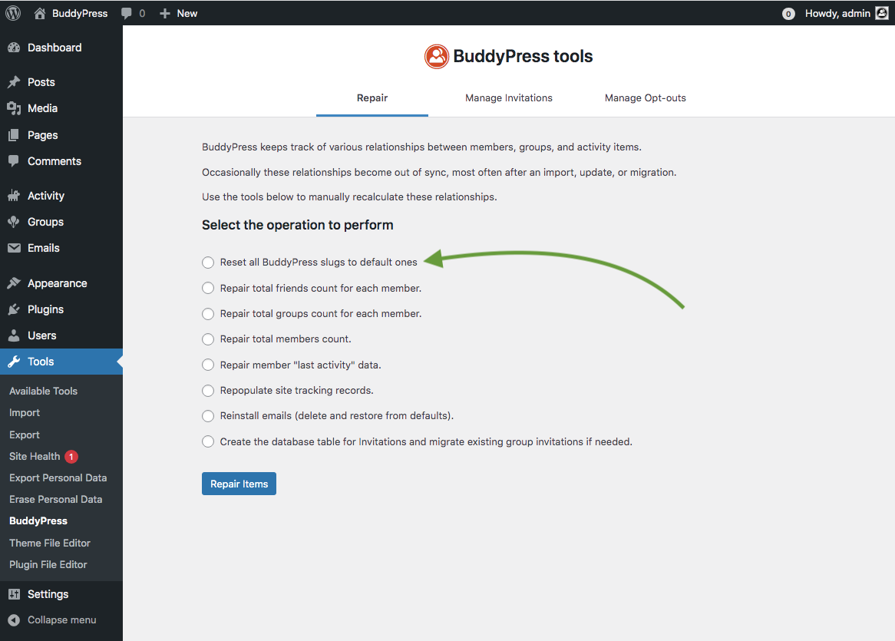
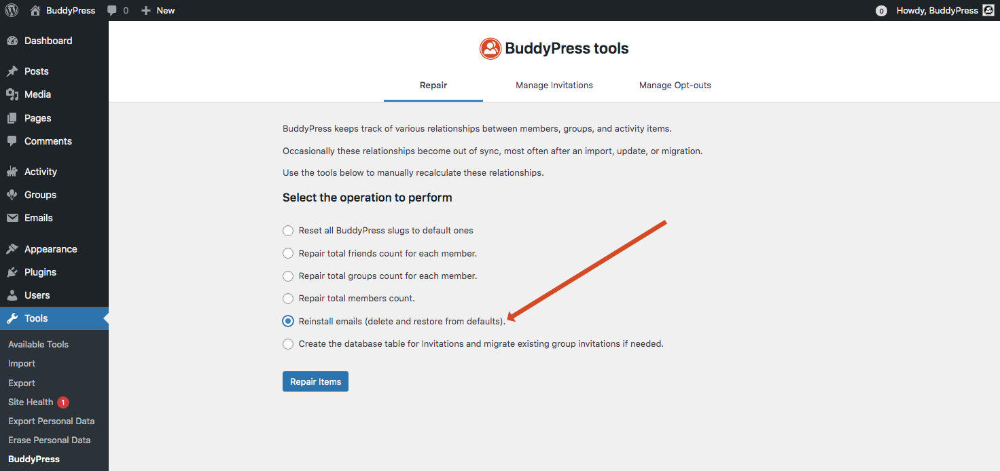

# BuddyPress repair tool

This is the first BuddyPress tool, it helps you perform some reparations when your BuddyPress relationships are out of sync or some other bulk operations.

## Reset all BP URLs to their default values

Since version 12.0 of BuddyPress, you can customize all URLs the plugin is generating. If for some reasons, you need to come back to the way there was before you customized them, you can use this tool.

## Reinstall Emails

Use this tool to delete all edits you may have made to BuddyPress Emails and restore their content to the default one. You may also need this tool if Emails were primarly installed in a different language than the one you use on your site.

