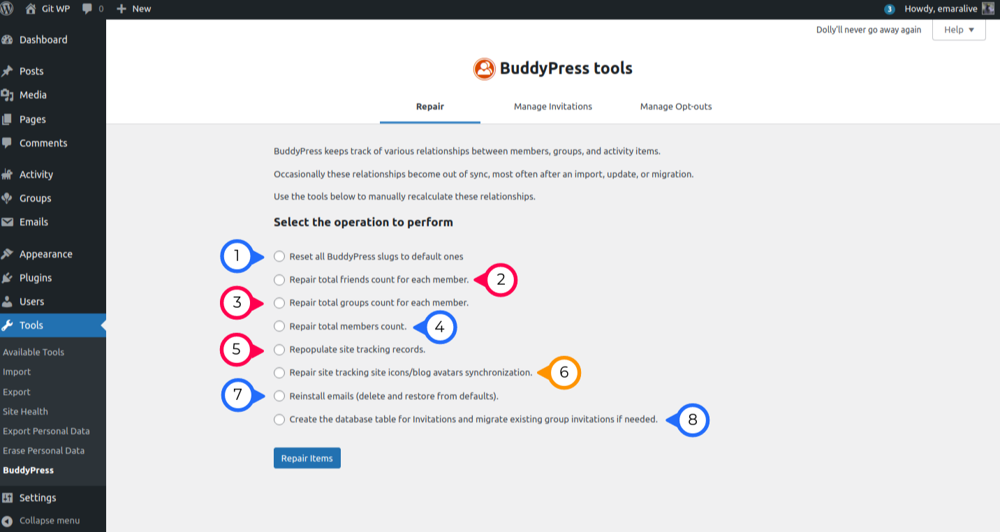

# BuddyPress Repair Tool

This is the 1st of 3 BuddyPress tools to help you perform an assortment of repair tasks when your BuddyPress relationships are out of sync or conduct other bulk operations.

### (1) Reset all BuddyPress slugs to default ones
Since version 12.0 of BuddyPress, you can customize all URLs the plugin utilizes on the front-end (see [Managing URLs](../settings/urls.md)). If for some reason, you need to revert back to a default state, you can use this task.

### (2) Repair total friends count for each member
> [!NOTE]
> Only available when the **Friend Connections** component is active!

Use this task to recalculate the total friends count for each member.

### (3) Repair total groups count for each member
> [!NOTE]
> Only available when the **User Groups** component is active!

Use this task to recalculate the total groups count for each member.

### (4) Repair total members count
Use this task to recalculate the total number of active site members.
### (5) Repopulate site tracking records
> [!NOTE]
> Only available when the **Site Tracking** component is active!

Use this task to recalculate the "user-to-blog" relationships and other useful blog meta data.

### (6) Repair site tracking site icons/blog avatars synchronization
> [!NOTE]
> Only available when the **Site Tracking** component is active and **Multisite** is enabled!

Use this task to resynchronize site icons/blog avatars.

### (7) Reinstall emails (delete and restore from defaults)
Use this task to delete all edits you may have made to BuddyPress Emails and restore their content to the default one (see [Managing BP Emails](../emails/README.md)). You may also need this tool if Emails were primarily installed in a different language than the one you use on your site.

### (8) Create the database table for Invitations and migrate existing group invitations if needed
Use this task to create the database table for Invitations, if one does not exist. Additionally, migrate existing group invitations, if needed.

