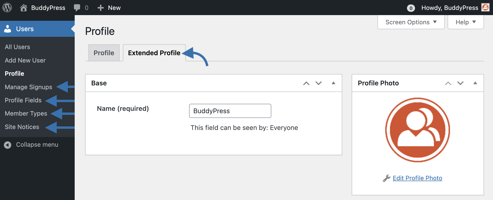

# BuddyPress Administration - Users

BuddyPress adds various submenus to the Dashboard **Users** menu, as well as, adding a tab to the Profile screen (Extended Profile) in order to help you manage user/member community related features.

- Extended Profile
- [Manage Signups](./signups.md)
- [Profile Fields](./xprofile.md)
- Member Types
- Site Notices
