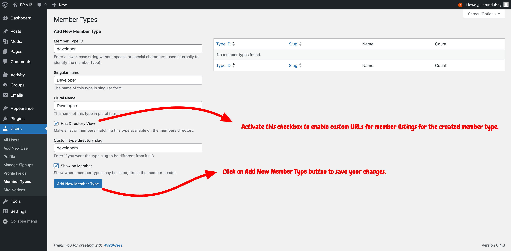
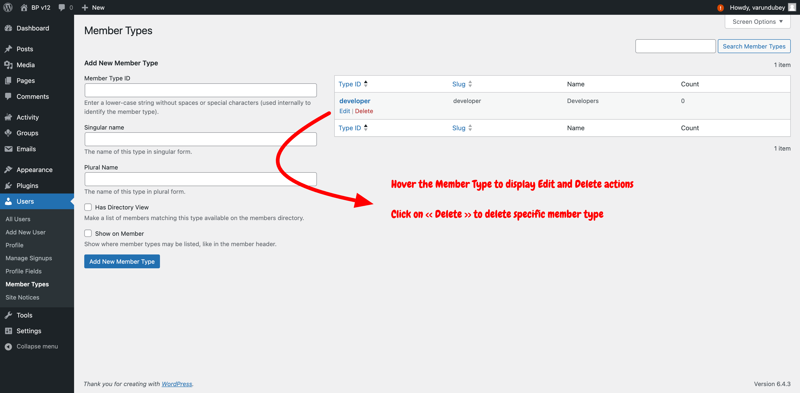
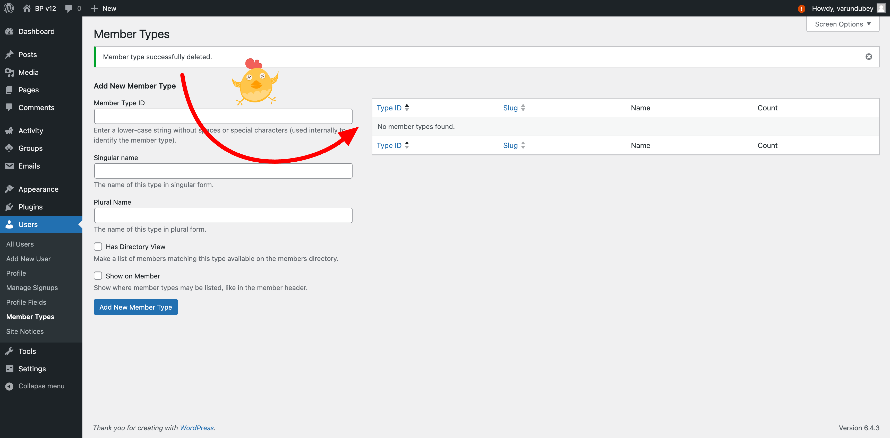

# BuddyPress Member Types

BuddyPress Member Types feature allows for categorizing community members into distinct community roles, enhancing the management and personalization of user experiences within the community.

## Overview

Member Types in BuddyPress provide a powerful way to classify users within your community. By defining various member types, such as "Students", "Teachers", or "Alumni", you can create a more organized and tailored community environment. This feature is especially useful for communities with diverse user groups, allowing customized interactions, content access, and privileges.

## Creating Member Types

To create a member type, you simply need to open the Member Types User's submenu of your Dashboard left menu bar. Once you reach the Member Types administration screen, you can use the form on the left part of the screen to define the properties of your member type and click on the "Add new Member Type" blue button at the bottom of the form when you're happy with the properties you defined.

Be aware plugins or themes can also register member types using custom code. They usually do so because they can build custom features or layouts according to these generated member types.

### Add Member Type:

As explained earlier, you'll see into the screenshot below, the form to add your member type. Here are what inputs are used for within BuddyPress:

#### Member Type ID
 
It's your unique identifier for your member type. It's a required field and you need to use regular & lower-case character to fill this input. As this value is used as a fallback to the URL portion of the Member type directory link, make sure to choose wisely this identifier.
 
#### Singular name

This name will be shown into various places such as the user's metabox to set their member type (which is available into WP-Admin extended profile page) or the user's header of their front-end profile pages (if the **Show on Member** checkbox is activated).

#### Plural name

It's the plural form of the previous field. It's not currently used by BuddyPress, but it may be used by some plugins and themes.

#### Has Directory View

When this checkbox is active, you'll be able to filter the Members directory according to a specific member type.  FYI, a Member Type URL is looking like this `https://site.url/members/type/memberTypeID`. If you need to use a different URL portion to list users having as specific Member Type inside the Members directory, you can use the **Custom type directory slug** input that is appearing as soon as you activate the **Has Directory View** checkbox.

#### Show on Member

Activate this checkbox if you want the Member's Member Type information to be displayed on their front-end profile pages header.

Once saved, an admin notice at the top of the screen will confirm you successfully added a new member type 👏. And the table on the right part of the screen will contain a new specific row so that you can edit or remove this member type.

### Edit Member Type:

When you need to edit a member type, go back to the Member types administration of your dashboard to find the table listing all available member types. Hover the member type ID you need to edit so that action links will appear right under this ID. Click on the Edit link to reach the Edit form shown below.

Once you're satisfied with your changes, click on the "Update" blue button to save them. The page will be reloaded to display the same form with applied changes and an Admin notice at the top of the screen will confirm you successfully updated your member type properties. The link inside this notice brings you back to the screen listing all available member types.

### Delete Member Type:

Deleting a member type is very similar to editing a member type. The only difference will be that instead of clicking on the "Edit" link, you'll click on the "Delete" one. This time, the main Member types administration screen will be directly reloaded and a notice will confirm you successfully deleted the Member type. The corresponding row won't be listed in the table of the right part of the screen anymore

### Considerations for Creating Member Types:
- **Uniqueness**: Ensure each member type has a unique identifier to avoid conflicts.
- **Descriptiveness**: Choose clear and descriptive names and labels for member types to ensure they are easily understandable by administrators and community members.

## Assigning Member Types

Administrators can assign Member Types manually through the WordPress Dashboard or programmatically through custom code. This flexibility allows for individual and bulk member-type assignments, catering to the needs of large and diverse communities.

### Methods of Assignment:
- **Manual Assignment**: A Member Type metabox is available for administrators to assign or change a member type through the user's admin dashboard profile page.
- **Bulk Assignment**: Administrators can assign member types to multiple users at once from the users listing page, streamlining the process for large user bases.

"As shown in the above screenshot, community Administrators can assign multiple member types directly from the user’s WP-Admin/Extended profile page.

To bulk assign a member type to a list of users:

1. **Activate the checkboxes** next to the users' avatars.
2. **Select a Member Type** from the Member Types dropdown list, located above or below the users table.
3. **Click the "change" button** immediately to the right of this dropdown list.

**Important:** This action will override any existing member types for the selected users.

If you need to remove all member types of many users, you can do so selecting the "No Member Type" choice of the Member Type's select box.
## Utilizing Member Types

With Member Types assigned, you can leverage them to enhance your community's functionality and user experience. This includes creating member-type-specific directories, displaying customized profile fields, and implementing access control based on member type.

### Applications of Member Types:
- **Customized Directories**: Create directories that list users of a specific member type, making it easier for members to find and interact with each other.
- **Tailored User Profiles**: Show or hide profile fields based on the user's member type, allowing for more relevant and streamlined user profiles.
- **Content Access**: Control access to content and functionalities based on member type, ensuring users see content relevant to their role within the community.

## Best Practices

When working with Member Types, consider the following best practices to ensure a smooth and effective implementation:
- **Regular Review**: Review your member types to ensure they align with your community's structure and goals.
- **Community Feedback**: Engage with your community members to gather feedback on the usefulness and clarity of the defined member types.
- **Documentation**: Keep clear documentation of the member types used within your community, including their purpose and how they are assigned.
