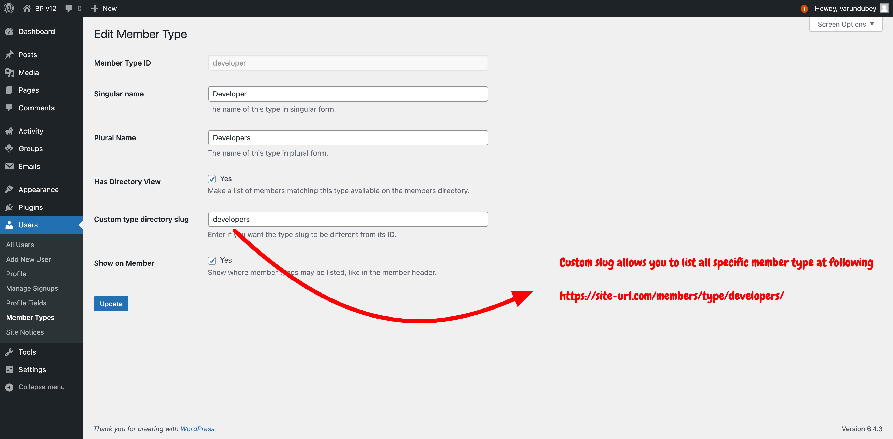
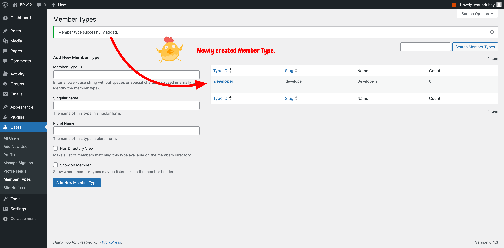
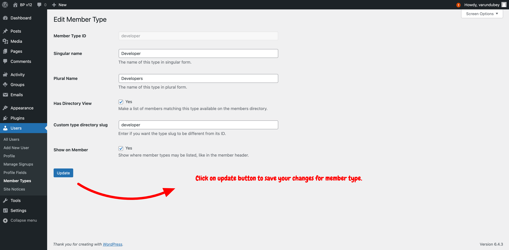

# BuddyPress Member Types

BuddyPress Member Types feature allows for categorizing community members into distinct roles, enhancing the management and personalization of user experiences within the community.

## Overview

Member Types in BuddyPress provide a powerful way to classify users within your community. By defining various member types, such as "Students", "Teachers", or "Alumni", you can create a more organized and tailored community environment. This feature is especially useful for communities with diverse user groups, allowing customized interactions, content access, and privileges.

## Creating Member Types

Creating Member Types involves registering them within your BuddyPress theme or a custom plugin. This process allows you to define unique identifiers and labels for each member type, making them recognizable and manageable within the admin interface.

### Add Member Type:




### Edit Member Type:





### Delete Member Type:


###  Best Practices
Ensure BuddyPress is active before using these functions to avoid errors.
Verify the member type exists before assigning it to a user.
Use these functions responsibly, especially when updating or removing member types, to maintain a positive user experience.

### Considerations for Creating Member Types:
- **Uniqueness**: Ensure each member type has a unique identifier to avoid conflicts.
- **Descriptiveness**: Choose clear and descriptive names and labels for member types to ensure they are easily understandable by administrators and community members.

## Assigning Member Types

Administrators can assign Member Types manually through the WordPress Dashboard or programmatically through custom code. This flexibility allows for individual and bulk member-type assignments, catering to the needs of large and diverse communities.

### Methods of Assignment:
- **Manual Assignment**: A Member Type metabox is available for administrators to assign or change a member type through the user's admin dashboard profile page.
- **Bulk Assignment**: Administrators can assign member types to multiple users at once from the user listing page, streamlining the process for large user bases.

Community administrators can assign multiple member types directly from the user’s WP-Admin/Extended profile page.


To bulk assign a member type to a list of users:

1. **Activate the checkboxes** next to the users' avatars.
2. **Select a Member Type** from the Member Types dropdown list, located above or below the users table.
3. **Click the "change" button** immediately to the right of this dropdown list.

**Important:** This action will override any existing member types for the selected users. For example, if "imath" is selected and reassigned to "Lead Developer," he will no longer be associated with the "Pizza lover" member type.


## Utilizing Member Types

With Member Types assigned, you can leverage them to enhance your community's functionality and user experience. This includes creating member-type-specific directories, displaying customized profile fields, and implementing access control based on member type.

## Custom Functions for Managing BuddyPress Member Types

This document provides custom functions to add, update, and remove member types for members in a BuddyPress community. These functions extend BuddyPress's built-in capabilities, allowing for more flexible management of member types within your site.

### Adding a Member Type to a User

You can use the `bp_set_member_type()` function to assign a new member type to a user. This function assigns a specified member type to a user, replacing any existing member type the user may have.
```
/**
 * Assigns a member type to a user.
 *
 * @param int $user_id The ID of the user.
 * @param string $member_type The member type to assign.
 * @return bool True on success, false on failure.
 */
function custom_add_member_type($user_id, $member_type) {
    return bp_set_member_type($user_id, $member_type);
}
```

### Updating a Member Type for a User
To update a user's member type, you can use the bp_set_member_type() function again to assign a new member type, replacing the previous one.
```
/**
 * Updates the member type for a user.
 *
 * @param int $user_id The ID of the user.
 * @param string $new_member_type The new member type to assign.
 * @return bool True on success, false on failure.
 */
function custom_update_member_type($user_id, $new_member_type) {
    return bp_set_member_type($user_id, $new_member_type);
}
```
### Removing a Member Type from a User
To remove a member type from a user, you can set the user's member type to an empty string using bp_set_member_type(), which effectively removes any member type from the user.
```
/**
 * Removes any member type from a user.
 *
 * @param int $user_id The ID of the user.
 * @return bool True on success, false on failure.
 */
function custom_remove_member_type($user_id) {
    return bp_set_member_type($user_id, '');
}
```

### Querying Members by Type
BuddyPress facilitates the retrieval of members based on specific types through its bp_has_members() function and BP_User_Query. The member_type parameter can filter members by one or multiple types.

To fetch members who are either 'students' or 'teachers':
```
$member_args = array(
    'member_type' => array('student', 'teacher'),
);

if (bp_has_members($member_args)) {
    // Process the members here
}
```
### Fetching a User's Member Type
To obtain the member type for a specific user, use the bp_get_member_type() function.
```
// Retrieve the member type for user with ID 5412
$member_type = bp_get_member_type(5412);

// Display the member type
echo 'Member type: ' . $member_type;
```

### Setting a User's Member Type
To assign or change a user's member type, the bp_set_member_type() function is utilized.
```
// Assign the 'student' member type to user 5412
if (bp_set_member_type(5412, 'student')) {
    echo 'Member type successfully updated.';
} else {
    echo 'Failed to update member type.';
}
```


### Applications of Member Types:
- **Customized Directories**: Create directories that list users of a specific member type, making it easier for members to find and interact with each other.
- **Tailored User Profiles**: Show or hide profile fields based on the user's member type, allowing for more relevant and streamlined user profiles.
- **Content Access**: Control access to content and functionalities based on member type, ensuring users see content relevant to their role within the community.

## Best Practices

When working with Member Types, consider the following best practices to ensure a smooth and effective implementation:
- **Regular Review**: Review your member types to ensure they align with your community's structure and goals.
- **Community Feedback**: Engage with your community members to gather feedback on the usefulness and clarity of the defined member types.
- **Documentation**: Keep clear documentation of the member types used within your community, including their purpose and how they are assigned.
