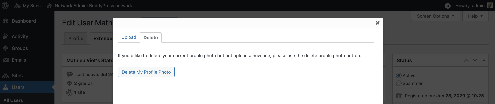

# BuddyPress Extended Profile

BuddyPress extends the WordPress Dashboard's profile page adding a navigation to switch between this WordPress profile screen and the BuddyPress Extended profile one. The primary goal of this BuddyPress Admin screen is to let Site Administrator(s) (on regular WordPress configs) or Network Administrator(s) (on Multisite configs) manage/moderate a specific member.

When viewing a WordPress user's profile, the Extended Profile screen can be reached by clicking on the corresponding tab of the navigation showed in the above screen capture.

It can also be reached from the the WordPress Users Administration screen by hovering one of the Usernames listed to reveal the action links and click on the "Extended" one.

## Moderating a user

### Moderating the user status & their profile photo

When the Extended Profiles component is **not** active and there are no available [member types](./member-types.md), moderating a user status (1) or editing/deleting a user’s profile photo (2) are the 2 actions an Administrator can perform.

1. Marking a user as a spammer can be achieved by checking the corresponding radio button before clicking on the "Update Profile" blue button.
2. Editing a profile photo that doesn't match your community rules is a 2 steps operation: first click on the "Edit Profile Photo" link, then using the modal window that will be displayed, you can use this modal's Upload or Delete tab to change or remove the profile photo.

> [!NOTE]
> Marking a user as a spammer will mark all their activities as spam as well as remove their Extended Profile/blogs/friends & groups information.

### Moderating the user extended profile information

When the Extended Profiles component is active, Administrators can also edit the profile fields value and/or their community visibility.

1. Extended profile fields group, unlike what's happening on front-end, are all listed into this screen and inside a specific metabox containing all the fields for the group.
2. To edit field visibilities, you need to click on the "Change" button next to the field visibility mention so that visibility options will show under this mention.
3. Once you're satisfied with your edits: you need to click on the "Update Profile" blue button to save these.

### Assigning one or more member types to the user

When some [member types](./member-types.md) are available, Administrators can assign one or more of them to the displayed user. A new metabox will be available into the Extended Profile screen to help them do so.

1. From this metabox, click on the Member type checkbox(es) of your choice and validate this choice by clicking on the "Update Profile" blue button.
2. All metaboxes can be reorganized & minimized using the buttons at the right of their title. You can also use "drag & drop" to move them from the left column to the main one & vice versa.

## Editing user's own extended profile

All members can edit their profile photo or profile fields (when the Extended Profiles component is active) as well as check their personal information from the Extended profile tab of their Dashboard's profile page.

> [!NOTE]
> They cannot assign themselves to a member type. Using the "View profile" button, they can reach their front-end profile page in a new browser's tab.

