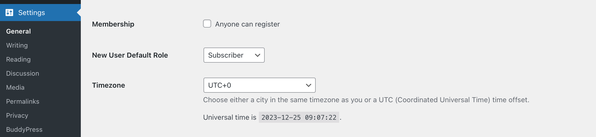

# BuddyPress Sign-ups administration

BuddyPress is extending the WordPress custom registration processes to improve your next users experience. Every step of this process is happening on the front-end to better integrate with the theme of your community site.

## WordPress settings

In regular WordPress sites, the [Membership](https://wordpress.org/documentation/article/settings-general-screen/#membership) section of your site’s general settings let you activate a checkbox to define that "anyone can register". 

## WordPress multisite settings

## BuddyPress regular sign-up process

## Customize sign-up profile fields

## Manage pending user accounts

## Alternative registration workflows