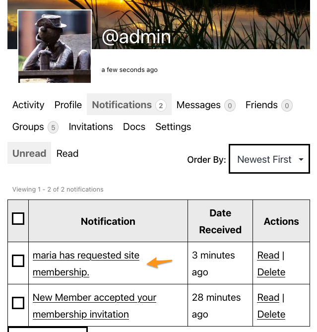

# BuddyPress Sign-ups administration

BuddyPress is extending the WordPress registration feature with custom registration workflows to improve your next users experience. Every steps users need to perform are happening on the front-end to better integrate with the theme of your community site.

## Regular registration workflow

When your WordPress site (or network) is allowing users registration, BuddyPress will add a registration page and an activation page to your site (or the site BuddyPress is activated on). It will also override the WordPress registration link with its own link to this registration page. BuddyPress uses by default a 2 steps registration process. First, users need to fill a form containing at least the username, email & password they wish to use on your site. Once this form is submitted, a validation email is sent to their email address to check there's an existing human behind the sign-up request. This email contains an activation link heading the user to the activation page. The second step is the account activation which happens once the user actually clicks on this activation link. Once users activate their account, they will be able to login using the username and password they specified on the registration form.

> [!NOTE]
> **NB**: whether BuddyPress is activated on a regular WordPress site or on a multisite network, registrations are logged into the `$wpdb->signups` WordPress table. 

### WordPress settings

In regular WordPress sites, the [Membership](https://wordpress.org/documentation/article/settings-general-screen/#membership) section of your site’s general settings let you activate a checkbox to define that "anyone can register".

BuddyPress will enable its regular registration workflow if this setting is activated.

### WordPress multisite settings

If you are using a WordPress sites network, the [Registration](https://wordpress.org/documentation/article/network-admin-settings-screen/#allow-new-registrations) section of your network settings let you chose whether:

1. Registration is disabled. (default)
2. User accounts may be registered.
3. Logged in users may register new sites.
4. Both sites and user accounts can be registered.

BuddyPress will enable its regular registration workflow if you activated option **2** or **4**.

### Customize the registration form with sign-up profile fields

To manage the fields to use into the "Profile Details" section of your sign-up form, head over to the [Users > Profile Fields Administration screen](./xprofile.md). You'll discover a tab named "Signup fields" at the last position of the xProfile groups navigation.

Once you activate this tab and just under it, you'll find a message explaining how to use drag and drop to pick the fields you want to use into the sign-up form. You can select any fields from any other xProfile field groups.

There's another way to add fields to the sign-up form thanks to a specific metabox into the xProfile single Field edit screen.

You can also activate the Sign-ups metabox checkbox to include a field into the registration form.

Sign-up fields are added the ones under the others. If you need to change this order, you can do it at any time using drag and drop inside the Sign-up Fields tabbed area.

Finally, If you need to remove a field from the sign-up form, you can do it using the corresponding "Remove" link (displayed at the bottom right of the Field's box) into this tabbed area or from the xProfile single Field edit screen deactivating the Sign-ups metabox checkbox.

### Manage pending user accounts

BuddyPress also adds a view to your [WP Users Administration screen](https://wordpress.org/documentation/article/users-screen/) so that you can manage and moderate **pending accounts**. From there, action links that are appearing when you're hovering usernames will let you perform common tasks with pending accounts:

- manually activate accounts,
- resend activation emails, or
- delete pending accounts.

## Alternative registration workflows

You can change the default BuddyPress registration flow by allowing **membership invitations** and/or requiring **site membership requests**. These features can be used separately or together to change who is allowed to join your site.

### Membership Invitations

Invitations can be used when public registration is open to help grow your site's membership or when public registration is closed to only allow membership by referral from an existing member.

Enable membership invitations by visiting the [WP Admin > Settings > BuddyPress > Options screen](../settings/options.md).

Your site members can send invitations from their user profiles.

The invited member will receive an email containing a link to the registration form.

Even if you have disabled public registration, valid invitation holders will be able to access the form using the link in the email.

Once the user registers, the account will be activated immediately (responding to the invitation has already verified the user's email address) and will be able to log in to the site.

### Site Membership Requests

Enabling membership requests interrupts the registration process by preventing the activation email from being sent automatically, and instead requires that a site administrator manually review and approve each account request.

Enable membership requests by visiting the [WP Admin > Settings > BuddyPress > Options screen](../settings/options.md). Note that public registration must be disabled for requests to be activated.

Then, visitors will be able to visit the registration form to submit a membership request.

When a new request is submitted, the site admins will receive a site notifications and an email. The email can be disabled via the user's email preferences screen.

The link in the email or site notification will take administrators to an approval screen where they can review the submitted membership request and choose to confirm it.

The administrator can also visit the Manage Pending Memberships screen at WP Admin > Users > Manage Pending Memberships.

Hovering over a row will reveal the following actions available to the admin:

- "Activate" will activate the user immediately without requiring that they validate their email.
- "Approve Request" or "Resend Approval" takes you to the confirmation screen before being able to send the activation link to the desired pending request. You can only send the activation email once per day.
- "Profile Info" will display extended profile information for the request.
- "Delete" allows you to delete a pending account from your site. You will be asked to confirm this deletion.

If the administrator approves the request, the submitter will receive an activation email and can complete their registration.

If the administrator deletes the request, the submitter will receive an email telling them that their request has been declined.
