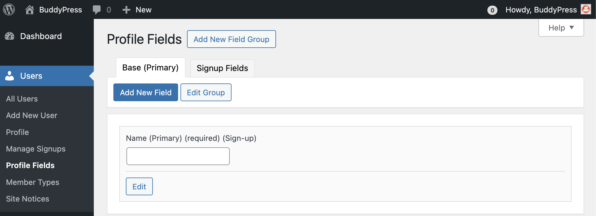
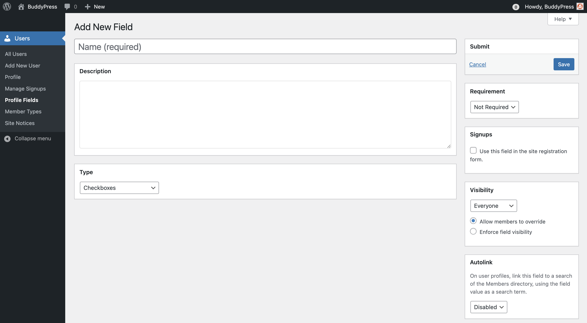
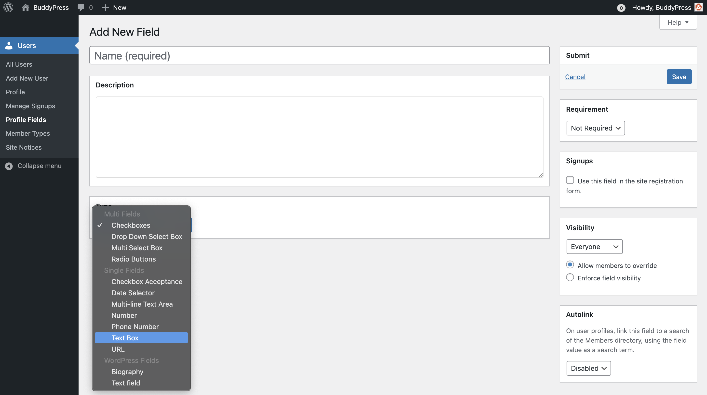
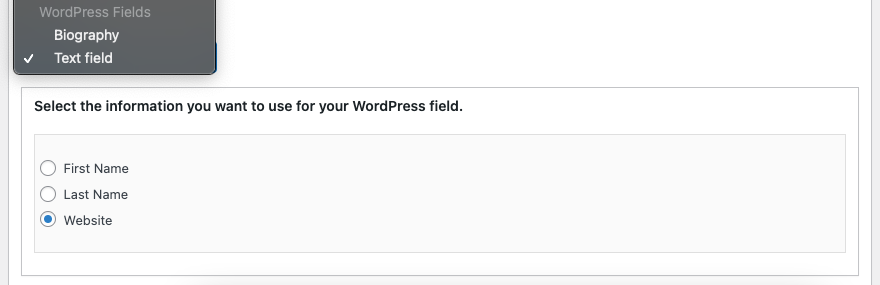
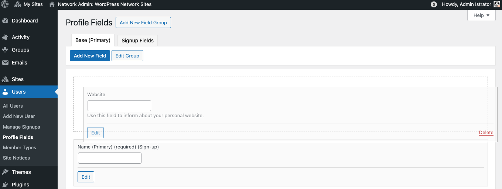
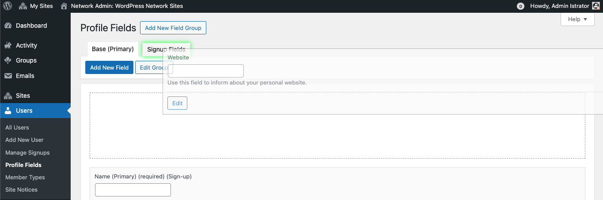
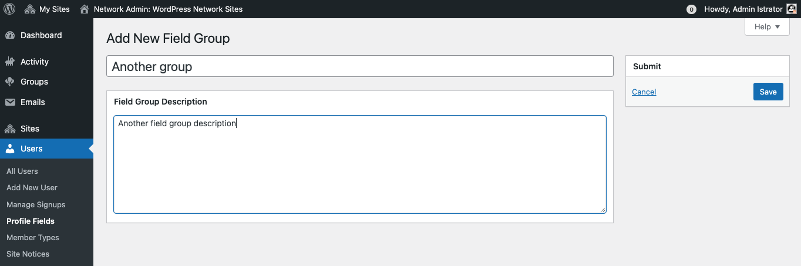
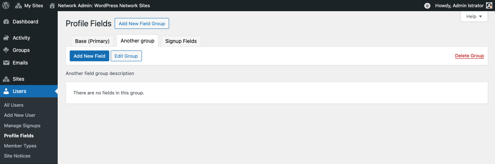
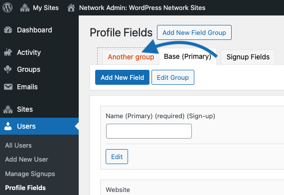

# BuddyPress xProfile fields administration

Highlight the best of your community members by creating an unlimited number of Extended Profile (xProfile) Fields and/or groups of Extended Profile Fields custom-made for your community site.

To start creating xProfile fields, go to administration menu Users > Profile Fields. If you have a multisite installation with BuddyPress activated network-wide via Network Admin > Plugins, you’ll find the Profile Fields admin screen via Network Admin > Users > Profile Fields.

The BuddyPress xProfile component comes with 2 default groups of profile fields:
- the "Base" profile field group
- the "Signup Fields" group (fields attached to this group are only displayed into the registration page of your site).

> [!NOTE]
> **NB**: As shown above, groups of profile fields are listed using tabs just over the list of profile fields they are including.

It also adds a primary profile field (to store the display "Name" of your members) inside these two groups. The "Name" xProfile field as well as the "Base" & "Signup fields" xProfile field group cannot be deleted.

## Adding a new field to a profile field group

Activate the group's tab you want to add your profile field into and then click on the "Add new field" button to reach the below xprofile field form:

### Name

Use this form field to define the label to use for your xProfile field. This label will be displayed just before the input to set the xProfile field value into single Members' profile edit screen and just before the the xProfile field value into the single Members' profile view screen.

### Description

Use this form field to define the member's guidance to use for your xProfile field. This guidance will be displayed just around the input to guide the logged in member about how the field should be filled into the single Members' profile edit screen.

### Type

Using the select box of this form field, you can pick the xProfile field type according to the data you need to store. Types are organized in 3 categories.

#### Multi fields

Use this type when you need to let a member select one or more values inside an options list. As soon as you pick one of these types, a new metabox will let you define the options list for the field type.

#### Single fields

Use this type when you need to let a member define a unique value for your xProfile field. Depending on the xProfile field type you choose, a new metabox might show to let you customize the behavior of the xProfile field on your community site’s front-end. For instance, when you choose the "Date selector" type, this metabox help you define the displayed date format.

#### WordPress fields

The goal of these field types is to incorpore regular WordPress user fields into a BP xProfile fields loop. Using these will let your members to also edit their corresponding values on the front-end from their profile‘s page edit screen. You can pick the Biography or one of the available text fields: First Name, Last Name or like shown above the Website one. If some custom code is adding specific WordPress contact methods, these will be also available into the text fields list.

### Requirement

Use the select box to make your xProfile field "Required" or "Not required". Required fields have an asterisk sign appended to their label into the single Members' profile edit screen.

### Signups

Use the checkbox if you need the xProfile field to be inserted into the registration form of your community site.

### Member Types

If you created one or more member types for you community site, you'll be able to restrict your xProfile field usage to members having one or more of your registered member types.

### Visibility

Using the xProfile Field visibility select box you can define the default visibility of it between 3 to 4 levels: an xProfile field can be visible to "everyone", only the member viewing its own profile ("only me"), only to logged in members ("All members"), or - if the BP Friends component is active - only to friends of the displayed member. Once you selected this default visibility for your xProfile field, you can choose whether each member can customize this visibility or not.

### Autolink

If you enable this xProfile field property, then, on the single Member's profile view screen, a link to search all members who defined the field's value the same way than the one you're seeing will be applied to the field value.

## Modifying/Deleting an existing xProfile field

Activate the xProfile field group tab containing the field you need to modify. From the list of displayed fields, you'll find:
- at the left of these the "Edit" button to open the xProfile field edit form and perform your changes from it;
- at the right of these a red "Delete" link (except for the primary field) will let you remove existing fields.

The xProfile Admin UI also supports drag & drop edits. As shown above, you can reorder the list of xProfile fields for the activated group tab. You can also move an xProfile field to another group of fields as shown below.

To do so, simply hover the group's tab untill a green shadow is displayed around it, then drop the field.

> [!NOTE]
> **NB**: When you drop a field inside the "Signup fields" group, it won't remove it from the active group tab but will add it to the fields to display into the registration form.

## Adding a new profile field group

You first need to click on the "Add new field group" located immediately to the right of the Administration’s screen title. Doing so you will reach the form to create a new group of fields.

From there you can define the name of your group and optionally its description.

## Modifying/Deleting an existing xProfile field group

Activate the xProfile field group tab you need to modify. Just under the tab, you'll find:
- on the left: the "Add new field" button will let you populate your group with new fields and clicking on the "Edit Group" button will open the xProfile field group edit form and perform your changes from it;
- on the right: a red "Delete Group" link (except for the primary field group) will let you remove existing fields.

To reorder xProfile field groups, use the xProfile Admin UI drag & drop support. To do so, click & move the group's tab of your choice according to your preferred order.

