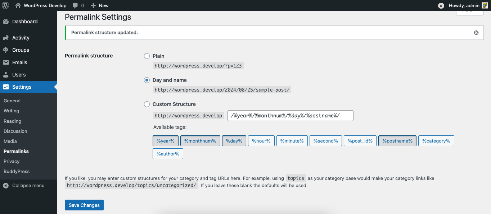
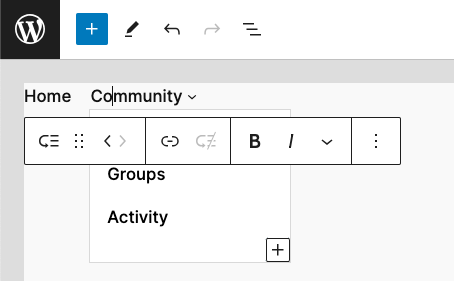

# Customizing BuddyPress base URL

Adding BuddyPress directories as a submenu of a regular WordPress page (for example: a page titled "Community") is pretty easy, you simply need to use the right [Administration screen of your dashboard](../administration/navigations/README.md) (`Appearance > Menus` or `Appearance / Site editor`).

It requires a bit more work when you need the "Community" page URL to be used as the BuddyPress base URL (eg: `https://site.url/community/members/`). Below are the 3 steps you need to accomplish to make it happen.

## 1. Use filters to customize the BuddyPress base URL

You can use the [bp-custom.php](functionalities.md) file to prepend an URL chunk to BuddyPress base URLs for all BP directories & BP specific pages.

The filter names to use are:

- `'bp_activity_root_slug'` - The Activity directory page,
- `'bp_members_root_slug'` - The Members directory page,
- `'bp_members_register_root_slug'` - The BP registration page,
- `'bp_members_activate_root_slug'` - The BP activation page,
- `'bp_groups_root_slug'` - The Groups directory page,
- `'bp_blogs_root_slug'` - The Sites directory page (for multisite configurations),

```php
<?php
/**
 * Here resides my awesome BuddyPress functionality customizations!
 *
 * Using this file is making sure the custom code is loaded when
 * BuddyPress is activated and ready to power the community area
 * of my WordPress site.
 */

// Exit if accessed directly.
if ( ! defined( 'ABSPATH' ) ) {
	exit;
}

/**
 * Prepends a 'community' URI chunk to BP directory root slugs.
 * 
 * @param string $root_slug The BP Default root slug.
 * @return string The new root slug having the 'community' URI chunk prepended.
 */
function prepend_community_slug( $root_slug ) {
	return 'community/' . $root_slug;
}
add_filter( 'bp_activity_root_slug', 'prepend_community_slug' );
add_filter( 'bp_members_root_slug', 'prepend_community_slug' );
add_filter( 'bp_members_register_root_slug', 'prepend_community_slug' );
add_filter( 'bp_members_activate_root_slug', 'prepend_community_slug' );
add_filter( 'bp_groups_root_slug', 'prepend_community_slug' );
```

## 2. Update your site permalinks

Once the above custom code is in place, you need to update your site permalinks from the `Settings > Permalinks` Administration screen so that BuddyPress rewrite rules are updated and the customization is actually taken in account.



Simply click on the "Save Changes" blue button to refresh your permalink settings.

## 3. Update your site's navigation

Go to the Administration screen you use to customize your site's main navigation:

- The [WordPress Appearance Menus screen](../administration/navigations/README.md#appearance-menus-screen) if you are using a **regular theme** and a WordPress Nav Menu.
- The [WordPress Appearance Site Editor](../administration/navigations/README.md#site-editor-navigation) if you are using a **block theme** and the Navigation block.



First make sure to remove existing BuddyPress directory menu items as their URLs are not using the `community` prepended URL chunk you added thanks to your customization yet.

Once done, as shown in the above screenshot, you just need to Add the "Community" page to you site's navigation and add a Sub Menu to this page containing your BuddyPress directories.
