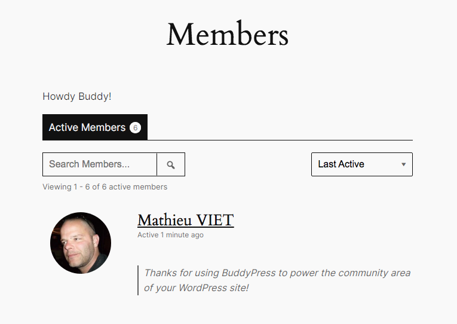

# Customizing functionalities

As BuddyPress is a WordPress plugin using a lot WordPress [hooks](https://developer.wordpress.org/plugins/hooks/), it's pretty easy to adjust BP behavior to include your tiny customizations (You may include them into a plugin when it becomes too heavy!).

You may have heard you can add custom code into the `functions.php` file of your [active theme](https://developer.wordpress.org/themes/basics/theme-functions/) (1) or about adding this custom code into a file you drop inside the [Must Use (MU) plugins directory](https://developer.wordpress.org/advanced-administration/plugins/mu-plugins/) (eg: `/wp-content/mu-plugins/custom-code.php`) of your WordPress site (2). Of course these 2 ways will work to hook your custom code to BuddyPress [actions](https://developer.wordpress.org/plugins/hooks/actions/) or [filters](https://developer.wordpress.org/plugins/hooks/filters/). But both ways can be problematic:

1. When using the `functions.php` file of your active theme: your BuddyPress custom code will only fire when this theme is active. When you switch your site to another theme, you'll need to copy/paste this code into the new activated theme.
2. If using a file inside the MU Plugins directory will make your BuddyPress custom code load no matter what theme is active, you'll need to check BuddyPress is active as soon as you use a BuddyPress function outside of the context of one of the many BuddyPress hooks the plugin is offering (which is also the case about the `functions.php` file of your active theme btw!).

## bp-custom.php

To take no risks and be sure that your BuddyPress custom code is only loaded when BuddyPress is active and early enough in the WordPress loading process, we strongly advise you to use the `bp-custom.php` file instead of previous ways.

`bp-custom.php` is a file that resides in your WordPress `plugins` folder where you can add a bunch of custom code hacks and modifications to BuddyPress. It does not exist by default. If you don’t have a file located at `/wp-content/plugins/bp-custom.php`, go ahead and create a blank file with the following:

```php
<?php
/**
 * Here resides my awesome BuddyPress functionality customizations!
 *
 * Using this file is making sure the custom code is loaded when
 * BuddyPress is activated and ready to power the community area
 * of my WordPress site.
 */  

// Exit if accessed directly.
if ( ! defined( 'ABSPATH' ) ) {
	exit;
}
```

Next, save the file as `bp-custom.php` and verify that this file is located at `/wp-content/plugins/`. When you'll need to add some customizations to BuddyPress, you'll be able to use this file! If you want to test it, here's a custom hook you can have fun with:

```php
function say_hi_just_before_the_members_list() {
	printf( '<p>%s</p>', esc_html__( 'Howdy Buddy!' ) );
}
add_action( 'bp_before_directory_members_page', 'say_hi_just_before_the_members_list' );
```

Going to your Members directory, you should get:


