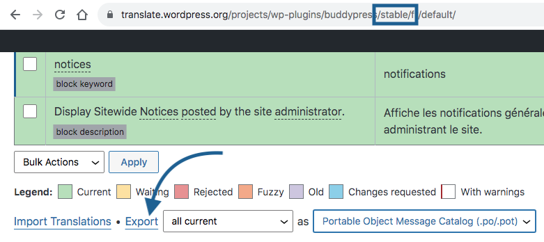
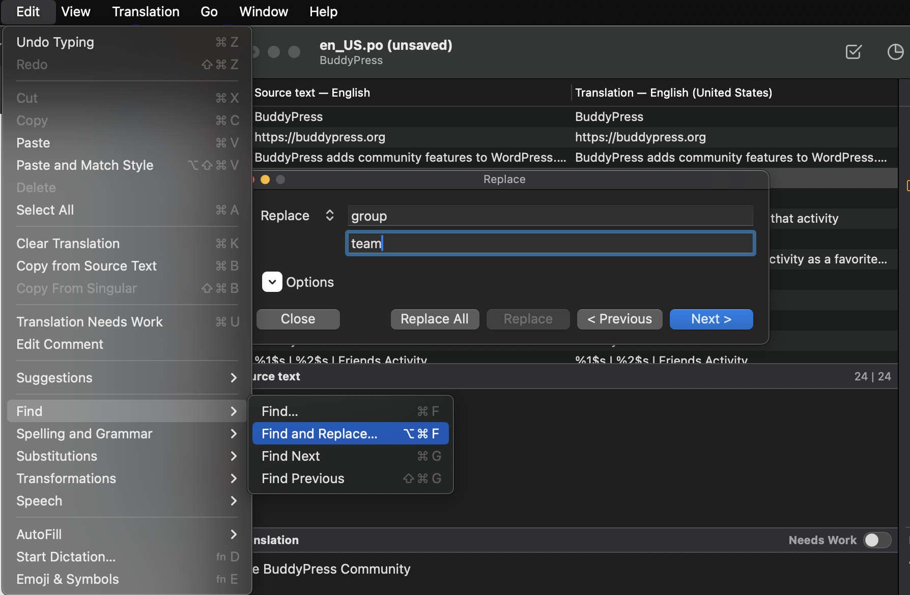

# Customizing BuddyPress texts to match your community purpose

BuddyPress is using texts as generic as possible to adapt to a wide range of communities. If your community site needs a very specific lexical field or vocabulary, the best way to reach this level of customization is to override the default translation files provided by the [WordPress Polyglots team](https://translate.wordpress.org/projects/wp-plugins/buddypress/).

## Your toolkit

WordPress is using the [Gettext open source library](https://www.php.net/manual/en/intro.gettext.php) to achieve its internationalization. In short, translatable strings into the source code are extracted into a "Portable Objects Template" file (having a `.pot` extension). Thanks to this kind of file contributors can focus on translating the english strings to generate a human readable translation file (having a `.po` extension) as well as a binary file (having a `.po` extension) for the machines to read it faster! In the end WordPress & BuddyPress end users can enjoy the 2 softwares into their own/native language.

> [!NOTE]
> The naming convention of the .mo files is based on the ISO-639 language code (e.g. pt for Portuguese) followed by the ISO-3166 country code (e.g. PT for Portugal or BR for Brazil). So, the Brazilian Portuguese file would be called pt_BR.mo, and a non-specific Portuges file would be called pt.mo. Complete lists of codes can be found at [(country codes)](https://www.gnu.org/savannah-checkouts/gnu/gettext/manual/gettext.html#Country-Codes) and [(language codes)](https://www.gnu.org/savannah-checkouts/gnu/gettext/manual/gettext.html#Language-Codes).

### The `.pot` file is key!

To get the latest version of the BuddyPress translatable strings, you can [view & download it](https://plugins.trac.wordpress.org/browser/buddypress/trunk/buddypress.pot) (link at the bottom of the page) from the WordPress plugin's official repository.

### A software to generate `.po` & `.mo` files out of a `.pot` one is required.

[Poedit](https://poedit.net/wordpress) is a free software available for Mac, Windows and Linux OS. You'll need to download, install & use it to build your custom language files.

### The default translation file (`.po`) for your locale

> [!NOTE]
> You can skip this tool if you're using the American language, which is the default WordPress language (`en_US`), on your site.

Getting this `.po` file will save you some time as you'll be able to avoid starting from scratch! Go to the [BuddyPress translation place on WordPress.org](https://translate.wordpress.org/projects/wp-plugins/buddypress/) to pick your language `.po` file for the latest **stable** version of BuddyPress.

### Translation files (`.json`) for JavaScript

When you need to customize the texts used in BuddyPress blocks, you'll need to copy & edit some JSON files generated by WordPress and located into the `/wp-content/languages/plugins` directory of your Website. These files are named according to this schema: `buddypress-{locale code}-{md5 encoded script source relative path}.json`.

## Create your custom Translation file

### Custom language files locations

||||
|:-:|:-:|:-:|
||WordPress default translation files location||

Official BuddyPress translations are located into the `/wp-content/languages/plugins` directory of your WordPress site. BuddyPress will override these language files by custom ones if you put them into one of these directories:
 
- `/wp-content/languages/plugins/buddypress`
- `/wp-content/languages/buddypress`
- `/wp-content/languages`

### Your site locale is `en_US`

Even if `en_US` is WordPress default locale and all BuddyPress strings are written into this locale into the source code, adapting BuddyPress texts to match your specific community vocabulary can be done by adding a `buddypress-en_US.mo` file into one of the above directories.

Let's take a simple example to illustrate how you can customize BuddyPress default strings. A community site about sport might want to use the `team` term instead of the `group` one. To achieve this customization, below are the steps you need to perform.

#### Open the `buddypress.pot` file in Poedit

Launch Poedit, use the `New from POT/PO file` command and browse your computer files looking for the latest stable `buddypress.pot` file you [downloaded](https://plugins.trac.wordpress.org/browser/buddypress/trunk/buddypress.pot) when setting your toolkit. Once it's opened, make sure to select the **English (United States)** into the modal window that has popped up. Click on the **Ok** button.

#### Fill your `en_US` translation with default BuddyPress strings

Click on one of the listed rows, then hit the `Cmd+A` or `Ctrl+A` keys of your keyboard to select all rows. From the **Edit** menu, click on the **Copy from Source Text** command to use all default strings as your translation. It will save you some time compared to starting from scratch!

#### Carefully replace most `group` then `Group` occurrences by `team` then `Team`

Click on one of the listed rows, then use the **Find and Replace** command to display the modal window to enter what needs to be replaced (`group`) and with what (`team`).

Check each `group` occurrences hitting the **Next button** and click on the **Replace button** except when you reach a BP Email message content. You'll recognize them thanks to the "Notes from translators" frame: it contains a warning text about the fact [BP Email tokens](https://github.com/buddypress/buddypress/blomaster/docs/user/administration/emails/tokens.md) shouldn't be translated. For these translations, manually replace `group` occurrences that are not prefixed with brackets `{{`.

Once you finished these replacements, do the same for the `Group` occurrences: this time you can use the **Replace All** button.

Finally, save your custom `buddypress-en_US` files into one of the BP Language custom locations.

||||
|:-:|:-:|:-:|
||One of the BP Custom languages location||

You should see that your Site is now using `team|Team` instead of `group|Group` everywhere in your site 🙌.

### Your site locale is something different than `en_US` (e.g. `fr_FR`)

#### Open your locale default translation `.po` file in Poedit

Launch Poedit, use the `Open` command and browse your computers file looking for the default translation `.po` file for the locale you exported from the [BuddyPress translation place on WordPress.org](https://translate.wordpress.org/projects/wp-plugins/buddypress/) when setting your toolkit. Once it's opened, make sure to select the corresponding locale into the modal window that has popped up. Click on the **Ok** button.

#### Carefully replace most translated `group` then `Group` occurrences by `team` then `Team` in your locale

Click on one of the listed rows, then use the **Find and Replace** command to display the modal window to enter what needs to be replaced (`groupe`) and with what (`équipe`).

Check each translated `group` then `Group` occurrences hitting the **Next button** and click on the **Replace button** to replace it with your locale version of `team` then `Team`. You may need to adapt some other parts of the translated texts to match your locale grammar.

||||
|:-:|:-:|:-:|
||One of the BP Custom languages location||

Finally, save your custom `buddypress-xx_XX` files into one of the BP Language custom locations.

## Create a custom Script Translation file

The easiest way to do so is to use JSON files WordPress adds into `/wp-content/languages/plugins` when you are using a locale that is not `en_US`. Find the Block corresponding to the JSON translation file looking for the `comment.reference` property. Copy it into one of the BuddyPress custom language locations.

||||
|:-:|:-:|:-:|
||One of the BP Custom languages location||

Once copied, use a text/code Editor to edit this file.

> [!TIP]
> Using VSCode, you can use the command to restructure & prettify the one line file (Shift + option + F) so it's easier to work with it.

Save your edits! For the above example which is about the Groups Block, you should see the customization results within the Block Editor.

Good job! You have customized BuddyPress default strings and/or BuddyPress translations to match your community specific lexical field 💪. 
