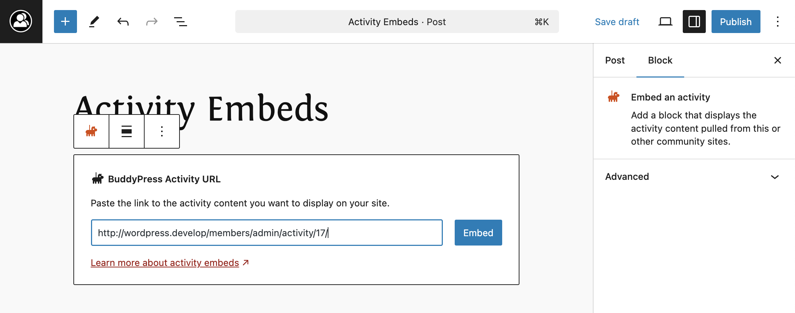

# Activity Embeds

## Overview

BuddyPress introduced support for embedding single activity items starting from version 2.6.0, utilizing the WordPress oEmbed functionality. This allows activity items to be embedded within WordPress posts or pages:

- by pasting the activity permalink into the Classic Editor.
- by using the BP Activity Embed Block into the Block Editor.



The embedded activity will display content, media (if applicable), and comments.

## Disabling Activity Embeds

If you prefer not to use activity embeds on your BuddyPress site, you can disable the feature using the following code snippet:

```php
add_filter( 'bp_is_activity_embeds_active', '__return_false' );
```

## Media Support in Embeds

When an activity item contains media from a registered WordPress oEmbed provider, the media will be displayed in the embedded content. If no oEmbed media is found, BuddyPress will attempt to embed inline video or audio using HTML5.

For a list of supported oEmbed providers, visit [WordPress oEmbed Providers](https://wordpress.org/documentation/article/embeds/#list-of-sites-you-can-embed-from).

## Use Cases for BuddyPress Embeds

### Use Case 1: Embedding Activity Items in WordPress Posts

Users can easily share individual BuddyPress activity items by embedding them into WordPress posts or pages. This allows for greater interaction and sharing of community updates.

### Use Case 2: Restricting Media Display in Embeds

For sites that want to hide media in embedded activity items (e.g., to keep embeds simple), the `hide_media` parameter can be used to suppress media display.

Example:

```php
https://example.com/wp-json/oembed/1.0/embed/activity?url=https://example.com/members/user/activity/123&hide_media=true
```

### Use Case 3: Customizing the Look and Feel of Activity Embeds

Advanded users can fully customize the appearance of embedded activity items by overriding the [default templates](../../advanced/template-hierarchy.md) and [styles](../../advanced/styles.md) provided by BuddyPress. This allows for a seamless integration of activity embeds with your site's design.
