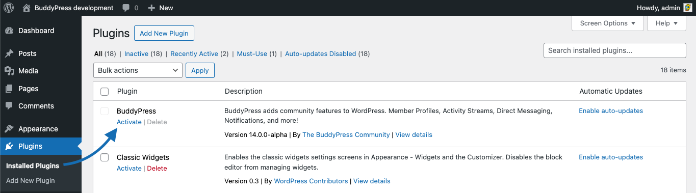

# BuddyPress Activation Guide for a regular WordPress Site.

Welcome to the BuddyPress activation guide for a regular WordPress site! This document is designed to help beginners configure BuddyPress on their WordPress site. Whether you're setting up a community site, a social network, or a collaborative space, BuddyPress is a powerful plugin that adds social networking features to your WordPress site.

## Before you begin

If you haven't installed the BuddyPress plugin into your WordPress site's plugins directory yet, please read this [documentation page first](./install.md).

## Step 1: Activate BuddyPress from the Individual Site's Dashboard

- From your site's admin area, navigate to `Plugins`.
- Locate BuddyPress in the list and click `Activate` to enable it.
- Post-activation, you will be redirected to your WordPress Dashboard home page which will show the "Hello BuddyPress" modal window we use to inform about plugin's major version highlights.

## Step 2: Configure BuddyPress

- After activation, you'll find the BuddyPress settings under `Settings → BuddyPress` in the site’s admin panel.
- Configure the necessary components, such as Profiles, Groups, and Activity Streams. You may choose to activate only what's necessary for this site's community.

## Final Steps

- After completing the installation and configuration, it is crucial to thoroughly test all BuddyPress features, such as user registration, profile updates, group creation, and private messaging across different sites on your network, to ensure everything is working as expected.
- Maintain regular backups and update BuddyPress, WordPress, and all other plugins and themes to ensure security and compatibility.

