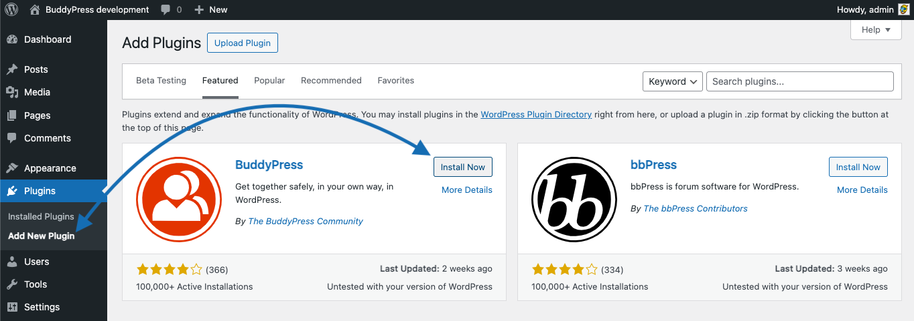
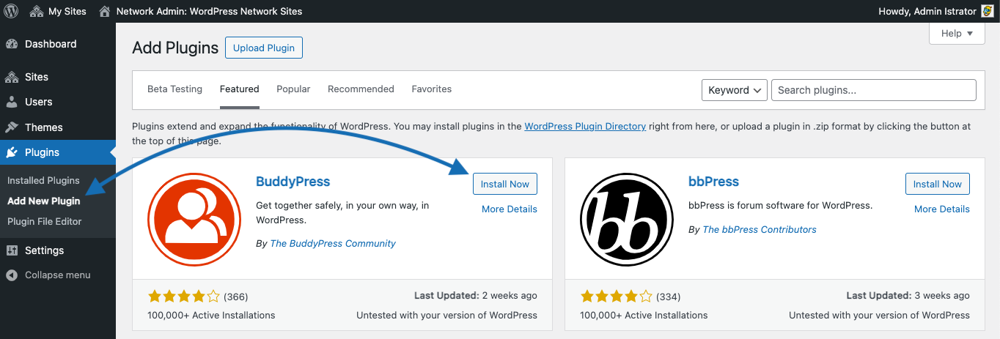
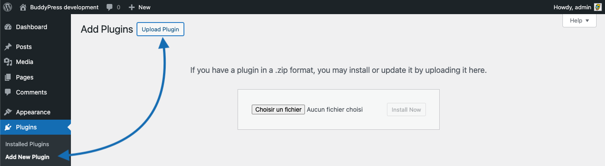
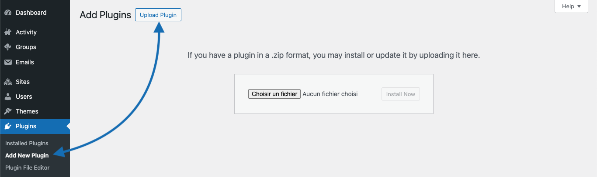

# BuddyPress Installation Guide for Website Administrators

Welcome to the BuddyPress installation guide! BuddyPress is a versatile plugin that enriches your WordPress site with a community environment for your family, friends, colleagues, teammates, customers, in short the people you want to be in touch with. This guide will walk you through installing BuddyPress on your WordPress site. Before you begin, please ensure that your server meets [BuddyPress's minimum requirements](./php-version-support.md) and that your WordPress version is compatible.

## Prerequisites

Please ensure your WordPress installation is current and compatible with the BuddyPress plugin. A good way to quickly find this information is to check the [plugin's official page](https://wordpress.org/plugins/buddypress/) on the WordPress Plugin Directory and look for the required **WordPress Version** as well as the required **PHP Version**. These informations are also available at the top of the [readme.txt](https://plugins.trac.wordpress.org/browser/buddypress/trunk/readme.txt) file that is include in the plugin's package.

## Automated Installation Procedure

### Step 1: Confirm WordPress Installation

Please confirm that WordPress is installed on your hosting environment. If WordPress still needs to be installed, please download and install it from the [official WordPress website](https://wordpress.org/download/).

### Step 2: Install BuddyPress

Access your WordPress administrative panel and navigate to `Plugins → Add New`. You can either activate the "Featured" tab and scroll down to find it or use the search field to look for `BuddyPress`. Click on `Install Now` blue button of the BuddyPress plugin card.

> [!NOTE]
> If you are using a WordPress multisite config, BuddyPress installation happens into the Network administrative panel, inside the `Plugins → Add New` network admin screen.

## Manual Installation Process

For administrators who prefer or require a manual installation approach, please follow these steps:

### Step 1: Download BuddyPress

Navigate to the [BuddyPress page](https://wordpress.org/plugins/buddypress/) on the WordPress plugin repository and download the most recent version of the plugin. You'll get a zip Archive having a name looking like this `buddypress.VersionNumber.zip`.

### Step 2: Upload BuddyPress

You can alternatively go to the `Plugins → Add New` administration screen and use the WordPress plugin uploader to transfer the zip Archive you downloaded into your plugins directory or unzip the Archive locally and utilize your preferred FTP client to drop the `buddypress` plugin folder into the `wp-content/plugins` directory within your WordPress installation on your web server.

> [!NOTE]
> If you are using a WordPress multisite config, BuddyPress installation happens into the Network administrative panel, inside the `Plugins → Add New` network admin screen.

## Next step

- Activate BuddyPress [on a regular WordPress site](./activate.md), [on a multisite WordPress](./network-activate.md).
