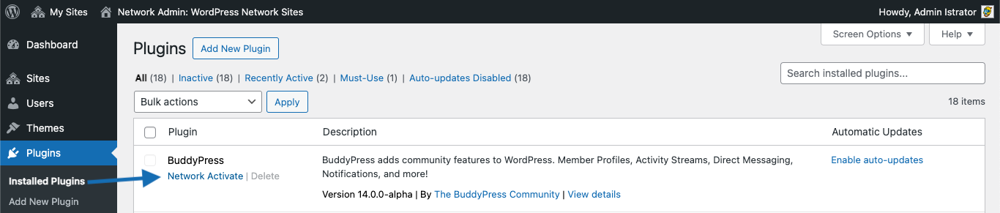
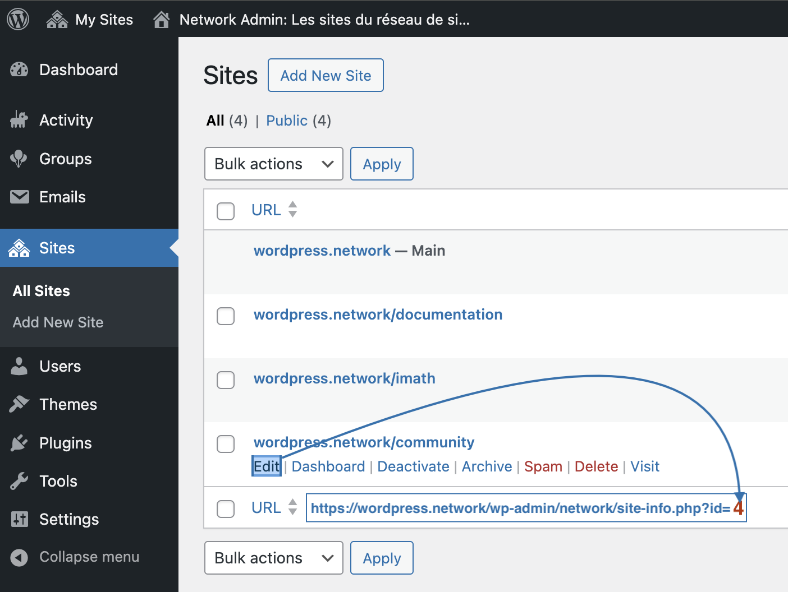

# BuddyPress Activation Guide for WordPress Multisite

Welcome to the BuddyPress activation guide for WordPress Multisite! This document is designed to help beginners configure BuddyPress on their WordPress Multisite network. Whether you're setting up a community site, a social network, or a collaborative space, BuddyPress is a powerful plugin that adds social networking features to your WordPress site.

## Before you begin

Just like there's only one common Users database table shared across your multisite network, BuddyPress only installs a common set a database tables for your network. This means, out of the box, BuddyPress does not provide a way to have more than one instance of it into your network so that you could have different communities for each of your network sites. In other words, activating BuddyPress network widely will only power your network with one BuddyPress instance you can choose to house on the main or a secondary site of your network.

If you haven't installed the BuddyPress plugin into your WordPress site's plugins directory yet, please read this [documentation page first](./install.md).

## Activation Options

BuddyPress can be activated network-wide, affecting all sites in your multisite network or on a single site within your network, allowing for a more tailored setup.
- **Case 1:** Network-wide activation using the **Main** Site of your network to house your BuddyPress community
- **Case 2:** Network-wide activation using a **Secondary** Site of your network to house your BuddyPress community
- **Case 3:** Activating BuddyPress on one of the site of your network only.

### Network-wide activation using the Main Site of your network to house your BuddyPress community

Enabling BuddyPress network-wide allows you to have social networking features across all the sites in your multisite network. BuddyPress is activated across the network but configured to consider the main site as the primary location for all BuddyPress content. This setup is perfect for networks where the main site is the central hub for all community interactions.

#### Step 1: Network Activate BuddyPress

- From the Network Admin dashboard, go to **Plugins**.
- You will see BuddyPress listed among other installed plugins. Click on **Network Activate** to enable BuddyPress across your entire network.



#### Step 2: Configure BuddyPress from the Network Admin

- In the Network Admin dashboard, navigate to **Settings → BuddyPress**.
- Configure the components you wish to enable network-wide, such as Friends, Groups, Private Messaging, etc.

### Network-wide activation using a Secondary Site of your network to house your BuddyPress community
One way to set up BuddyPress network-wide is to activate it across the entire network. Still, a secondary site should be designated as the main hub for all BuddyPress content and activities. This setup can be especially helpful if the network's main site has a specific function and is not meant to be used for community interactions.

#### Step 1: before Network activating BuddyPress: identify Secondary Site ID and Modify your WordPress Configuration

1. **Access Network Admin Dashboard**:
   - Navigate to `Dashboard → Network Admin`.

2. **Identify the Secondary Site**:
   - Click on the `Sites` link.
   - Locate and note the ID number of the secondary site you want to use as the root for BuddyPress.



3. **Configure wp-config.php**:
   - Access your server via FTP or your hosting file manager to open the `wp-config.php` file.
   - Add the following line, replacing `$blog_id` with the actual ID of your chosen site: in the above screenshot it's `4`.
     ```php
     define('BP_ROOT_BLOG', 4);
     ```
   - Save and close the file.

#### Step 2: Network Activate BuddyPress

- From the Network Admin dashboard, go to **Plugins**.
- You will see BuddyPress listed among other installed plugins. Click on **Network Activate** to enable BuddyPress across your entire network.


#### Step 3: Configure BuddyPress from the Network Admin

- In the Network Admin, navigate to `Settings → BuddyPress`.
- Set up and adjust the necessary settings and components, such as user profiles, groups, and site tracking, to suit your network’s needs.
- Confirm that all settings are properly saved and effectively applied network-wide, focusing on the newly designated root site.

Following these steps, you can successfully configure BuddyPress on a secondary site within your WordPress Multisite network, centralizing all BuddyPress activities on your chosen site and preserving the main site's primary functionalities.

### Setting Up BuddyPress on an Individual Site in WordPress Multisite

You can also choose to only activate BuddyPress on one of your WordPress network site. This allows for site-specific community features without affecting other sites in the network. In this case, the activation process is very similar to [Activating BuddyPress on a regular WordPress site](./activate.md).

> [!IMPORTANT]
> Please note BuddyPress can only be activated once in such a case. You currently cannot have multiple instances of BuddyPress on a WordPress network.
